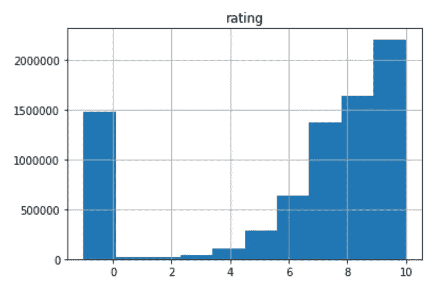

# 基于协同过滤的动漫推荐

> 原文：<https://medium.com/analytics-vidhya/anime-recommendations-by-using-collaborative-filtering-e9b2220a0427?source=collection_archive---------1----------------------->

这项研究旨在通过使用 myanimelist 用户评级向人们推荐动漫。推荐方法是频繁模式挖掘，使用的工具是 Apache Spark。对于数据预处理，通过 jupyter notebook 使用 Ptyhon-Pandas 库。动漫不像电视剧或者电影那么受欢迎。所以，找到好的推荐就更难了。希望我的发现能帮助到某个人:)

# 数据选择

首先选择包含 [myanimelist](https://myanimelist.net/) 用户分数的 [rating.csv](https://www.kaggle.com/CooperUnion/anime-recommendations-database/version/1) 。这些列是:

user_id —不可识别的随机生成的用户 id。

anime_id —用户已评级的动漫。

评级—用户指定的 10 分中的评级(如果用户观看了该视频但没有指定评级，则为 1 分)。

其次，选择 anime.csv 以从与 rating.csv 相同的来源获得类似电视、电影、OVA 的动漫类型。最后，从 [AnimeList.csv](https://www.kaggle.com/azathoth42/myanimelist) 中选择相关列。因为所有的数据都是从 myanimelist 中获取的，所以它们可以通过 *anime_id* 属性相互连接。

# 数据预处理

在这一部分，为规则挖掘算法准备数据。较低的评级和不重要的类型被丢弃，季节数据被合并。

## A.扔掉

首先，考虑较低的评分来做推荐是不合适的。



图一。显示评分分布的直方图

为了便于判断，绘制了上述直方图。如果用户不喜欢给一部动画评分，则使用“-1”值。但这并不意味着用户不喜欢它。因为如果人们太喜欢动漫，他们会给它打分。因此，考虑使用“-1”值。忽略“-1”，平均评级值为 7.80。在这些过高的评分点中，0–5 分可以忽略。总而言之，6-10 分和-1 分被视为不喜欢，0-5 分被视为不喜欢。

## B.类型过滤

一些类型的动画由几集组成，其中包括关于主要动画的故事。规则挖掘不能考虑它们。所以，OVA，ONA，音乐和特别的动漫必须放弃。类型数据和评级数据加入，除了电视或电影动画，所有数据被删除。也看到大部分掉的动漫都没有评级。因此，未分级的动画变得比以前更有价值。

## C.季节数据合并

一部动漫每个不同的季节都有自己的 anime_id。举个例子，美少女战士有五个季节和动漫 id。

*   美少女战士-530
*   美少女战士 R -740
*   美少女战士 S -532
*   美少女战士超级 S -1239
*   美少女战士水手之星-996

它们必须合并，否则，规则挖掘算法会互相推荐季节。在数据选择部分提到的*相关的*数据包括每个 id 的 JSON。美少女战士 R 的一个简化例子是:

```
{'Prequel': [{'mal_id': 530, 'title': 'Bishoujo Senshi Sailor Moon'}],
'Side story': [{'mal_id': 531, 'title': 'Bishoujo Senshi Sailor Moon R: The Movie'}],
'Sequel': [{'mal_id': 532, 'title': 'Bishoujo Senshi Sailor Moon S'}],
'Summary': [{'mal_id': 8756, ''title': 'Bishoujo Senshi Sailor Moon Memorial'}],
'Alternative version': [{'mal_id': 14751, title': 'Bishoujo Senshi Sailor Moon Crystal'}]}
```

由于 JSON 包含前传和续集的季节数据，可以用于合并。首先，通过 Python 的 json 库对 json 进行编辑，以获得可解析的 JSON。通过使用“前传”功能，不仅电视连续剧，而且电影连续剧被合并。选择第一季或第一部电影来代表所有系列。写一个递归前传函数。这个函数通过递归使用前传数据给出第一项。

```
def prequel(anime_id):
    previous = None
    try:
        preJson = related[related["anime_id"] == anime_id].iloc[0]
    except IndexError as e:
        print("No related data")
        return anime_id
    data = preJson["related"].replace("\"", "")
    data = data.replace("\'", "\"")
    data = json.loads(data)
    try:
        previous = data["Prequel"][0]["mal_id"]
    except KeyError as e:
        print("No Prequel data")
    if previous is not None:
        return prequel(previous)
    else:
        return anime_id
```

# 方法

在数据准备之后，使用 PFP 算法，该算法在 Apache Spark MLlib 中有一个实现[这里是](https://spark.apache.org/docs/latest/ml-frequent-pattern-mining.html#fp-growth)。让我们看看关联规则挖掘算法是如何工作的。

目标是生成以下格式的规则:

如果 ***条件*** 则 ***结论***

在这个项目中，规则是这样的:如果用户喜欢 x 动漫，那么就喜欢 y 动漫。规则是通过使用频繁模式生成的。换句话说，如果有很多人同时喜欢 x 和 y，他们之间就会产生一个规则。

还有几个参数用于理解生成的规则的值。*支持度*定义为同时具备*条件和*结论的概率

*支持* = P( *条件，结论*)

*置信度*是通过知道*条件*为真而得出*结论*的概率；

*置信度* = P( *结论* | *条件*)

*重要性*是*置信度*除以*结论概率*的比值:

*重要性* = *置信度* / P( *结论*)

最小支持度设置为 0.1，最小置信度设置为 0.4。所以，如果至少有 10%的人喜欢 x 动漫，那么可以生成一个包含 x 的规则，在这些条件下，内存对于 PFP 算法来说就变得不足了。通过向 spark 提交命令行添加以下命令，可以为 spark 分配更多的内存:

```
*— driver-memory 12g*
```

在此步骤之后，生成 5550 条规则，然后计算*重要性*值以评估结果。

# 结果

规则按*重要性*值排序。这个指标有两个好处。第一个是检测动画之间的关系。当*重要性*过高，特别是大于 5 时，观察到动画之间已经有关联。例如，如果“漂白电影 1”，则“漂白电影 2”。在数据集上，他们没有任何前传-续集的关系，但他们都是基于漂白的故事。第二个好处是帮助理解哪个规则更有价值。死亡笔记是数据集上最受欢迎的动画，有 0.53 的频率。所以，死亡笔记的推荐太多了。经过*重要性*值排序后，热门动漫推荐已经走到了底部，不太热门的已经排到了顶部。


图二。埼玉看到了重要性的重要性

忽略关于相关动漫的几条规则，大部分规则都是令人满意的。知名动漫有好的推荐，相似动漫也有按内容分类的规则。此外，myanimelist 网站上还有用户推荐。对于热门动漫，很多人添加了推荐和规则结果与人类推荐并行。举个例子，对于剑艺在线，Log Horizon，Accel Word 和 Btooom！是用户的前三个推荐。这些建议的结果有规则和*重要性*值分别为 2.18、2.11、2.07。

另一方面，这项研究也有一些不足之处。如果一个动漫的频率小于 0.1，因为最小支持度，所以不生成规则。然后，数据集不会更新。所以，新动画没有规则。

# 选择一个推荐

我希望我能建立一个界面，但我的工作和硕士教育不允许我这样做。首先，打开你最喜欢的动画之一的“我的动画列表”页面。例如第一动漫，星际牛仔，你会在地址栏看到下面的文字:

```
[https://myanimelist.net/anime/**1**/Cowboy_Bebop](https://myanimelist.net/anime/1/Cowboy_Bebop)
```

**动漫/** 后面的数字就是动漫 id。在这里找到我的规则[，按你的 id 过滤条件。从结论栏看你推荐的动漫 id。最后，将推荐的 id 附加到 https://myanimelist.net/anime/.上](https://drive.google.com/open?id=1ecYchVqFwJB99RSzxEZt3xvSBEkqQs5u)