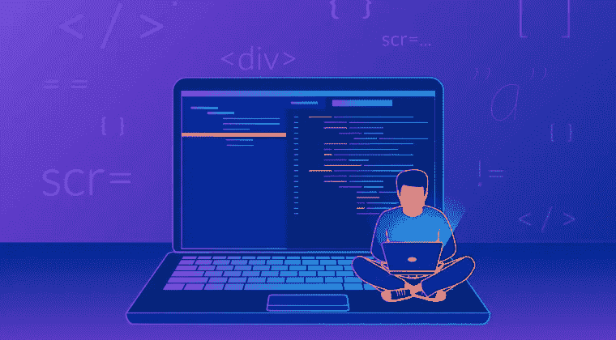

# 宣布机器学习启动计划！【14 天免费使用！]

> 原文：<https://medium.com/analytics-vidhya/announcing-the-machine-learning-starter-program-free-access-for-14-days-2e22673b5948?source=collection_archive---------17----------------------->

# 开始机器学习之旅的理想时机！

想象一下，你想学习所有关于机器学习的知识，但就是找不到时间。有太多的事情要做，无论是我们的专业工作还是即将到来的考试。突然间，你有了大量的空闲时间和千载难逢的机会来学习机器学习并应用它！

这正是现在摆在你面前的机会。我们生活在一个前所未有的时代，世界上一半的人都被完全封锁，并遵循社交距离协议。在封锁期间出现了两种人:

*   那些看电影和上网打发时间的人
*   那些渴望掌握一项新技能、学习一门新编程语言或应用你的机器学习知识的人

如果您属于后一类，我们很高兴地宣布:

[**机器学习启动程序！**](https://courses.analyticsvidhya.com/bundles/machine-learning-starter-program?utm_source=Medium&utm_medium=medium_blog)

***你可以使用代码‘LOCKDOWN’免费报名参加机器学习入门项目！从注册之日起，您可以在 14 天内学习该课程。张贴这个，该计划的费用将是卢比。4999 英镑(约合 80 美元)。***

# 什么是机器学习入门计划？

机器学习入门计划是一个循序渐进的在线入门计划，旨在学习机器学习的基础知识，听取行业专家和数据科学专业人士的意见，并在机器学习黑客马拉松中应用您的知识！

这是点燃你羽翼未丰的机器学习事业的完美起点，并朝着你梦想的数据科学家角色迈出了一大步。

机器学习入门课程的目标是:

*   帮助你理解这个领域是如何改变和颠覆行业的
*   让你熟悉核心的机器学习算法
*   通过竞赛和黑客马拉松来增强和补充您的学习

我们相信整体学习方法，这就是我们策划[机器学习启动项目](https://courses.analyticsvidhya.com/bundles/machine-learning-starter-program?utm_source=Medium&utm_medium=medium_blog)的方式。

# 机器学习入门课程包括哪些内容？

机器学习启动程序中有几个组件:

*   机器学习基础课程
*   行业从业者对各种机器学习主题的专家演讲
*   2 场精彩的机器学习黑客马拉松
*   《机器学习简化版》电子书

让我们更详细地了解一下每种产品。

# 机器学习基础课程

本课程为您提供应用机器学习解决商业问题所需的所有工具和技术。以下是您将在机器学习基础课程中学到的内容:

*   了解机器学习和数据科学如何颠覆当今的多个行业
*   用于构建机器学习模型的线性、逻辑回归、决策树和随机森林算法
*   了解如何解决机器学习中的分类和回归问题
*   如何评估你的机器学习模型，并通过特征工程进行改进
*   通过特征工程改善和增强您的机器学习模型的准确性

# 专家讲座

经验是不可替代的。

本课程融合了机器学习专家、从业者、专业人士和领导者的各种演讲，他们拥有数十年的学习经验。他们已经经历了整个学习过程，并在这些讲座中展示了他们的工作和思考过程。

本课程的特色是 rockstar 数据科学专家，如 Sudalai Rajkumar (SRK)、Balaraman Ravindran 教授、Dipanjan Sarkar、Kiran R 等。

# 机器学习黑客马拉松

机器学习入门计划有两个很棒的黑客马拉松来增强你的学习:

*   贾纳塔哈克
*   机器学习启动程序黑客马拉松

# 《机器学习简化版》电子书

这本电子书旨在提供机器学习的概述，机器学习的最新发展和当前的挑战。以下是对所包含内容的快速总结:

*   什么是机器学习？
*   机器学习的应用
*   机器是如何学习的？
*   为什么机器学习受到这么多关注？
*   构建机器学习模型所需的步骤
*   一个人如何在机器学习领域建立职业生涯？

还有更多！

# 机器学习入门课程是给谁的？

机器学习入门计划适用于以下任何人:

*   是机器学习的初学者
*   想要开始他们的机器学习之旅
*   想了解核心机器学习算法
*   对实用的学习环境感兴趣
*   想要练习和增强他们现有的机器学习知识

那么，你还在等什么？使用代码“LOCKDOWN”免费注册 [**机器学习入门课程**](https://courses.analyticsvidhya.com/bundles/machine-learning-starter-program?utm_source=Medium&utm_medium=medium_blog) **，立即开始您的学习之旅！**

*原载于 2020 年 4 月 1 日 https://www.analyticsvidhya.com**的* [*。*](https://www.analyticsvidhya.com/blog/2020/04/announcing-machine-learning-starter-program/)