# 基于 Z 分数和修正 Z 分数的异常检测

> 原文：<https://medium.com/analytics-vidhya/anomaly-detection-by-modified-z-score-f8ad6be62bac?source=collection_archive---------1----------------------->

***这是关于如何使用 Z 分数和修改的 Z 分数作为异常检测的介绍。***

首先让我们简单介绍一下 z-score，以及为什么我们实际上需要修改 z-score。

z-score 是对 1D 数据中的异常进行评分的常用方法。如果均值和标准差已知，那么对于每个数据点

我们将 z 分数计算为:

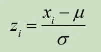

z 得分衡量一个点离平均值的距离，因为标准偏差的有符号倍数和 z 得分的大绝对值表明异常。

现在让我们来看一个数据集，它显示了 z 分数的局限性以及修改后的 z 分数为什么有用。

我们将看看从 1930 年到 2018 年(共 21 场比赛)每届世界杯最佳射手的进球数。原始数据来自这里:

 [## 国际足联世界杯最佳射手

### 在 21 届国际足联男足世界杯决赛中，已经有超过 2000 个进球，这还不算…

en.wikipedia.org](https://en.wikipedia.org/wiki/FIFA_World_Cup_top_goalscorers) 

数据被清理并保存为 CSV 格式。把它作为一个数据帧载入来看看。

 [## 认识 Google Drive -一个存放所有文件的地方

### Google Drive 是一种免费的文件备份方式，可以从任何手机、平板电脑或电脑上轻松访问。开始…

drive.google.com](https://drive.google.com/open?id=1x1yB17eNHEshqI58-t_o-hbjY1tD1nJ7) 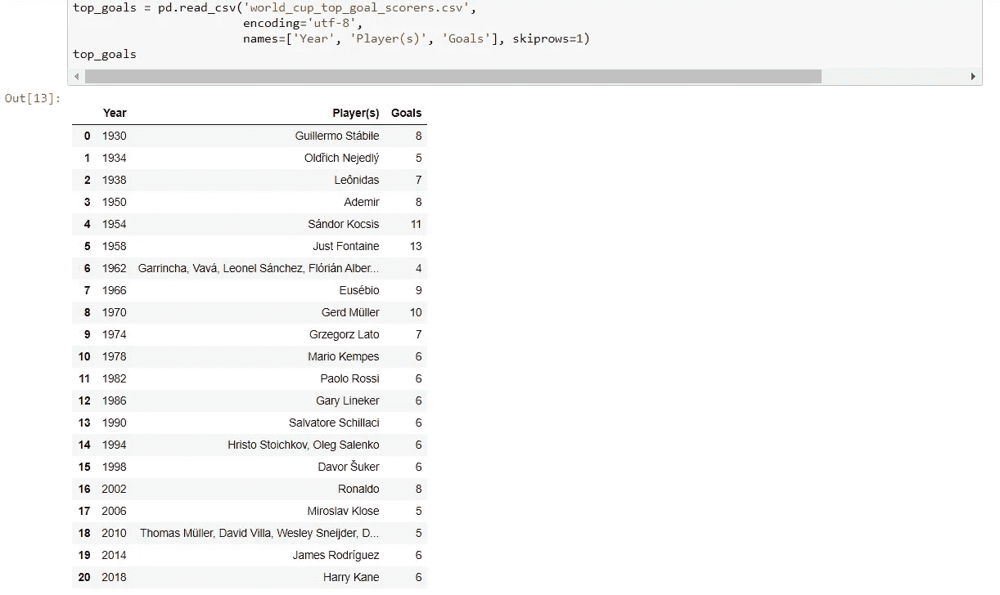

我们将从使用 z 分数来识别异常开始。由于我们对超级明星感兴趣，我们将有一个上限。我们选择𝑧 =+2。高于这个 z 值，任何玩家都会被贴上异常的标签。

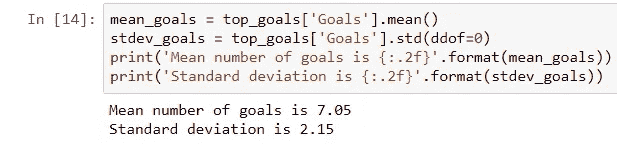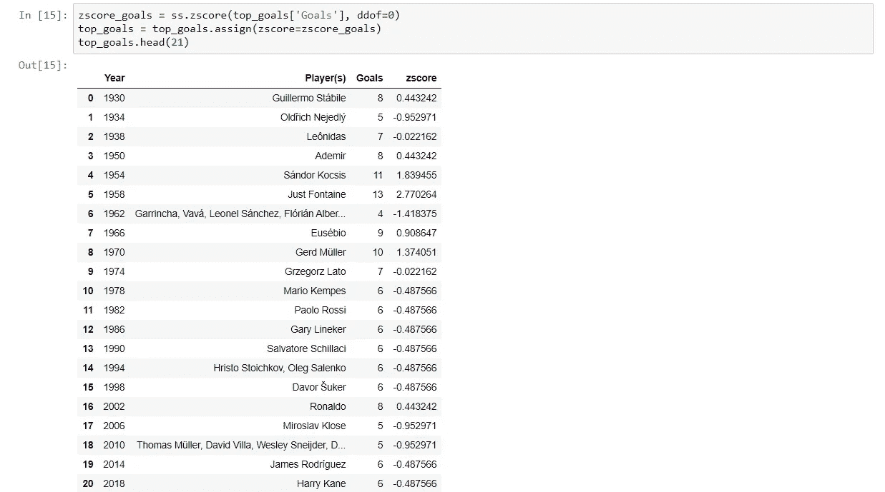

计算 z 分数并添加到数据框

现在让我们定义一个绘图函数来显示结果:

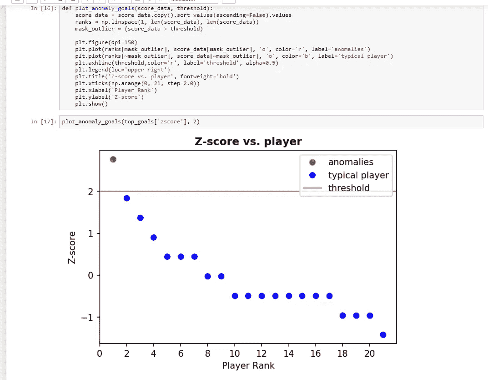

只有一名球员被选中:朱思特·方丹。

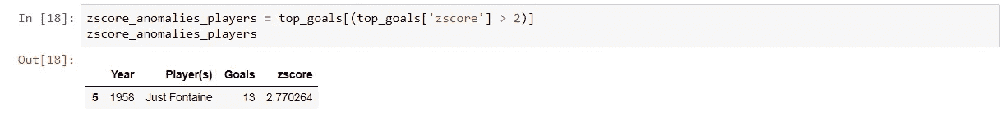

显然我们的分析有缺陷。通过观察该图，我们看到在 21 场比赛中的 12 场比赛中，最佳射手的进球数低于平均进球数(7.05)。

所以问题来了，为什么会这样？

答案是**,均值和标准差本身容易受到异常的影响。凭借他的 13 个进球，令人惊叹的方丹将平均水平提高了如此之多，以至于大多数球员都低于平均水平。结果，他成了唯一的异类。**

正因为如此，z 分数有时可能不可靠，因为平均值和标准差本身对异常很敏感。

**改进的 z 分数**通过使用**中间值**来解决这个问题:

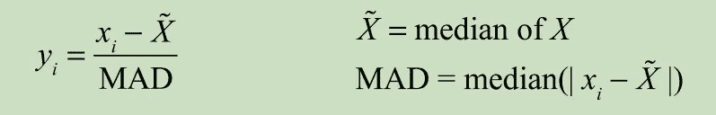

**MAD** 代表距离中间值的**m**edian**a**b solute**d**偏差。

因此，在修改的 Z 分数的情况下，修改的 Z 分数的大绝对值暗示异常。

让我们用修改后的 z 分数重复这个分析，看看会发生什么。

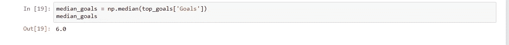

请注意，中值(6.0)低于平均值(7.05)，正如图中所预期的那样。

这里我们要做一个小小的修改，引入一个**一致性** **修正 k** ，允许我们使用 MAD 作为标准差的一致性估计。k 的值取决于数据的基本分布。为简单起见，我们将使用 **k=1.4826** 。

(参见:[https://en.wikipedia.org/wiki/Median_absolute_deviation](https://en.wikipedia.org/wiki/Median_absolute_deviation))

因此**修改后的 z 值**变为

这是我们将在下面的函数中使用的表单。

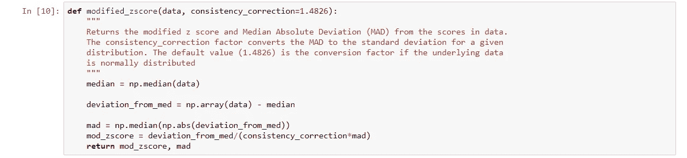

像以前一样，计算所有玩家的修改后的 z 分数，然后绘制并列出结果。注意，阈值在 **y=+2** 保持不变。

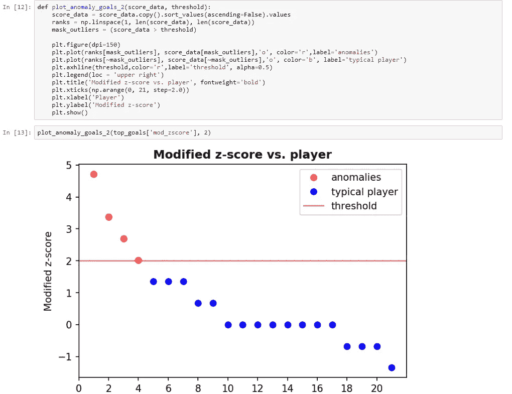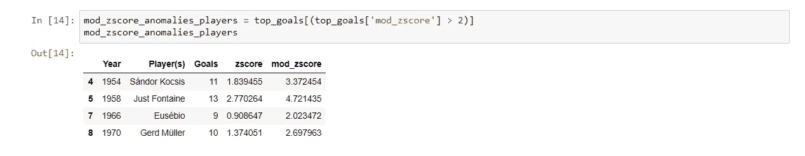

现在我们发现了四个异常玩家。

那么 MAD 与之前计算的标准差相比如何呢？

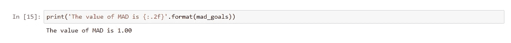

**k∫MAD**为 **1.48** ，小于**标准差(2.05)** 。我们看到，异常对标准偏差有较大的影响，标准偏差取决于与均值偏差的平方(MAD 线性地取决于偏差)。

本文中使用的代码可以在 github 上找到:

 [## 杰尼克/异常检测

github.com](https://github.com/jainyk/Anomaly-detection/tree/master/Zscore%20and%20modified%20zscore) 

如有任何疑问，请在下方留言。欢迎任何进一步的建议。