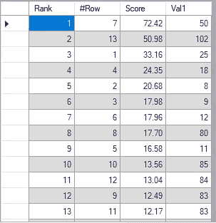
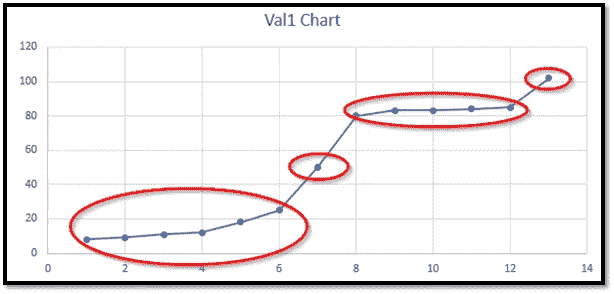

# 异常检测—第 1 部分

> 原文：<https://medium.com/analytics-vidhya/anomaly-detection-part-1-acf1a993b573?source=collection_archive---------19----------------------->

均值或中位数可能是异常吗？

一个**异常**是一个明显不同于其他观测的数据点。然而，它可能不是极值。例如，取一维值的数据集{25，8，9，18，11，12，50，80，83，85，83，84，102}。数据集中有十三个数字。这个数据集的平均值是 50。这个数据的标准差是 36.76729。

如果对给定的数据集进行排序，得到{8，9，11，12，18，25，50，80，83，83，84，85，102}。由于数据集有十三个数字，第七个数字是中值。所以，中位数是 50。进一步计算，我们发现第十个数字是 Q3 = 83，第四个数字是 Q1 = 12。四分位距= Q3-Q1 = 83–12 = 71

**基于平均值和标准差的异常**:

我们可以使用平均值和标准差来计算异常值。下面，我们给出了基于平均值和标准差的异常值:

(1) **弱异常**:在(均值—标准差)和(均值+标准差)之外的任意值。

下限= 50–36.76729 = 13.23271

上限= 50 + 36.76729 = 86.76729

由此，我们发现值 8、9、11 和 12 小于下限，而 102 大于上限。因此，基于平均值和标准差，值 8、9、11、12 和 102 是弱异常。

(2) **中位异常**:在(均值—2 *标准差)和(均值+2 *标准差)之外的任意值。

让我们按照这种方法计算下界和上界。我们发现

下限= 50–2 * 36.76729 =-23.53458

上限= 50 + 2*36.76729 = 123.53458

因为没有值低于下限，也没有值高于上限。没有基于介质异常的异常。

(3) **强异常**:在(均值—3 *标准差)和(均值+3 *标准差)之外的任意值。

由于没有介质异常，所以不可能有强异常。然而，让我们仍然计算下限和上限。

下限= 50–3 * 36.76729 =-60.30187

上限= 50 + 3*36.76729 = 160.30187

由于在下限和上限之外没有值，所以基于这种方法没有强异常。

**基于四分位距的异常**:

下面，我们给出了基于四分位距的异常值:

(1) **弱异常**:在(Q1-0.75 *四分位距)和(Q3+0.75 *四分位距)之外的任何值。

下限= Q1–0.75 *四分位距= 12–0.75 * 71 =-41.25

上限= Q3+0.75 *四分位距= 83 + 0.75*71 = 136.25

按照这种方法，在下限和上限之外没有值，因此没有弱异常。

(2) **中位异常**:在(Q1 —四分位距)和(Q3 +四分位距)之外的任意值。

下限= Q1-四分位数范围= 12–71 =-59

上限= Q3 +四分位间距= 83 + 71 = 154

由于在下限和上限之外没有值，所以没有介质异常。

(3) **强异常**:在(Q1-1.5 *四分位距)和(Q3+1.5 *四分位距)之外的任意值。

下限= Q1–1.5 *四分位距= 12–1.5 * 71 =-94.5

上限= Q3+1.5 *四分位距= 83 + 1.5*71 = 189.5

由于在下限和上限之外没有值，所以按照四分位数范围没有强异常。

如果我们仔细研究上述方法，我们发现值应该远离均值和中值才是异常。因此，平均值或中值不太可能是异常值。

我使用了一个软件“Discover”来计算给定数据的异常。请注意，**“发现”可以用于几百万行几百列**。它可以在几分钟内从数百万行和数百列中计算异常。所以，用它做 13 行 1 列有点过分了。然而，我想找到这个数据集的异常值，所以出于好奇我使用了它。请注意，我对未排序的数据使用了“发现”。下面，我给出结果截图:

Discover 对上述数据集进行异常检测的结果

从上表中，我们发现值 50 是异常值，得分为 72.42%，102 是异常值，得分为 50.98%。因此，如果有任何异常，它必须是 50，尽管它可能是弱异常，因为分数是 72%。请注意，50 是给定数据的平均值和中值。现在，统计学家可能不会同意这个结果，但让我们分析并做进一步的研究。

让我们创建排序值的图表:

所述数据集的数据点绘制成图表

如果我们看到上面的图表，我们已经将这些值分成了四组。第一个聚类包含值 8、9、11、12、18 和 25。这些是彼此接近的。值 50(平均值和中值)在聚类 2 中。它是孤立的，远离任何其他集群。所以，如果有任何异常，那一定只有这个。值 80、83、83、84 和 85 彼此接近，并且在第三群中。最后一个值 102 在第四个簇中。这也是孤立的但离 85 不远。因此，由“Discover”给出的结果是高度准确的，并且分数以百分比表示其异常值分数。

最接近 50 的值是 25，差 25。下一个最接近 50 的值是 80，差值是 30。因此，我们发现两个最接近的值都远离 50。然而，没有其他值是如此远离最近的值。比如最接近 102 的值是 85，差 17。下一个最接近的值是 84，差值是 18。

因此，平均值和中值可能是异常值，尽管这些可能是微弱的异常，并且仅在例外情况下。

**利用异常高效管理库存**:

我们能否使用异常来检测过量库存和短缺库存(紧急订购以避免缺货)？我从一家公司收到了包含大约 100，000 件商品的销售和净库存数据。该公司面临着维持优化库存的挑战。一些库存项目高于需求水平，另一些库存不足，导致收入和客户流失。由于我不能分享真实的数据，我已经改变了库存 ID，并采取了 10%的随机项目。

关于这一点的进一步细节将在下一部分提供。