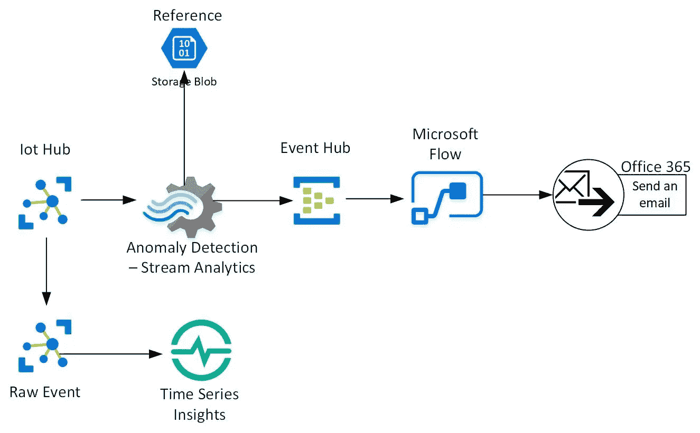
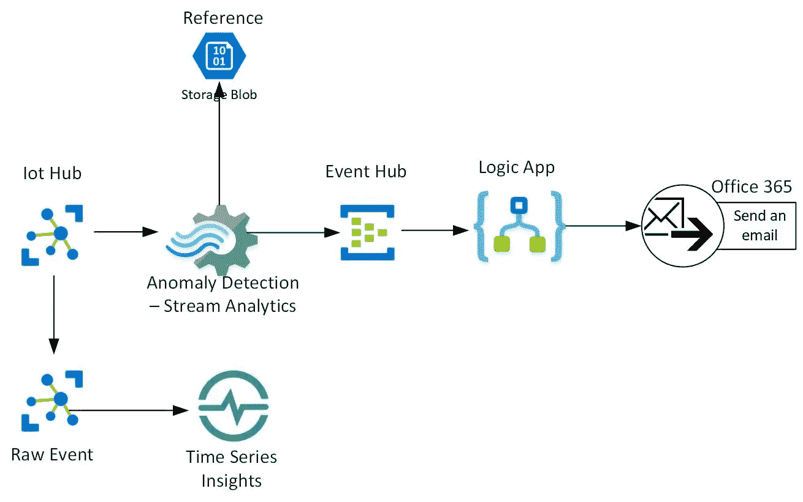
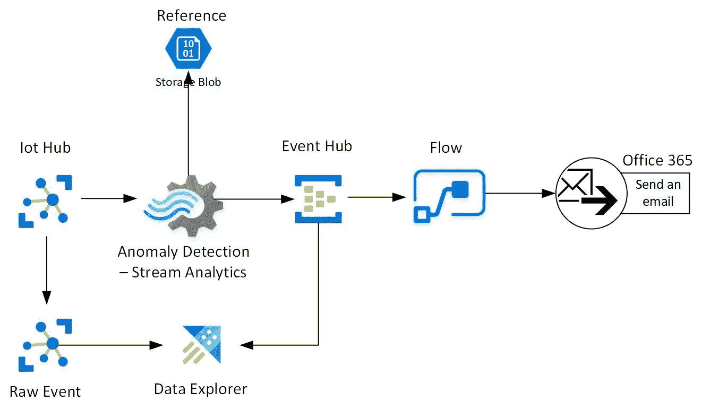
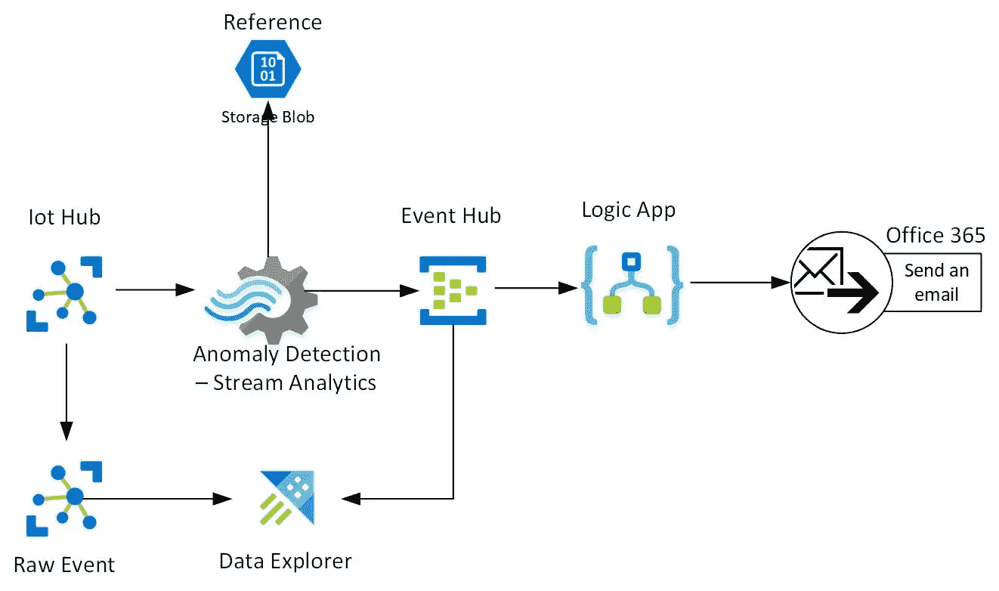
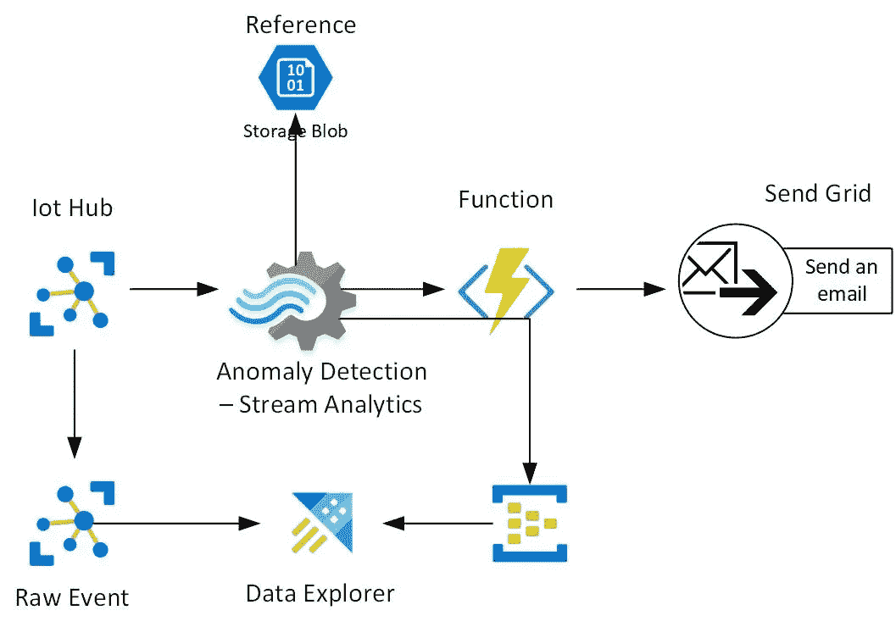

# 使用 Azure 流分析的异常检测模式

> 原文：<https://medium.com/analytics-vidhya/anomaly-detection-patterns-using-azure-stream-analytics-e6acddd25117?source=collection_archive---------24----------------------->

# 用例

如何使用 Azure PaaS 在工业物联网中构建异常检测？每个制造公司都会实施异常检测。

例如:温度超过阈值。

下面是一些不同的异常检测架构，从简单到高级。

# 结构

低码无码选项 1

组件:

*   物联网中心
*   原始事件—是一个拥有原始数据副本的使用者组。
*   时序洞察—用于根本原因分析和冷热存储的长期存储。
*   流分析—提取事件以检测异常检测
*   [https://docs . Microsoft . com/en-us/azure/stream-analytics/stream-analytics-machine-learning-anomaly-detection](https://docs.microsoft.com/en-us/azure/stream-analytics/stream-analytics-machine-learning-anomaly-detection)
*   事件中心—获取要发送的警报
*   流程从 Azure Event hub 获取事件，并使用 office 365 电子邮件发送电子邮件提醒。
*   [https://docs . Microsoft . com/en-us/azure/connectors/connectors-create-API-azure-event-hubs](https://docs.microsoft.com/en-us/azure/connectors/connectors-create-api-azure-event-hubs)

低码无码选项 2

*   物联网中心
*   原始事件—是一个拥有原始数据副本的使用者组
*   时序洞察—用于根本原因分析和冷热存储的长期存储。
*   流分析—提取事件以检测异常检测
*   [https://docs . Microsoft . com/en-us/azure/stream-analytics/stream-analytics-machine-learning-anomaly-detection](https://docs.microsoft.com/en-us/azure/stream-analytics/stream-analytics-machine-learning-anomaly-detection)
*   事件中心—获取要发送的警报
*   逻辑应用程序从 Azure 事件中心获取事件，并使用 office 365 电子邮件发送电子邮件警报。
*   [https://docs . Microsoft . com/en-us/azure/connectors/connectors-create-API-azure-event-hubs](https://docs.microsoft.com/en-us/azure/connectors/connectors-create-api-azure-event-hubs)

低代码选项 1

*   物联网中心
*   原始事件—是一个拥有原始数据副本的使用者组。
*   Azure data explorer —用于根本原因分析和冷热存储的长期存储。此外，机器学习和异常检测和 basketing 选项具有超过 200 个或更多的功能来运行即席查询和处理大型数据集。
*   流分析—提取事件以检测异常检测
*   [https://docs . Microsoft . com/en-us/azure/stream-analytics/stream-analytics-machine-learning-anomaly-detection](https://docs.microsoft.com/en-us/azure/stream-analytics/stream-analytics-machine-learning-anomaly-detection)
*   事件中心—获取要发送的警报
*   流程从 Azure Event hub 获取事件，并使用 office 365 电子邮件发送电子邮件提醒。
*   [https://docs . Microsoft . com/en-us/azure/connectors/connectors-create-API-azure-event-hubs](https://docs.microsoft.com/en-us/azure/connectors/connectors-create-api-azure-event-hubs)

低代码选项 2

*   物联网中心
*   原始事件—是一个拥有原始数据副本的使用者组。
*   Azure data explorer —用于根本原因分析和冷热存储的长期存储。此外，机器学习和异常检测和 basketing 选项具有超过 200 个或更多的功能来运行即席查询和处理大型数据集。
*   流分析—提取事件以检测异常检测
*   [https://docs . Microsoft . com/en-us/azure/stream-analytics/stream-analytics-machine-learning-anomaly-detection](https://docs.microsoft.com/en-us/azure/stream-analytics/stream-analytics-machine-learning-anomaly-detection)
*   事件中心—获取要发送的警报
*   逻辑应用程序从 Azure 事件中心获取事件，并使用 office 365 电子邮件发送电子邮件警报。
*   [https://docs . Microsoft . com/en-us/azure/connectors/connectors-create-API-azure-event-hubs](https://docs.microsoft.com/en-us/azure/connectors/connectors-create-api-azure-event-hubs)

低代码选项 3

*   物联网中心
*   原始事件—是一个拥有原始数据副本的使用者组。
*   Azure data explorer —用于根本原因分析和冷热存储的长期存储。此外，机器学习和异常检测和 basketing 选项具有超过 200 个或更多的功能来运行即席查询和处理大型数据集。
*   流分析—提取事件以检测异常检测
*   [https://docs . Microsoft . com/en-us/azure/stream-analytics/stream-analytics-machine-learning-anomaly-detection](https://docs.microsoft.com/en-us/azure/stream-analytics/stream-analytics-machine-learning-anomaly-detection)
*   事件中心—获取要发送的警报
*   Azure 函数从 Azure Event hub 获取事件，并使用第三方电子邮件，如发送网格到电子邮件提醒。
*   [https://docs . Microsoft . com/en-us/azure/connectors/connectors-create-API-azure-event-hubs](https://docs.microsoft.com/en-us/azure/connectors/connectors-create-api-azure-event-hubs)

*原载于*[*https://github.com*](https://github.com/balakreshnan/IIoT-AI/blob/master/IIoT/anomalydetectioniiot.md)*。*