# 使用基于角度的技术的异常检测

> 原文：<https://medium.com/analytics-vidhya/anomaly-detection-using-angle-based-techniques-5d8db8500d14?source=collection_archive---------8----------------------->

在我们的异常检测系列中，我们将要讨论的另一种方法是基于角度的技术。

基于角度的技术有助于多元数据的异常检测。让我们深入了解这项技术背后的直觉:

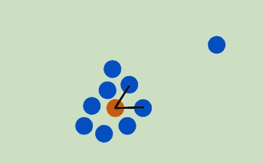

橙色点代表正常点

在上图中，考虑一组数据点，其中橙色点代表一个正常点。对于法线点，当您选择不同的数据点时，它与任何其他两个数据点所成的角度会有很大的变化。

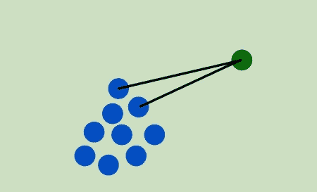

绿点代表异常点

现在考虑另一种情况，其中绿点代表异常，在这种情况下，它与其他数据点形成的角度不会随着您选择不同的数据点而有太大变化。

核心思想是，与具有高方差的正常点相比，异常点具有低方差。

我们将按照以下步骤实现上述算法:

1.  对于每个数据点，确定它与所有其他数据点对所成的角度。
2.  计算这个角度的方差。
3.  方差低于预定阈值的点是异常点。

让我们深入到编码部分:

注意:这里我们关注的是算法而不是数据，我们不会进行测试/训练分割。相反，我们将使用已知异常的模拟数据，并观察算法的执行情况。

数据:我们从创建数据开始，数据将是正常点和异常点的组合。每组点(正常和异常)都是从 2D 高斯分布中生成的，其中我们指定了每个维度的平均值以及协方差矩阵。我们选择正常数据是 100 个紧密聚集在一起的点，而异常数据是 10 个更远且分布更广的点。

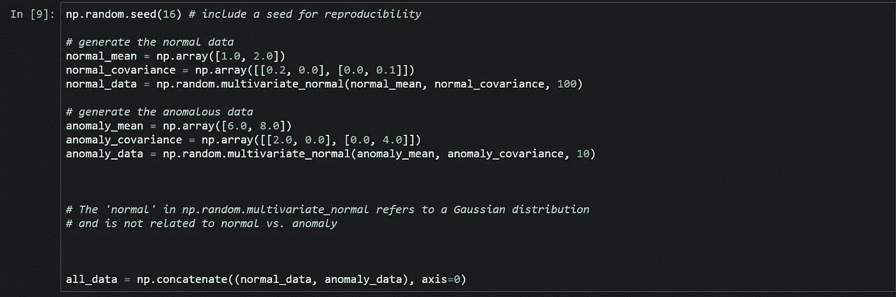

让我们绘制正常与异常的数据和颜色代码:

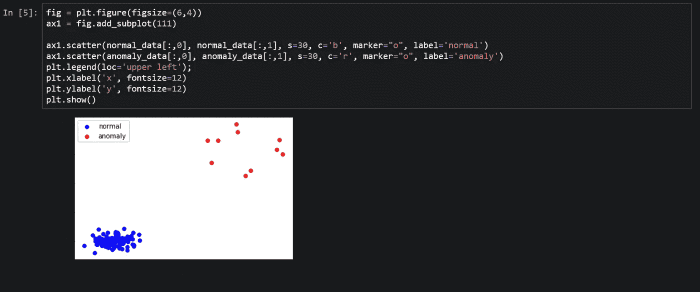

算法:我们将实现一个真正的基于角度的算法。也就是说，我们计算数据中每组三个点的实际角度。

我们将从构建基于角度的异常检测算法的两个关键函数开始。第一个函数 *angle* ，计算三点之间的角度。

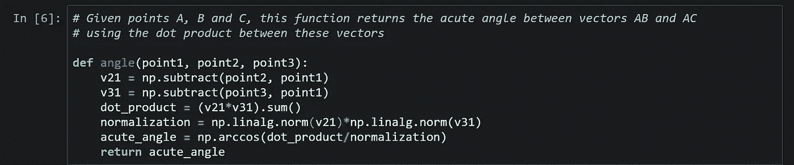

第二个函数， *eval_angle_point* ，接受两个输入:一个点和数据(点的集合)。此函数返回输入点与输入数据中所有点对之间的角度列表。它使用*角度*的角度计算。

通过数据中所有点对的简单循环是不够的，因为我们必须确保这三个点没有重复地指向确定的角度。更具体地说，如果我们选择点 A，然后考虑数据中的两点 B(第二点)和 C(第三点)，我们希望确保以下条件成立:

1.  B 点不同于 A 点
2.  C 点不同于 A 点和 B 点
3.  我们不会计算同一个角度两次。也就是说，如果我们计算矢量 AB 和 AC 之间的角度(其中 B 是第二点，C 是第三点)，我们不会用矢量 AC 和 AB 重复计算(其中 C 是第二点，B 是第三点)

*eval_angle_point* 中的 *if* 语句确保三个条件成立。

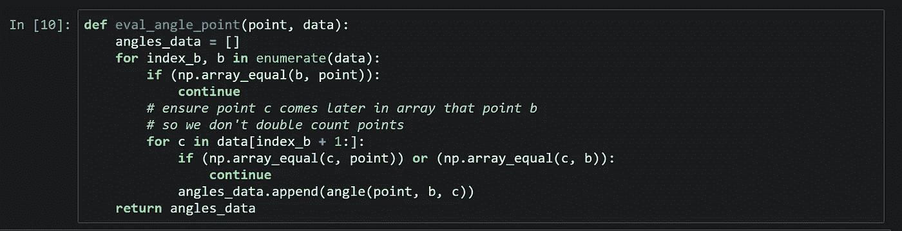

现在，我们使用 *eval_angle_point* ，其中一个点来自正常数据，另一个点来自异常数据，来说明我们在上面做出的声明:异常点比正常点具有更低的角度方差。

随机选择一个正常点和一个异常点，并绘制数据中 100 对点的角度。

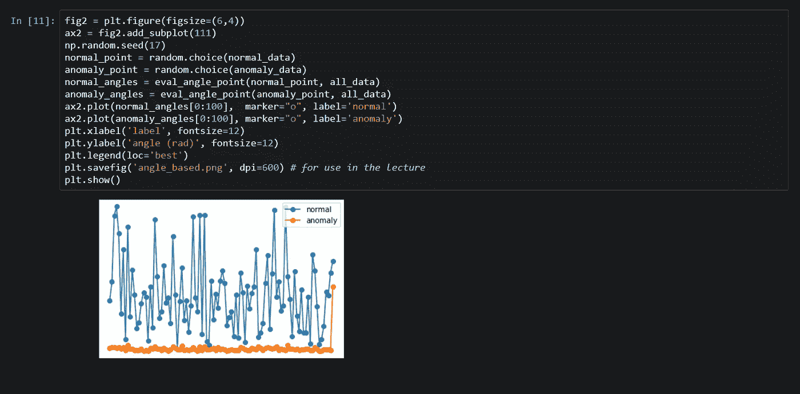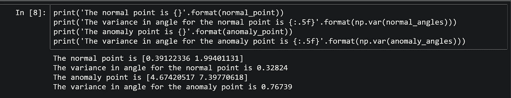

这两点比较看起来很有希望，但没有统计学意义。

让我们计算所有异常数据的角度方差。我们将用类型“0”标记异常，以便我们可以将它们与下面的正常数据(类型“1”)进行比较。

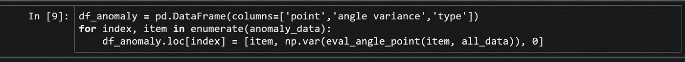

让我们看看前十个条目。

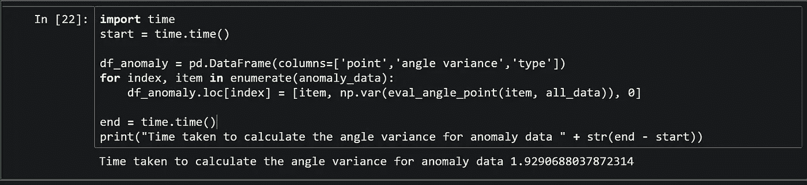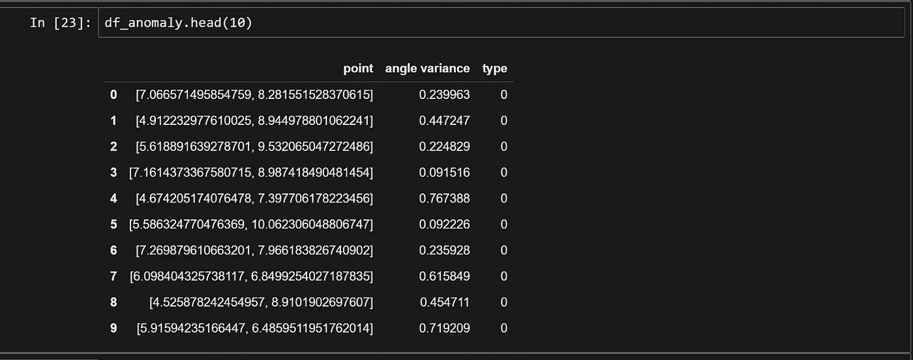

这有点令人不安。许多异常的角度方差相当高，甚至高于我们上面考虑的正常点的方差。为了完成我们的分析，我们还需要正态数据的方差，我们计算如下(将正态数据标记为类型“1”)。

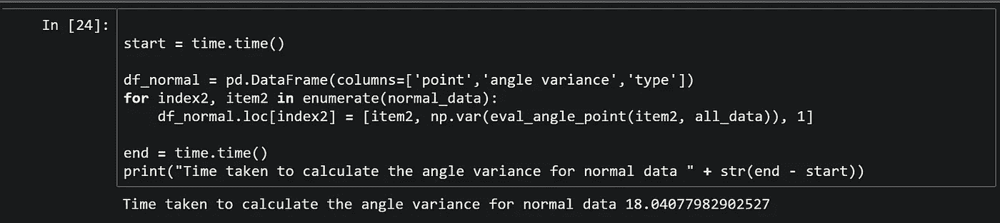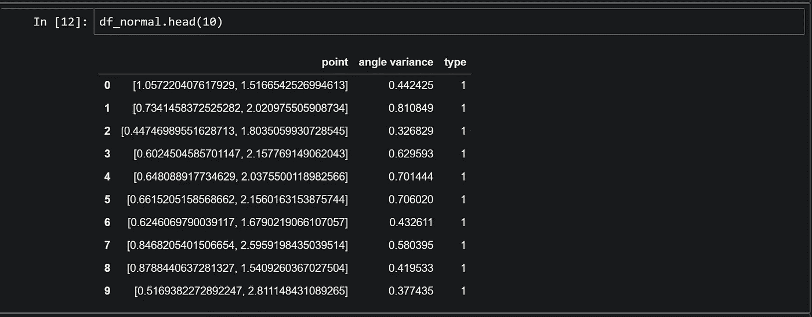

如果我们仔细观察，就会发现在计算正常数据和异常数据的角度变化所花费的时间之间存在显著的时间差。

所以问题来了，为什么*normal_data*的计算相对慢？

答案在于算法的复杂性，结果是 O(N^3，其中 n 是点数。

说明:要看到这一点，请思考一个角度是如何计算的。我们需要三分，而且应该都不一样。有 N 种方法选择第一点，N-1 种方法选择第二点，N-2 种方法选择第三点。交换第二个和第三个点给出相同的角度，所以总的复杂性是

N∗(N−1)∗(N−2)/2=O(N^3).

注意，这里我们将算法分成两部分: *eval_angle_point* 计算给定点的所有角度[复杂度 o(n^2]】,然后上面的最终循环(对于 *df_anomaly* 和 *df_normal* )遍历所有点[复杂度 O(N)]

从异常数据的 10 个点到正常数据的 100 个点，运行时间增加了大约 10 =1000 倍，这导致了明显的速度减慢。基于角度的异常检测速度很慢。

现在，让我们将异常点和正常点的两个数据帧结合起来，并按照角度变化对它们进行升序排序。如果我们的异常检测算法是完美的，那么前十个条目应该都是异常(类型 0)。

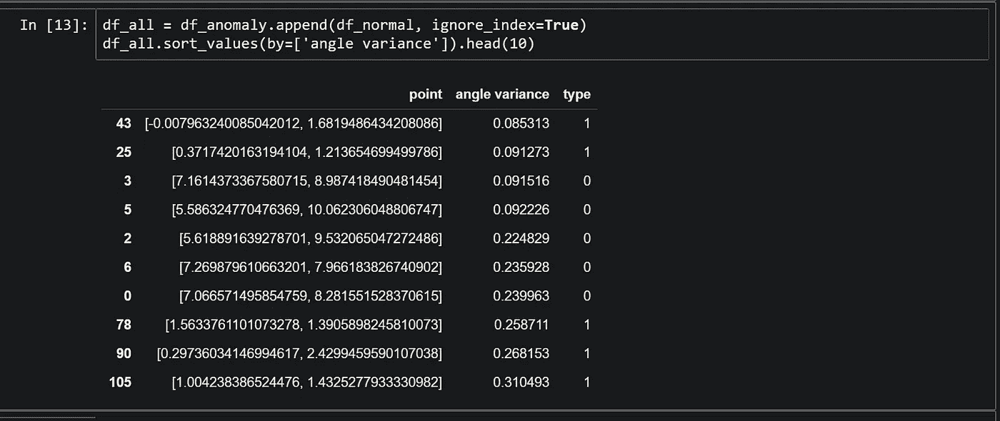

哎呀！我们只发现十个异常中的五个，方差最小的两个点属于正常数据。很明显我们的算法需要改进。

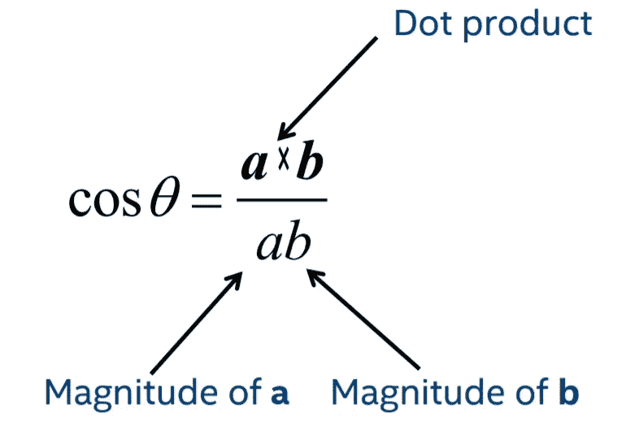

这是我们之前用来计算角度的公式，我们发现原则上角度是一个很好的度量，但在实践中并不总是有效。

因此，已经设计了其他类似角度的度量。例如:

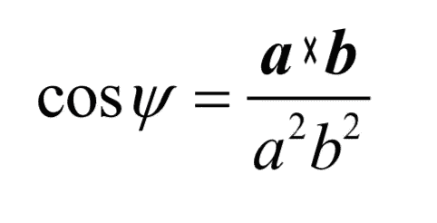

虽然ψ通常被称为角度，但它不是真正的角度。分母中的平方幂在此度量中引入了距离依赖性。

现在让我们更新公式，看看结果:

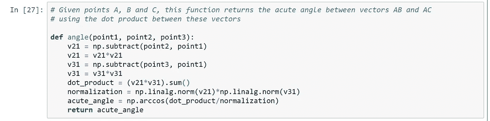

代码的其余部分保持不变。

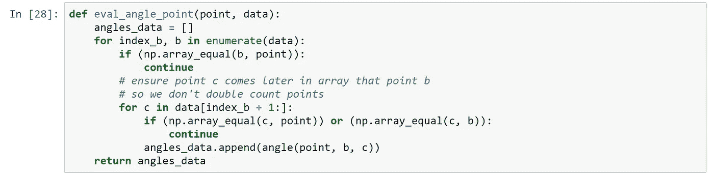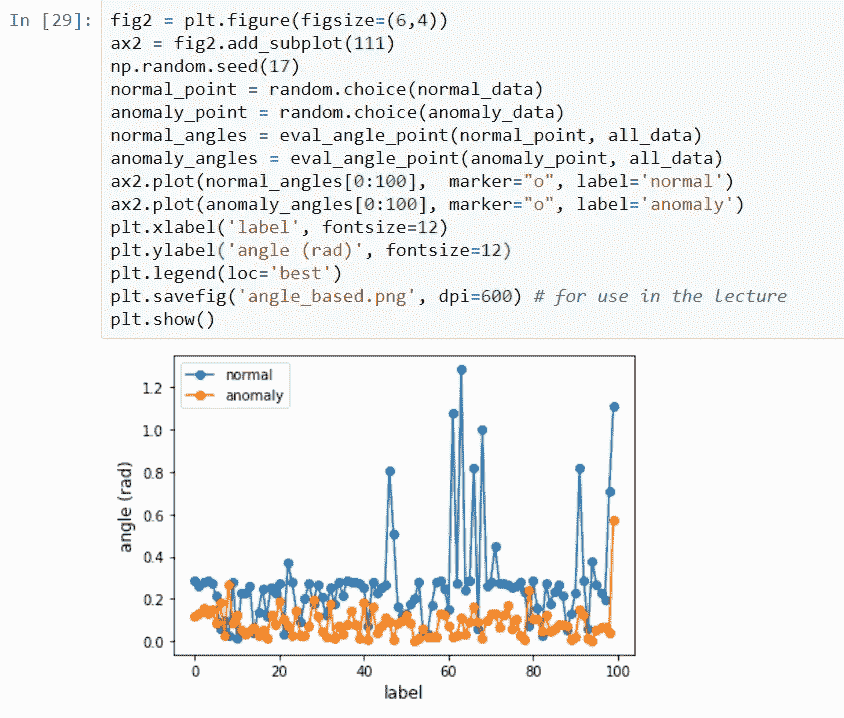

正如我们在下面可以观察到的，法线和异常点的角度变化之间的差异更加明显。

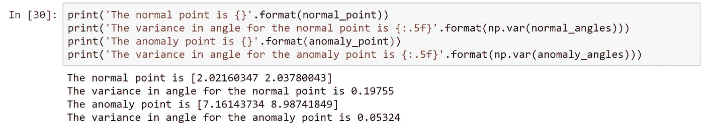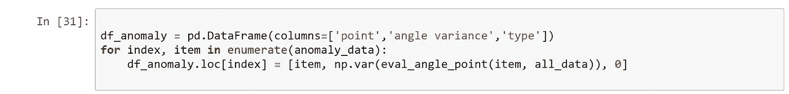

正如我们在下面观察到的，异常点的角度方差比以前小了。

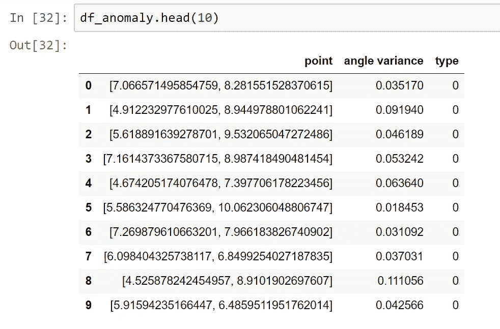

类似地，计算法线点的角度方差。

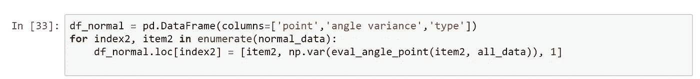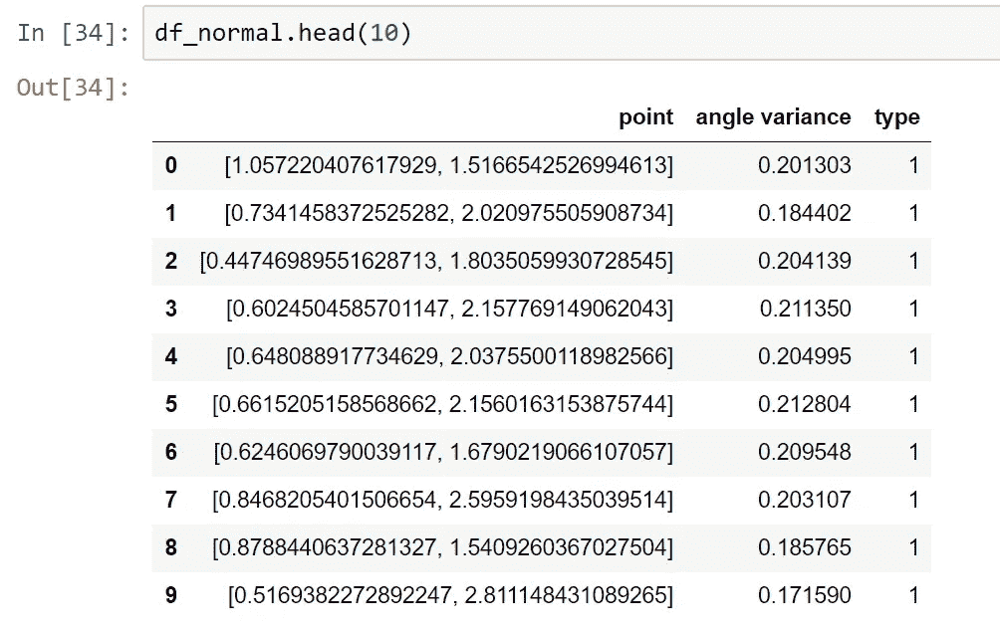

现在，将异常点和正常点的两个数据帧组合起来，并按照角度方差以升序对它们进行排序。如果我们的异常检测算法是完美的，那么前十个条目应该都是异常(类型 0)。

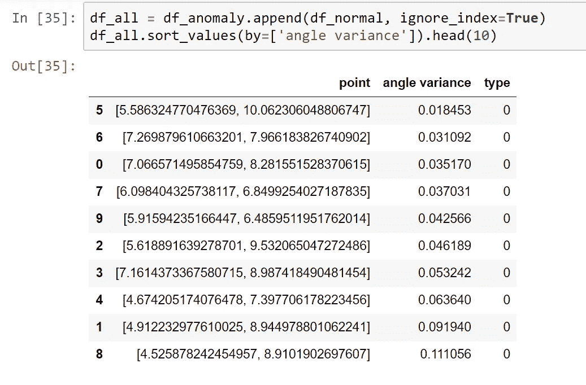

而且这次比以前好用多了。

本文中使用的代码可以在下面的 github 上找到:

 [## 杰尼克/异常检测

github.com](https://github.com/jainyk/Anomaly-detection/tree/master/Angle%20based%20techniques) 

如有任何疑问，请在下方留言。欢迎任何进一步的建议。