# 基于生成对抗网络的异常检测

> 原文：<https://medium.com/analytics-vidhya/anomaly-detection-using-generative-adversarial-networks-gan-ca433f2ac287?source=collection_archive---------0----------------------->

*原作者:*

费德里科·迪·马蒂亚、保罗·加利昂、米歇尔·德·西蒙尼、伊曼纽·盖尔菲

【https://arxiv.org/pdf/2004.01461v2.pdf】文章链接:[T5](https://arxiv.org/pdf/1906.11632.pdf)

*发布日期:2019 年 6 月 27 日*

不同于大多数其他对象的对象

# **简介**

异常检测是制造业、医学成像和网络安全等领域的关键问题之一。数据可能是复杂的和高维的，因此异常检测方法需要对正常数据的分布进行建模。异常检测是几个研究领域面临的重要问题。将看不见的数据检测和正确分类为异常是一个具有挑战性的问题，多年来已经以许多不同的方式进行了处理

# **1。关于甘**

生成对抗网是用于训练生成模型的替代框架，以避免逼近许多棘手的概率计算的困难。

生成对抗网络(GANs)是一类已经成功用于建模复杂和高维分布的模型。

敌对网络的主要优点是从不需要马尔可夫链，并且只使用反向传播就可以获得梯度。此外，在学习过程中不需要推理，各种各样的相互作用和因素可以很容易地纳入模型。

生成对抗网络(GANs)和对抗训练过程最近被引入来面对这一任务，产生了显著的效果。在本文中，我们将调查使用 GAN 方法的异常检测方法，陈述它们的优缺点。

训练有素的甘旨在拟合正态样本的分布，应该能够从潜在代表重构正态样本，并区分来自真实数据分布的样本。已经说过，由于 GANs 隐含地对数据分布本身进行建模，并且将它们用于异常检测涉及到恢复给定图像示例的潜在表示的昂贵的优化过程。这对于大型数据集或实时应用程序来说是不切实际的方法。

# 条款的范围和背景

我们将在第 1 节中介绍 GANs 框架及其扩展，称为条件 GANs 和甘比，分别在 1.2 和 1.3 节中进行了解释。第 2 节简要介绍了利用 GANs 进行异常检测的最新架构。第 5 节讨论了对所分析架构的所有经验评估，结论已包含在第 6 节中。

**1.1 甘斯**

最初的 GAN 框架有最小-最大游戏问题。在最小-最大问题中，两个参与者(生成器和鉴别器)总是相互竞争。鉴别器产生输出值***【D(x)***，指示 *x* 是真实图像的机会，主要目的是增加将真实图像识别为真实图像并将生成的图像识别为伪像的机会。为了测量损失，我们使用[交叉熵](https://jhui.github.io/2017/01/05/Deep-learning-Information-theory/)。目标如下:

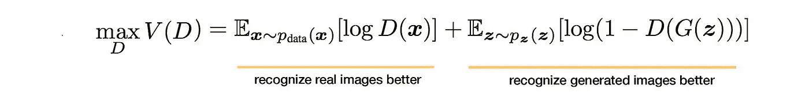

生成器侧的目标函数希望模型生成具有最高可能值鉴别器*的图像，以便它能够*欺骗鉴别器。

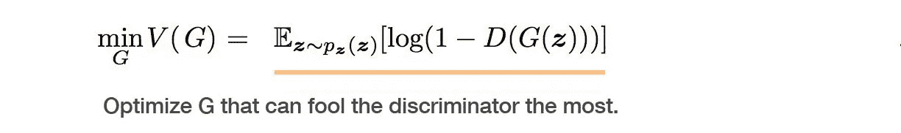

GAN 可以定义为一个 **minimax** 游戏，其中 *G* 想要最小化 *V* 同时 *D* 想要最大化它。

**1.2 有条件的 GANs**

GANs 可以扩展为一个条件模型。在有条件的 GAN 发生器和鉴别器以额外的信息为条件。这些额外信息可以是类别标签或其他数据。这种调节可以通过将这种额外信息作为附加输入层馈入鉴别器和发生器来完成。生成器将额外的信息和噪声组合在一起作为隐藏的联合表示，对抗训练框架在如何收集这种隐藏表示方面表现出相当大的灵活性。在鉴别器中，鉴别函数的输入表示为 x 和 y。

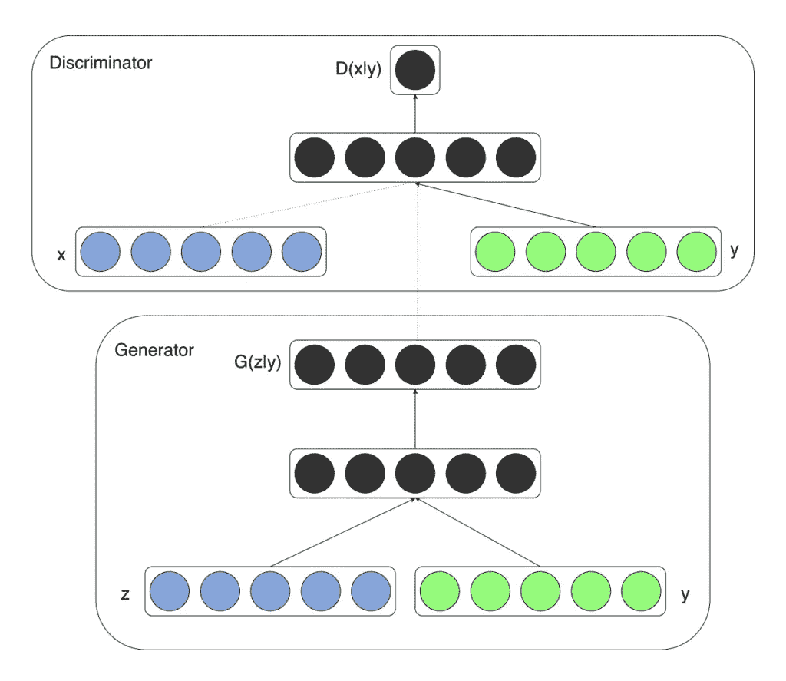

发生器 G，编码器 E:条件 GAN

1.3 比根斯

双向 GAN(甘比)是两年前提出的一种表征学习方法。在甘比，编码器被添加到标准的发生器-鉴别器 GAN 架构中。编码器的最小工作是输入数据并输出一个潜在的表示。稍后训练鉴别器，它不仅鉴别原始数据和生成的样本，而且消除编码器和生成器之间的分歧，因此，通过甘比框架训练的编码器成为在 ImageNet 上用于下游任务的视觉表示学习的有效手段。

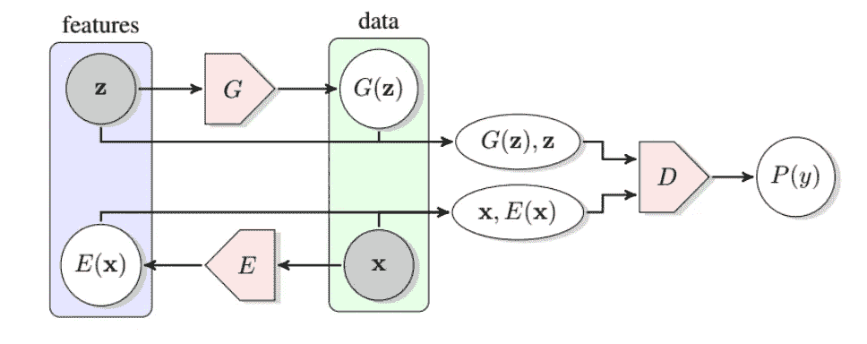

发电机 G、编码器 E 和联合鉴别器 d。

然而，后来一些研究人员发现，在甘比使用的 DCGAN 架构不能模拟高质量的图像，这是它应用 BigGAN 模型的鉴别器和生成器架构以产生高质量图像的动机。在这一阶段，他们还发现，对鉴别器的调整改善了表征学习的结果，而不影响生成。

# 2.用于异常检测的 GANs

用于异常检测的 GANs 是一个重要的研究领域。AnoGAN 首先提出了这一概念，但最初 AnoGAN 存在一些性能问题，因此提出了基于甘比的方法。此外，EGBADs(基于 GAN 的高效异常检测)的性能也优于 AnoGAN。后来提出了一种基于 GAN + autoencoder 的方法，在评测指标和执行速度方面比 EGBAD 表现更好。

接下来，我们将分析考虑过的架构和分析过的架构，这里主要关注映像。

**a .使用 AnoGAN 架构:**

在 AnoGAN 中使用标准 GAN，ano GAN 仅在正样本上训练，以学习从潜在空间表示 z 到现实样本 xˇ= G(z)的映射，并且该学习的表示用于将新的、看不见的样本映射回潜在空间。通过在正常样本上训练 GAN，生成器可以学习正常图像的流形 X，并且当异常图像被编码时，其重建可以是非异常的。在测试期间，找到将测试图像映射到其潜在表示的潜在向量。为了表示异常区域，使用重建图像，并且这是输入和重建图像之间的差异将显示异常的区域。下面是训练和检测异常的两个步骤的总结。

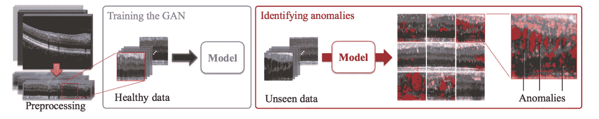

使用 AnoGAN 进行培训和测试

优点:

*   异常检测可以使用 GANs 来完成。

缺点:

*   异常分数不容易解释。

**b .使用 EGBAD 架构:**

高效的基于 GAN 的异常检测(EGBAD)将甘比架构引入异常检测领域。之前我们看到了 AnoGAN 架构，它有一些缺点，这些缺点被 EGBAD 所掩盖，EGBAD 允许学习编码器能够在对抗训练期间将输入样本映射到它们的潜在表示。EGBAD 的主要优势在于，它允许您在推断过程中计算异常分数，而不需要优化步骤，因为它发生在 AnoGAN 中。

**c .使用 GANomaly 架构:**

加诺马利深受阿诺根、甘比和埃格巴德的启发。这种体系结构在正常图像上训练生成器，以便它们可以学习它们的流形 X，并且自动编码器也同时被训练以有效地学习图像在其潜在表示中的编码。这种结构与标准 GAN 结构中的发生器和鉴别器是一个整体。

方法:

**发电机网络:**

生成器网络依次包括元件:编码器 GE、解码器 GD(该组件组装自动编码器结构),第三组件是另一个编码器 e

**鉴频器网络:** GAN 架构配有鉴频器网络。鉴别器和发生器部分是标准 GAN 架构的构建模块。

鉴别器网络的训练数据源

1.  真实数据实例—在训练时用作正面样本，这是人类的真实图像
2.  假数据实例—由生成并由鉴别器在训练期间用作反面例子。

鉴别器的主要目标是识别真实数据和生成数据，并相应地对其进行训练。当它不能识别差异时，意味着生成器产生真实图像。生成器不断更新以欺骗鉴别器。

**发电机损耗:**使用三个损耗函数 Minimax 损耗、修正的 Minimax 损耗、Wasserstein 损耗来制定目标函数。每一次损失都试图优化整个架构的不同部分。

优点:

*   由于编码器像 AnoGAN 一样在训练过程中学习，所以我们不需要研究过程。整个学习过程变得更快，因为我们使用自动编码器一样的架构(不使用噪声先验)。异常值更容易解释。

缺点:

*   定义新的异常分数。它允许检测图像空间和潜在空间中的异常，但是(结果)异常分数与计算的潜在空间不匹配，则它可以与具有低上下文损失值的一般样本相关联，因此它将非常类似于输入，反之亦然。

# **3。消融研究**

所有上述提到的算法都使用张量流来实现，以评估每个异常检测算法的性能。以下部分显示的结果是在所有进行的测试中获得的。

## 数据集:

这些架构决定在文献中常见的广为人知的数据集上进行训练和测试:MNIST、FashionMNIST、CIFAR-10 和 KDD99。

**MNIST** : MNIST 数据集是手写数字的数据库。

图像类型:28 X 28 像素灰度图像

总类-10，一个类被视为异常类，9 个类被视为正常数据

**时尚 MNIST:** 时尚 MNIST 数据集，包含不同的服装项目

图像类型:28 × 28 像素灰度图像。总班数— 10

**CIFAR-10:** 各种对象图像的数据集。

图像类型:32×32 像素彩色图像。总班数— 10

**KDD:** KDD 数据集是网络入侵检测数据的集合。

# **4。方法学**

将上述算法放在一起，从这个大样本池中选择一个类作为异常，在数据集洗牌后，选择 80%的训练集，而剩余的 20%用作测试集。

每个模型都根据其在训练集上的原始实现进行训练，并在由常规和异常数据组成的整个数据集上进行测试。

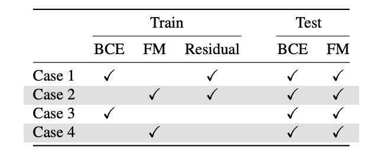

培训和测试配置组合。

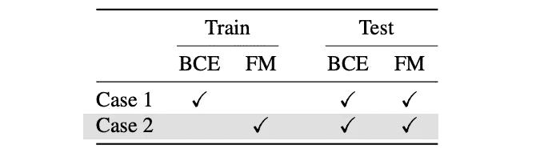

# **5。结果**

对所有结果的完整理解请参考下表。

张量框架已被使用并产生了不同的结果。所有测试都是通过测量 AUPRC -(精确度和召回曲线下的面积)进行的。用不同的超参数配置来训练 GAN 网络，以便测试更广泛的模型配置。通过使用 GANomaly 方法，增加了评估过程来进行模型选择，从而在训练阶段选择最佳模型。已经为甘比和加诺玛利选择了模型，因为为阿诺甘选择模型是不可行的，因为测试时每个样本都需要γ研究步骤。AnoGAN 模型的性能评估被有意省略，这是由于架构的内部工作需要很长时间来进行测试，因为每次对每个图像都需要找出最佳的潜在表示。

甘比/埃格巴德:在甘比/埃格巴德架构下，执行了最高数量的训练和测试配置，并且在测试阶段使用特征匹配(FM)和 BCE 计算了两次异常得分。在训练阶段 BCE 或 FM 之间的选择影响发电机损耗。

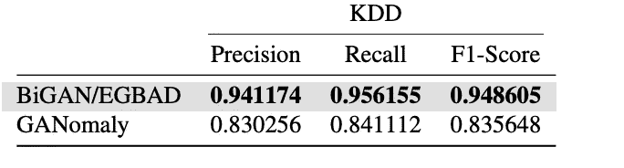

甘比/埃格巴德和加诺玛利模型在 KDD 数据集上的性能。

加诺马利:训练和测试也与加诺马利的甘比/埃格巴德架构相似。在训练阶段增加了模型选择步骤，以便始终保存最佳模型。对于这种架构，已经使用异常分数完成了测试阶段，该异常分数等于首先用网络的自动编码器部分编码的图像的潜在表示与在重构之后用编码器再次编码的图像的潜在表示之间的平方差。GANomaly 架构中使用的图像是调整到 32 × 32 的原始图像。

AnoGAN:如前所述，AnoGAN 的结果尚未重现，因为繁琐的计算要求导致训练和测试阶段非常耗时。

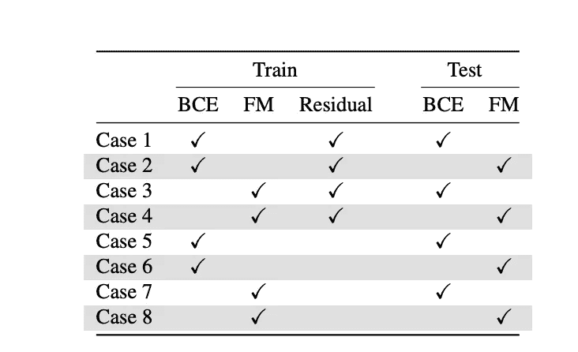

甘比—培训和测试配置组合。

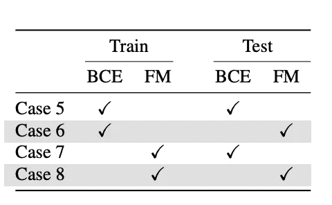

GANomaly —培训和测试配置组合

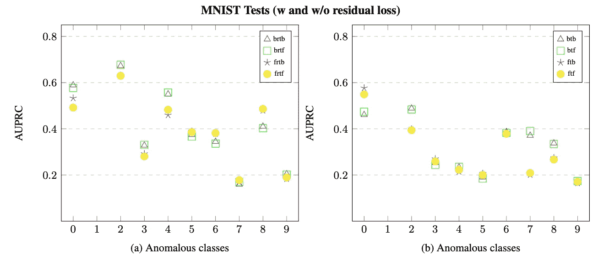

MNIST 数据集的甘比/埃格巴德架构测试结果

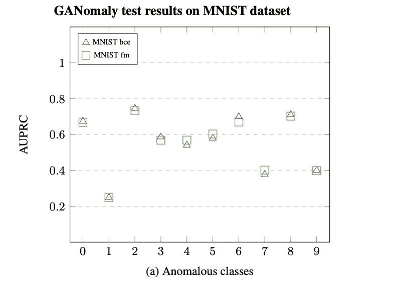

MNIST 数据集的 GANomaly 架构测试结果

# **6。结论**

实现了基于 GANs 的最新异常检测算法。这允许使用基于 GAN 的方法来验证异常检测的有效性，同时还强调了原始论文和公开可用代码之间的差异。此外，该调查旨在为开箱即用的异常检测工具包提供一个模块化的现成解决方案。

# **7。参考文献**

【https://arxiv.org/pdf/1906.11632.pdf 

[https://github.com/tSchlegl/f-AnoGAN](https://github.com/tSchlegl/f-AnoGAN)

[https://arxiv.org/pdf/1411.1784.pdf](https://arxiv.org/pdf/1411.1784.pdf)

https://openreview.net/pdf?id=S1EfylZ0Z

【https://arxiv.org/pdf/1805.06725.pdf 

[https://developers . Google . com/machine-learning/gan/generator](https://developers.google.com/machine-learning/gan/generator)

[https://developers . Google . com/machine-learning/gan/discriminator](https://developers.google.com/machine-learning/gan/discriminator)

[https://arxiv.org/abs/1606.03498](https://arxiv.org/abs/1606.03498)

[https://arxiv.org/abs/1802.06222](https://arxiv.org/abs/1802.06222)

[http://papers . nips . cc/paper/5423-generative-adversarial-nets . pdf](http://papers.nips.cc/paper/5423-generative-adversarial-nets.pdf)