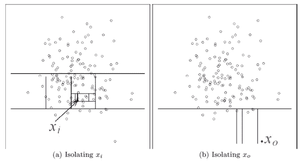
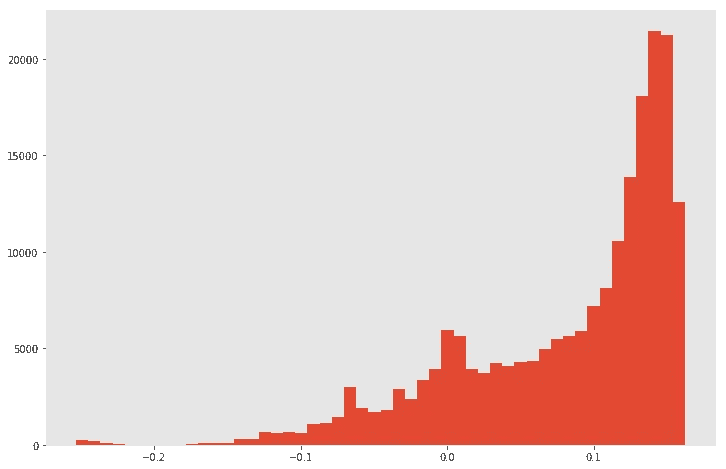

# 基于隔离森林算法的异常检测

> 原文：<https://medium.com/analytics-vidhya/anomaly-detection-using-isolation-forest-algorithm-8cf36c38d6f7?source=collection_archive---------5----------------------->

让我们从一个简单的游戏开始——“找出怪人”。我会给你看一张图片，你必须识别出图片中的奇怪物体。

准备好了吗？


找出古怪的人

那一定很容易。绿柠檬是独一无二的。
让我们试试下一个:


找出奇怪的人。

我敢打赌，这会更困难。

你可能需要更多的时间来识别闭上嘴的表情符号。

这个古怪的人只不过是一个与众不同的异类。对于较小的数据集，我们在识别异常时不会遇到困难，但是当规模增大时，人和机器在识别该异常时都会遇到困难。

# 什么是异常，如何识别异常？

**异常**是数量少且不同的数据点。它有一个模式，看起来与正常数据点有不同的特征。

*异常情况示例:*
1)欺诈性使用信用卡通常会被视为异常情况，因为欺诈者可能会尝试在新的商户进行交易或进行高额交易。
2)对计算机网络的攻击等

**检测异常的方法:**

检测异常的三种基本方法基于:

1.  密度
2.  距离
3.  孤立。

我们将在下面详细讨论它们。

# 基于密度和距离的方法

使用密度和距离的基本方法的用于异常检测的大多数现有方法如下:
1)复制器神经网络(RNN)——它是具有前馈多层感知器的神经网络，其训练网络相对良好地复制看不见的正常实例。在 RNN，那些重建很差的被视为异常。
2)一类 SVM-它找到包含大多数正常数据点的最小区域，该区域之外的点被视为异常。
3)基于聚类的方法，构建正常实例的简档，然后将异常识别为不符合正常简档的那些。

# **密度和距离测量异常检测的假设:**

对于密度测量，“正常点出现在密集区域，而异常点出现在稀疏区域”。例如:RNN 和一等 SVM
对于距离的度量，“正常点靠近其邻居，异常点远离其邻居”。例如:基于聚类的方法。

然而，它们的异常检测能力通常是算法的“副作用”或副产品，该算法最初被设计用于除异常检测之外的目的，导致如下的缺点:
a)太多的错误警报
例如:将正常实例识别为异常或检测到太少的异常。
b)许多现有方法受限于低维数据和小数据量
，因为它们的原始算法存在遗留问题。

此外，在密度和距离测量异常检测的假设中存在违规，例如，高密度和短距离并不总是意味着正常情况；同样，低密度和长距离并不总是意味着异常。

为了解决密度和距离测量异常检测的缺点，我们有隔离森林。

# 隔离森林

让我们详细了解什么是隔离林，以及它如何有助于识别异常。

**隔离:**术语隔离的意思是“将一个实例与其余的实例分离开来”。因为异常是“少数和不同的”,因此它们更容易被隔离。

**什么是隔离林？** 隔离林通过随机选择一个特征，然后随机选择所选特征的最大值和最小值之间的分割值来“隔离”观察值。

这是一种无监督算法，因此不需要标签来识别异常值/异常值。

它遵循以下步骤:

1.  对数据进行随机递归划分，表示为一棵树(随机森林)。这是用户定义子样本参数和树数的训练阶段。
2.  一旦数据的递归划分完成，就到达了树的末尾。预计到达异常值所需的距离远小于正常数据所需的距离(见图)。
3.  路径的距离被平均和标准化以计算异常分数。
4.  异常值的判断是基于分数进行的。

下面是同样的数字:



Isolation Forest 纯粹基于隔离概念检测异常
,而不采用任何距离或密度测量，这与所有现有方法完全不同。

隔离林利用子采样来实现较低的线性时间复杂度和较小的内存需求。以处理淹没效应和掩蔽效应。

它利用了异常的两个定量属性:
1)它们是由少数实例组成的少数群体
2)它们具有与正常实例非常不同的属性值。
换句话说，异常是“少数和不同的”，这使得它们更容易受到我们称为隔离的机制的影响。

隔离森林为给定的数据集建立隔离树的集合，异常是那些在隔离树上具有短平均路径长度的实例。接近 1 的分数被认为是正常的，而接近 0 的分数被认为是异常的。
隔离森林具有线性时间复杂度，常数小，内存需求最小。
隔离林是专门为异常检测而建立的。

到目前为止，您可能已经很好地理解了隔离森林及其相对于其他基于距离和密度的算法的优势。

让我们使用 python 中的隔离森林来识别异常。

**数据描述:** 我们使用的数据集是 1999 年 KDDCUP 的 Http [数据集](http://kdd.ics.uci.edu/databases/kddcup99/kddcup99.html)。
该数据集包含来自七周网络流量的 623091 条 HTTP 连接记录。
数据集已经过预处理，包含 41 个独立 TCP 连接特征、内容特征和流量特征。
每个连接被标记为正常或攻击，只有一种特定的攻击类型。

**问题定义:** 是识别连接，是正常还是攻击。

# **Python 代码:**

```
# Loading respective Library FIle 
import pandas as pd
import numpy as np
import matplotlib.pyplot as plt
plt.style.use(“ggplot”)
%matplotlib inline# Loading respective Library FIle 
import pandas as pd
import numpy as np
import matplotlib.pyplot as plt
plt.style.use(“ggplot”)
%matplotlib inline# Loading DATA
cols = [“duration”, “protocol_type”, “service”, “flag”, “src_bytes”, “dst_bytes”, “land”, “wrong_fragment”, “urgent”,
 “hot”, “num_failed_logins”, “logged_in”, “num_compromised”, “root_shell”, “su_attempted”, “num_root”, 
 “num_file_creations”, “num_shells”, “num_access_files”, “num_outbound_cmds”, “is_host_login”,
 “is_guest_login”, “count”, “srv_count”, “serror_rate”, “srv_serror_rate”, “rerror_rate”, “srv_rerror_rate”,
 “same_srv_rate”, “diff_srv_rate”, “srv_diff_host_rate”, “dst_host_count”, “dst_host_srv_count”, 
 “dst_host_same_srv_rate”, “dst_host_diff_srv_rate”, “dst_host_same_src_port_rate”, “dst_host_srv_diff_host_rate”,
 “dst_host_serror_rate”, “dst_host_srv_serror_rate”, “dst_host_rerror_rate”, “dst_host_srv_rerror_rate”]
kdd_data = pd.read_csv(“…./Issolation_forest_data/kddcup.data/kddcup.data.corrected”, sep=”,”, names=cols + [“label”], index_col=None)#Viewing The data.
kdd_data.head()# Dropping unwanted variable
kdd_data = kdd_data[kdd_data[“service”] == “http”]
kdd_data = kdd_data.drop(“service”, axis=1)
cols.remove(“service”)
kdd_data.shape
```

输出:

```
(623091, 41)## Encoding the categorical column 
from sklearn.preprocessing import LabelEncoder
encs = dict()
kdd_data_1 = kdd_data.copy() #.sample(frac=1)
for c in kdd_data_1.columns:
 if kdd_data_1[c].dtype == “object”:
 encs[c] = LabelEncoder()
 kdd_data_1[c] = encs[c].fit_transform(kdd_data_1[c])#### Implementing Isolation forest 
from sklearn.ensemble import IsolationForest
#### Spliting the data into Train, Test and validation dataset 
X_train, y_train = kdd_data_1[cols][:300000], kdd_data_1[“label”][:300000].values
X_valid, y_valid = kdd_data_1[cols][300000:500000], kdd_data_1[“label”][300000:500000].values
X_test, y_test = kdd_data_1[cols][500000:], kdd_data_1[“label”][500000:].values
```

隔离林参数: **n_estimators:** 要使用的树木数量。论文建议了 100 棵树，因为路径长度通常在此之前就收敛了。
max_samples:构建单棵树时要绘制的样本数。该参数在本文中被称为子采样，他们建议 **max_samples** =256，因为它通常提供足够的细节来跨大范围的数据执行异常检测。
**污染:**数据集的污染量，即数据集中离群点的比例。在拟合以定义决策函数的阈值时使用。稍后我会告诉你如何挑选这个门槛。

```
### Building isolation forest 
iso_Forest = IsolationForest(n_estimators=100, max_samples=256, contamination=0.2, random_state=2018)## Fitting the model 
iso_Forest.fit(X_train)#### Ploting the graph to identify the anomolie score .
plt.figure(figsize=(12, 8))
plt.hist(scores, bins=50);
```



```
From the plot we clearly get the cluster under -0.2\. Hence we can consider average path lengths shorter than -0.2 as anomalies.from sklearn.metrics import roc_auc_score
print(“AUC: {:.1%}”.format(roc_auc_score((-0.2 < scores), y_valid == list(encs[“label”].classes_).index(“normal.”))))
```

**输出:**

```
AUC: 99.0%
```

挺好的。现在让我们检查测试数据集。

```
### getting score for test 
scores_test = iso_Forest.decision_function(X_test)
print(“AUC: {:.1%}”.format(roc_auc_score((-0.2 < scores_test),
 y_test == list(encs[“label”].classes_).index(“normal.”))))
```

**输出:**

```
AUC: 99.3%
```

它在识别测试数据集上的异常时也给了我们很好的准确性。

现在，我们能够使用 python 中的隔离林成功地实现异常检测。