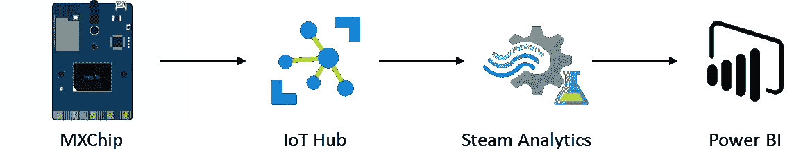

# 使用 Azure 流分析进行异常检测

> 原文：<https://medium.com/analytics-vidhya/anomaly-detection-with-azure-stream-analytics-bdb0cf1e07f2?source=collection_archive---------4----------------------->

在这篇文章中，我将向你展示如何在你的实时数据流中实现异常检测，以及如何在 Power BI 中可视化。
我使用 MXChip 作为传感器，让它发送温度和湿度数据，但你可以自由使用任何其他设备来发送数据。

# 先决条件