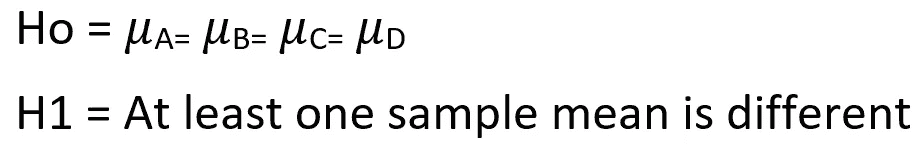
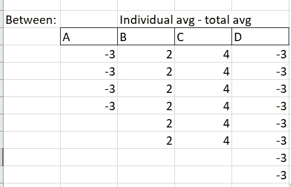
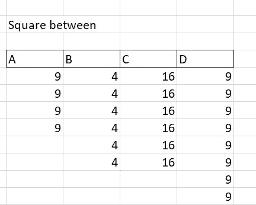

# 方差分析

> 原文：<https://medium.com/analytics-vidhya/anova-analysis-of-variance-6331b69fbb7a?source=collection_archive---------13----------------------->

诺亚·西利曼在 [Unsplash](https://unsplash.com?utm_source=medium&utm_medium=referral) 上的照片

它用于比较两个以上的平均值。

方差分析的假设是:

**为什么我们不能一次取两个样本进行 t 检验？**

如果我们应用双样本 t 检验，alpha()值将会改变。因此，为了保持整体α()，我们需要进行方差分析。这种机制被称为家族错误率。

A=>B，A=>D 等之间的比较称为个体差错率。

让我们用下面的例子来理解这一点？

你是一个农民，你需要决定买哪家公司的肥料。在我们的示例中，有四种品牌可供选择，它们在四个不同的地区使用。

**适用于 4 种性质相似的不同土地的肥料类型。**

无效假设是所有的肥料都是一样的。另一种假设认为至少有一种肥料是不同的。

在开始方差分析之前，让我们先讨论一些基础知识..

**方差分析的基本原理:**

1.  随机化:随机选取样本。
2.  背景误差控制或噪音控制:在施肥之前，我们需要确保所有的田地都有相同的条件。

示例:矿物(NPK) %必须相同

3.复制:通过改变样品来复制实验。

让我们在种植多种作物后用一些价值观来理解这一点:

**单位肥料产量**

a、B、C、D 是肥料，相应的数字是产量单位。

现在产量内的误差是:

**原始观察值—平均值**

**每次观察的误差**

**平方误差。**

如果你看到这些值，这就是方差。

差异

所以如果我们计算给定观测值的方差，应该是

10/4,40/6,14/6,48/8.

为了进行方差分析，我们需要一些假设:

1.  各组之间的误差方差应该是相同的。这个性质叫做**同质性**。

差异应该是相同的

2.误差应该正态分布为 0 和 sigma 平方。

假设，让我们继续计算方差分析:

如果没有肥料的影响，那么理想情况下，我们应该得到所有观测值的整体平均值:

**总平均/总平均**

**间错误**

这些误差通过用总平均值减去单个平均值来计算。

分别是 61-64，66- 64，68-64，61-64。

现在平方之间的误差:

**误差平方之间**

噪声/偏差范围内的总平方:112

在偏差范围内

总偏差:228

偏差之间

总计= 112 + 228 = 340

我们来计算一下总体误差:(个别观察—总体平均)

例如:62 -64 等。

**整体误差**

**总体平方误差**

总误差平方和为:340

从这个观察中，我们可以得出结论，总偏差数据可以用误差之间和误差之内的总和来解释。

**注:误差范围内不能以任何方式处理。误差是可控的。**

有了所有的知识，让我们生成方差分析表。

现在是理解表格的时候了:

在上面已经讨论过的组之间和组内。

总自由度为:观察总数-1 = = > 24–1 = 23

自由度范围=(4–1)+(6–1)+(6–1)+(8–1)= 20

自由度之间= 23–20 = 3，满足加性或处理次数-1 = = > 4–1 = 3

平均平方和(MS) = 228/3，112/20 ===> 76，5.6

Fcalc : 76/5.6 = 13.6

F 暴击:这个需要用 F 表计算。在我们的例子中，我们需要找到自由度(3，20)的值，即 3.09。

**显示自由度为 0.5 的 F cric 值和 Fcalc】**

**从上图可以清楚地看出，Fcric/Ftab 值小于 Fcalc 值，因此拒绝无效抵押(H0)。所以所有的肥料对田地的影响都不一样。**

**注意**:如果你注意到我们从比较平均值开始，但以比较方差结束。所以这种方法叫做方差分析，而不是均值分析。

**结论**:通过进行方差分析，我们知道所有的肥料并不相同。为了确定哪种肥料效果更好，我们需要使用 **Tukey 方法或**Dunnet 方法。这是目前无法讨论的😃。