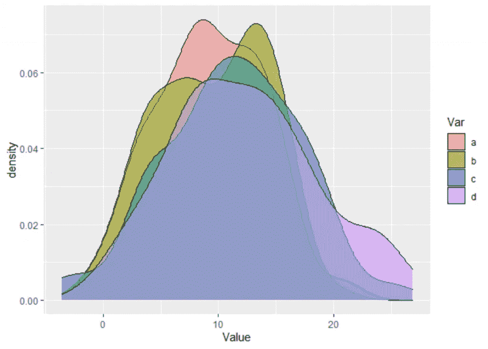

# 方差分析与多重比较

> 原文：<https://medium.com/analytics-vidhya/anova-vs-multiple-comparisons-6705750a0873?source=collection_archive---------7----------------------->

## 方差分析和多重比较之间的差异

[图片](https://predictivehacks.com/wp-content/uploads/2020/10/image-17.png)由预测黑客制作

 [## 用我的推荐链接加入媒体-乔治皮皮斯

### 阅读乔治·皮皮斯(以及媒体上成千上万的其他作家)的每一个故事。您的会员费直接支持…

jorgepit-14189.medium.com](https://jorgepit-14189.medium.com/membership)