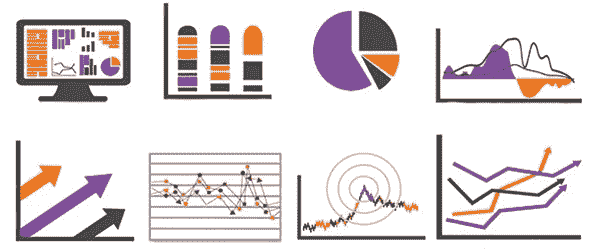
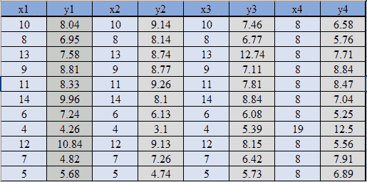
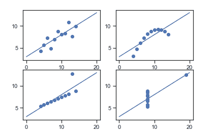
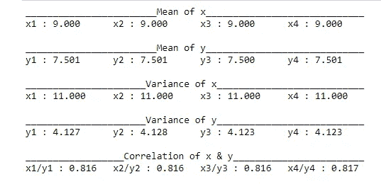

# Anscombe 的四重奏—数据可视化的重要性

> 原文：<https://medium.com/analytics-vidhya/anscombes-quartet-an-importance-of-data-visualization-856b3d1bd403?source=collection_archive---------4----------------------->

通常人们相信“数字计算是精确的，但是图表是粗糙的”，尽管这是完全错误的。甚至在学习数据分析之前，我对它的看法也不对。

如果你是数据科学或其子领域的新手，相信我，这是理解数据可视化和统计结果重要性的第一步。

图片来自谷歌

***安斯科姆的四重奏*** 是展示数据可视化重要性的典型例子，它由统计学家 ***弗朗西斯·安斯科姆*** 于 1973 年开发，以表明在用统计特性分析数据之前绘制数据的重要性。它由四个数据集组成，每个数据集由十一个(x，y)点组成。对这些数据集进行分析的基本要素是，它们都共享相同的描述性统计数据(均值、方差、标准差等)，但具有不同的图形表示。每个图表显示了与统计分析无关的不同行为。

*四个数据集*

对上述数据集应用统计公式，

> *x = 9 的平均值*
> 
> *y 的平均值= 7.50*
> 
> *x = 11 的方差*
> 
> *y = 4.12 的方差*
> 
> *相关系数= 0.816*
> 
> *线性回归方程:y = 0.5 x + 3*

然而，这四个数据集的统计分析非常相似。但是当我们在 x & y 坐标平面上绘制这四个数据集时，我们会得到以下结果&每个图形视图代表不同的行为。

*安斯科姆四重奏的图示*

*   数据集 I——由一组(x，y)点组成，这些点代表一种具有一定差异的线性关系。
*   数据集 II —显示曲线形状，但不显示线性关系(可能是二次曲线？).
*   数据集 III——看起来在 *x* 和 *y* 之间有紧密的线性关系，除了一个大的异常值。
*   数据集 IV——看起来, *x* 的值保持不变，除了一个异常值。

**GitHub 上的 Python 代码！**

 [## 穆罕默德-奥斯曼-108/安斯科姆斯-四重奏

### 数据可视化的重要性分析安斯科姆的《四重奏》就是一个典型的例子，说明了数据可视化的重要性

github.com](https://github.com/muhammad-usman-108/Anscombes-Quartet) 

Python 代码的输出

数据集在许多统计特性上是相同的，但产生不同的图形，在探索数据时经常被用来说明图形表示的重要性。这并不是说汇总统计是无用的。他们只是在误导自己。在更大的数据分析过程中，将这些作为一个工具来使用是很重要的。可视化我们的数据允许我们重新访问我们的汇总统计数据，并根据需要重新将它们放到上下文中。

“视觉化给你一些你不知道的问题的答案。”——[***本施耐德***](https://www.cs.umd.edu/users/ben/)

参考研究论文:[https://www.autodeskresearch.com/publications/samestats](https://www.autodeskresearch.com/publications/samestats)