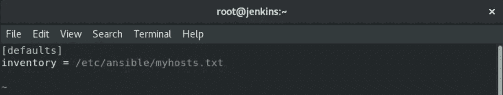

# RedHat8 上的可行安装

> 原文：<https://medium.com/analytics-vidhya/ansible-installation-on-redhat8-d1d4a7f60ada?source=collection_archive---------17----------------------->


# 介绍

由于现代应用程序环境的一次性本质，服务器自动化现在在系统管理中扮演着重要的角色。诸如 [**Ansible**](https://ansible.com/) 之类的配置管理工具通常用于通过为新服务器建立标准程序来简化自动化服务器设置的过程，同时减少与手动设置相关联的人为错误。

nsible 提供了一个简单的架构，不需要在节点上安装特殊的软件。它还提供了一组健壮的特性和内置模块，有助于编写自动化脚本。

与 Puppet、Chef 和 Salt 等类似工具相比，Ansible 是首选的配置工具，因为它不需要代理，并且可以在 SSH 和 python 上工作。

# Ansible 实验室详情

*   具有互联网连接的 RHEL 8 服务器。
*   一个可转换的节点(CLI 或 GUI)。

# Ansible 的安装

我们将使用 [**pip**](https://pip.pypa.io/en/stable/) **(python 的包管理器)**安装 Ansible，在这种情况下，我们首先需要安装 python3 及其 pip3 包。

```
sudo yum install python36 -y
```

安装 python3 后，运行以下命令检查其版本


python 版本

现在，使用 pip3 安装 Ansible。

```
pip3 install ansible
```


可行的安装

安装后，检查版本


可翻译版本

至此，我们的 ansible 安装成功。

# 如何使用 Ansible 自动化工具？

当我们使用 yum 或 dnf 命令安装 Ansible 时，它的配置文件、清单文件和角色目录会自动创建在/etc/ansible 文件夹下。但是当使用 pip3 作为安装程序时，我们必须配置一切。

首先创建一个可解析的文件夹。

```
sudo mkdir /etc/ansible
```

现在创建用于存储 IP 的清单文件。

```
vim /etc/ansible/myhost.txt
```


主机清单

您可以创建任何 ***。txt** 文件，但它应该只在/etc/ansible 中。

另外，**【web】**通过设置这个，我们可以创建主机组，在这些主机组下，我们可以放置尽可能多的 IP。当我们必须在许多主机 IP 中做类似的任务时，主机组是非常必要的。

在这里， **ansible_ssh_user=****** 给你要连接的用户和它的密码 **ansible_ssh_pass=***** 。

正在检查主机 IP 列表。


IP 列表

为了与节点连接，我们将使用 **ssh** 协议。

```
sudo yum install sshpass -y
```

现在，创建 ansible 的主配置文件，从这里它将了解它的受管节点。

```
vim /etc/ansible/ansible.cfg
```



配置文件

最后，整个配置完成。检查每件事都做对了。

```
ansible all -m pingor

ansible (node IP) -m pingor ansible (nodehost) -m ping
```


最终输出

> 注意:-如果使用 **CLI 管理节点**，则必须在**配置文件(/etc/ansible/ansible.cfg)** 中多添加一条命令。

```
host_key_checking = False
```

# 结论

自动化基础架构设置不仅可以节省您的时间，还有助于确保您的服务器遵循可根据您的需求定制的标准配置。随着现代应用程序的分布式本质和不同阶段环境之间一致性的需要，像这样的自动化已经成为许多团队开发过程中的核心组件。

所以，这就是如何在 **Redhat8( rhel8)** 中设置 **Ansible** 。所以，请继续关注 **Ansible** world 的更多精彩文章。

## 掌声和评论是最受欢迎的。

谢谢你。