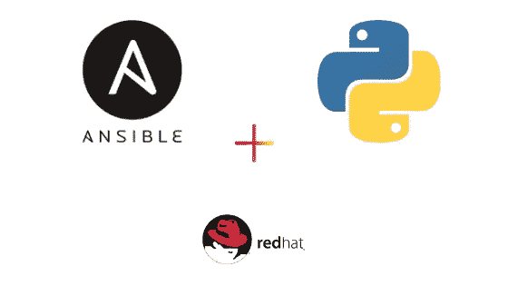

# Ansible + Python =自动化 RPM

> 原文：<https://medium.com/analytics-vidhya/ansible-python-automated-rpms-d892598d07f7?source=collection_archive---------6----------------------->

Ansible + Python + RPM

# 前言/免责声明

下面的内容是由需求而非设计驱动的项目结果，因此，把它当作一个程序性的头脑风暴，而不是一个教程！(尽管确实有效！).

# 你需要什么

为此，您需要具备以下条件: