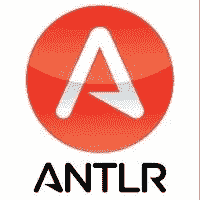

# ANTLR 和代码生成

> 原文：<https://medium.com/analytics-vidhya/antlr-and-code-generation-a71ead442005?source=collection_archive---------3----------------------->

在这一点上，驱动每一种现代编程语言的写作风格的思想是使用编译器设计的概念来定义的。这是一套典型的步骤，从**词汇**、**句法**和**语义分析**开始(确定一个人应该如何用你的语言写作的基础，以便可以被识别)。接下来是一组非常有趣的步骤**中间代码生成**、**优化**和**目标代码生成。**


# 编译器设计步骤？分析？扑朔迷离？我们是在写编程语言吗？号码

**ANTLR** 是**AN**other**T**ool for**L**language**R**ecognition 的缩写，是一个**功能强大的**解析器生成器框架，用于从语法文件构建语言识别器、编译器和翻译器，这些语法文件包含从源语言到目标语言的每个语句要执行的操作。



[www.antlr.org](https://www.antlr.org/)

目前在 4.7 版本中，它提供了一种方便且开发人员友好的方式来定义您自己的规则集，也称为**语法**，由一系列标记和动作组成，这些标记和动作定义了一个语句应该如何用您的源语言编写，以便它可以被正确地识别和解析。更有趣的是，它允许用户操作代码并将其生成目标代码的能力，所有这些都是以您选择的语言进行的。

在我们开始之前，有人可能会问，这有多成熟？对你喜欢的语言的支持呢？

# 有哪些可能的目标语言？

*   Ada，Action Script，C，C#，C#3，D，Java，JavaScript，Python，Ruby，Perl，Perl6，PHP，Oberon，Scala…你不想让我再点名了吧？

# 那么，谁在使用 ANTLR 呢？

*   编程语言:Boo，Groovy，Mantra，Nemerle，XRuby 等。
*   其他工具、框架:Apache Spark、Hibernate、Intellij IDEA、Jazillian、JBoss Rules、Keynote(Apple)、WebLogic(Oracle)等。

# 基础知识

Python 中的 Sum 函数

考虑上面的 Python 示例，这些编译器设计步骤从一种方法开始，该方法识别用 Python 编写的每个语句(源代码)的基本单元，并将其分解成一个令牌流，每个令牌被识别或映射到一个特定的类型，也称为**词法分析**。


python 函数的词法分析产生了一个令牌流

随后，根据这些标记出现的顺序识别书面陈述的上下文，并通过构建树(或通过语义分析**的**A**bstract**S**yntax**T**REE】来检查其正确性**提供了使用一种现有的树遍历方法进行遍历的能力。


语义分析后的语法树

# **TLDR？**

*   Lexer:将字符流转换为标记流。
*   解析器:令牌的处理，可能创建 AST。
*   抽象语法树(AST):已解析输入的中间树表示，比令牌流更容易处理。它也可以被多次处理。
*   树解析器:它处理 AST。
*   String Template:这个库支持使用带有占位符的模板来输出文本(ANTLR 特有的)。

ANTLR 是一个 **LL 解析器**(从左到右，最左边的派生)是一个[自顶向下解析器](https://en.wikipedia.org/wiki/Top-down_parsing)，用于[上下文无关语言](https://en.wikipedia.org/wiki/Context-free_languages)的子集。它从 **L** eft 向右解析输入，执行句子的[Left most 派生](https://en.wikipedia.org/wiki/Context-free_grammar#Derivations_and_syntax_trees)。它简化了许多步骤，使得创建语言识别器和解析器更加容易和方便。

这里有一个我为解析 python 函数而编写的解析器的简单例子。

其中一个主要的优点是它让用户拥有相同的词法和语法分析语法。然而，这里的区别因素是在语法层面上，是命名约定，其中以**大写字母**开头的规则是 lexer 规则。其他的都是解析规则。这花了我一些时间来适应，但是一旦用户熟悉了，这个想法就很方便了。


上述 python 函数解析的 ANTLR 插件(在 Intellij IDEA 上)输出

一旦定义完毕， [complete ANLTR jar](https://www.antlr.org/download/antlr-4.8-complete.jar) 文件提供了用您喜欢的编程语言代码生成一组文件的选项，也就是一个**解析器**。

```
java -Xmx500M -cp <path to ANTLR complete JAR> org.antlr.v4.Tool -Dlanguage=<target_language> PythonParserExample.g4
```

因为我使用 Python3 作为要生成的解析器的目标，所以 ANTLR 的配置生成了 3 个 Python 文件，这些文件可以作为代码翻译过程的一部分，用于将一种语言的源代码转换成另一种语言。


ANTLR 运行时输出文件包含用于识别 python 函数的代码

在接下来的系列文章中，我将创建一个简单的 ANTLR 解析器，用于将简单的布尔表达式转换成相应的 python 代码。