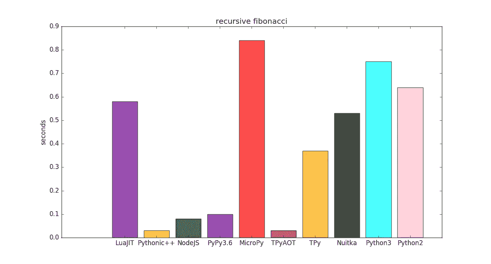
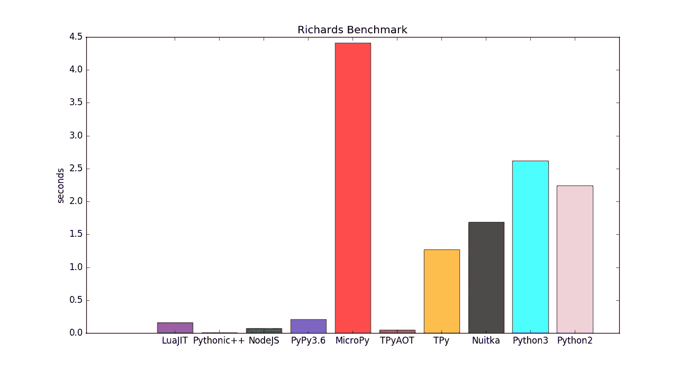

# Aotpy 比 Python 快 52 倍

> 原文：<https://medium.com/analytics-vidhya/aotpy-52x-faster-than-python-2bda98ab5e57?source=collection_archive---------10----------------------->



aotpy.py 构建脚本将尝试提前编译您的 python 脚本。它生成一个新的 TPython 解释器，链接到您编译的 AOT 模块中。



Richards benchmark AOT 兼容版本源代码 [richards_AOT.py](https://gitlab.com/hartsantler/tpythonpp/blob/master/benchmarks/richards_AOT.py)

# 过敏症

[aotpy.py](https://gitlab.com/hartsantler/tpythonpp/blob/master/aotpy.py) 默认使用 Clang 和 PGO (profile guided optimization)。对于 Richards 基准测试，最终优化的构建比 Python3 快 52 倍，比 PyPy 快 4 倍。

示例:

`./atopy.py myscript.py`

上面将最终的可执行文件保存到`/tmp/myscript.py.bin`

AOT 只支持 python 的一个静态子集，所有的类必须有唯一的成员和方法名，这样它们才能在一个[联合](https://en.wikipedia.org/wiki/Union_type)中兼容。

你可以选择使用`#AOT begin`和`#AOT end`来标记你的代码块为 AOT 兼容。

## 特应性 vs 努卡塔

Nuikta 对 Richards 的翻译产生了 25400 行 C 代码。 [Atopy.py](https://gitlab.com/hartsantler/tpythonpp/blob/master/aotpy.py) 只输出 613 行 C++。

```
def isHoldWait(self):
  return self.tskholding or ((not self.pktpending) and self.tskwaiting)
```

Aotpy 将函数`isHoldWait`翻译成 3 行代码。特应性翻译:

```
tp_obj isHoldWait() {
   return this->tskholding or ((not this->pktpending) and this->tskwaiting);
  return None;}// end of function: isHoldWait
```

函数`isHoldWait`由 [Nuitka](https://github.com/Nuitka/Nuitka) 翻译成 220 行代码。努特卡语翻译:

```
static PyObject *impl___main__$$$function_17_isHoldWait(struct Nuitka_FunctionObject const *self, PyObject **python_pars) {
    // Preserve error status for checks
#ifndef __NUITKA_NO_ASSERT__
    NUITKA_MAY_BE_UNUSED bool had_error = ERROR_OCCURRED();
#endif// Local variable declarations.
    PyObject *par_self = python_pars[0];
    struct Nuitka_FrameObject *frame_cb2ffef26946a1662d24a216157d24ee;
    NUITKA_MAY_BE_UNUSED char const *type_description_1 = NULL;
    PyObject *tmp_return_value = NULL;
    PyObject *exception_type = NULL;
    PyObject *exception_value = NULL;
    PyTracebackObject *exception_tb = NULL;
    NUITKA_MAY_BE_UNUSED int exception_lineno = 0;
    int tmp_res;
    static struct Nuitka_FrameObject *cache_frame_cb2ffef26946a1662d24a216157d24ee = NULL;// Actual function body.
    MAKE_OR_REUSE_FRAME(cache_frame_cb2ffef26946a1662d24a216157d24ee, codeobj_cb2ffef26946a1662d24a216157d24ee, module___main__, sizeof(void *));
    frame_cb2ffef26946a1662d24a216157d24ee = cache_frame_cb2ffef26946a1662d24a216157d24ee;// Push the new frame as the currently active one.
    pushFrameStack(frame_cb2ffef26946a1662d24a216157d24ee);// Mark the frame object as in use, ref count 1 will be up for reuse.
    assert(Py_REFCNT(frame_cb2ffef26946a1662d24a216157d24ee) == 2); // Frame stack// Framed code:
    {
        int tmp_or_left_truth_1;
        PyObject *tmp_or_left_value_1;
        PyObject *tmp_or_right_value_1;
        PyObject *tmp_source_name_1;
        int tmp_and_left_truth_1;
        PyObject *tmp_and_left_value_1;
        PyObject *tmp_and_right_value_1;
        PyObject *tmp_operand_name_1;
        PyObject *tmp_source_name_2;
        PyObject *tmp_source_name_3;
        CHECK_OBJECT(par_self);
        tmp_source_name_1 = par_self;
        tmp_or_left_value_1 = LOOKUP_ATTRIBUTE(tmp_source_name_1, const_str_plain_tskholding);
        if (tmp_or_left_value_1 == NULL) {
            assert(ERROR_OCCURRED());FETCH_ERROR_OCCURRED(&exception_type, &exception_value, &exception_tb);exception_lineno = 114;
            type_description_1 = "o";
            goto frame_exception_exit_1;
        }
        tmp_or_left_truth_1 = CHECK_IF_TRUE(tmp_or_left_value_1);
        if (tmp_or_left_truth_1 == -1) {
            assert(ERROR_OCCURRED());FETCH_ERROR_OCCURRED(&exception_type, &exception_value, &exception_tb);
            Py_DECREF(tmp_or_left_value_1);exception_lineno = 114;
            type_description_1 = "o";
            goto frame_exception_exit_1;
        }
        if (tmp_or_left_truth_1 == 1) {
            goto or_left_1;
        } else {
            goto or_right_1;
        }
        or_right_1:;
        Py_DECREF(tmp_or_left_value_1);
        CHECK_OBJECT(par_self);
        tmp_source_name_2 = par_self;
        tmp_operand_name_1 = LOOKUP_ATTRIBUTE(tmp_source_name_2, const_str_plain_pktpending);
        if (tmp_operand_name_1 == NULL) {
            assert(ERROR_OCCURRED());FETCH_ERROR_OCCURRED(&exception_type, &exception_value, &exception_tb);exception_lineno = 114;
            type_description_1 = "o";
            goto frame_exception_exit_1;
        }
        tmp_res = CHECK_IF_TRUE(tmp_operand_name_1);
        Py_DECREF(tmp_operand_name_1);
        if (tmp_res == -1) {
            assert(ERROR_OCCURRED());FETCH_ERROR_OCCURRED(&exception_type, &exception_value, &exception_tb);exception_lineno = 114;
            type_description_1 = "o";
            goto frame_exception_exit_1;
        }
        tmp_and_left_value_1 = (tmp_res == 0) ? Py_True : Py_False;
        tmp_and_left_truth_1 = CHECK_IF_TRUE(tmp_and_left_value_1);
        if (tmp_and_left_truth_1 == -1) {
            assert(ERROR_OCCURRED());FETCH_ERROR_OCCURRED(&exception_type, &exception_value, &exception_tb);exception_lineno = 114;
            type_description_1 = "o";
            goto frame_exception_exit_1;
        }
        if (tmp_and_left_truth_1 == 1) {
            goto and_right_1;
        } else {
            goto and_left_1;
        }
        and_right_1:;
        CHECK_OBJECT(par_self);
        tmp_source_name_3 = par_self;
        tmp_and_right_value_1 = LOOKUP_ATTRIBUTE(tmp_source_name_3, const_str_plain_tskwaiting);
        if (tmp_and_right_value_1 == NULL) {
            assert(ERROR_OCCURRED());FETCH_ERROR_OCCURRED(&exception_type, &exception_value, &exception_tb);exception_lineno = 114;
            type_description_1 = "o";
            goto frame_exception_exit_1;
        }
        tmp_or_right_value_1 = tmp_and_right_value_1;
        goto and_end_1;
        and_left_1:;
        Py_INCREF(tmp_and_left_value_1);
        tmp_or_right_value_1 = tmp_and_left_value_1;
        and_end_1:;
        tmp_return_value = tmp_or_right_value_1;
        goto or_end_1;
        or_left_1:;
        tmp_return_value = tmp_or_left_value_1;
        or_end_1:;
        goto frame_return_exit_1;
    }#if 0
    RESTORE_FRAME_EXCEPTION(frame_cb2ffef26946a1662d24a216157d24ee);
#endif// Put the previous frame back on top.
    popFrameStack();goto frame_no_exception_1;frame_return_exit_1:;
#if 0
    RESTORE_FRAME_EXCEPTION(frame_cb2ffef26946a1662d24a216157d24ee);
#endif// Put the previous frame back on top.
    popFrameStack();goto function_return_exit;frame_exception_exit_1:;#if 0
    RESTORE_FRAME_EXCEPTION(frame_cb2ffef26946a1662d24a216157d24ee);
#endifif (exception_tb == NULL) {
        exception_tb = MAKE_TRACEBACK(frame_cb2ffef26946a1662d24a216157d24ee, exception_lineno);
    }
    else if (exception_tb->tb_frame != &frame_cb2ffef26946a1662d24a216157d24ee->m_frame) {
        exception_tb = ADD_TRACEBACK(exception_tb, frame_cb2ffef26946a1662d24a216157d24ee, exception_lineno);
    }// Attachs locals to frame if any.
    Nuitka_Frame_AttachLocals(
        (struct Nuitka_FrameObject *)frame_cb2ffef26946a1662d24a216157d24ee,
        type_description_1,
        par_self
    );// Release cached frame.
    if (frame_cb2ffef26946a1662d24a216157d24ee == cache_frame_cb2ffef26946a1662d24a216157d24ee) {
        Py_DECREF(frame_cb2ffef26946a1662d24a216157d24ee);
    }
    cache_frame_cb2ffef26946a1662d24a216157d24ee = NULL;assertFrameObject(frame_cb2ffef26946a1662d24a216157d24ee);// Put the previous frame back on top.
    popFrameStack();// Return the error.
    goto function_exception_exit;frame_no_exception_1:;// Return statement must have exited already.
    NUITKA_CANNOT_GET_HERE(__main__$$$function_17_isHoldWait);
    return NULL;function_exception_exit:
    CHECK_OBJECT(par_self);
    Py_DECREF(par_self);    assert(exception_type);
    RESTORE_ERROR_OCCURRED(exception_type, exception_value, exception_tb);return NULL;function_return_exit:
   // Function cleanup code if any.
    CHECK_OBJECT(par_self);
    Py_DECREF(par_self);// Actual function exit with return value, making sure we did not make
   // the error status worse despite non-NULL return.
   CHECK_OBJECT(tmp_return_value);
   assert(had_error || !ERROR_OCCURRED());
   return tmp_return_value;
}
```