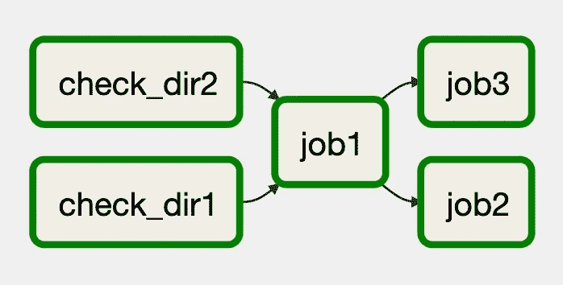
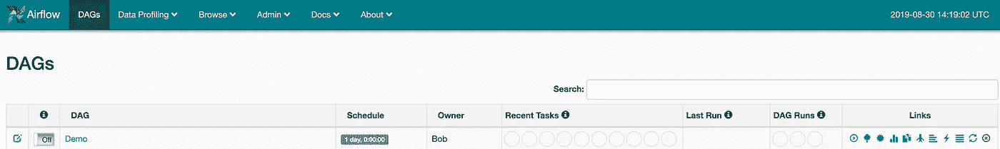
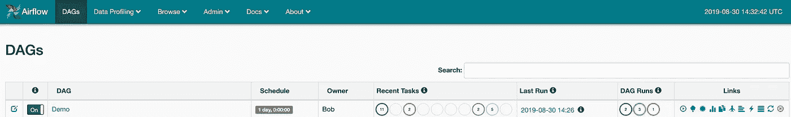
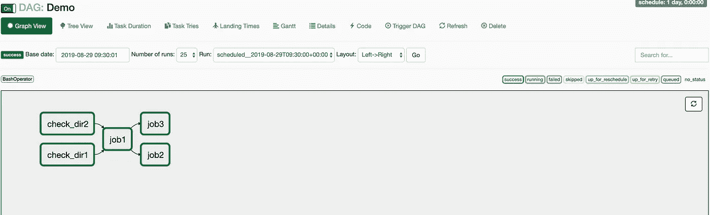

# 阿帕奇气流:一个真实的用例

> 原文：<https://medium.com/analytics-vidhya/apache-airflow-a-real-life-use-case-faf3b2439e86?source=collection_archive---------1----------------------->

## 在这篇文章中，我将指导你如何为一个实际的用例编写一个气流调度器。


# **概述**

一个 irflow 是一个简单的工具，让我们以编程方式安排和监控我们的工作流程。当处理复杂的管道时，其中许多部分相互依赖，使用 Airflow 可以帮助我们用 Python 和 WebUI 编写一个清晰的调度程序，以可视化管道，监控进度并在需要时解决问题。

# 现实生活中的例子

理解气流力量的最好方法是编写一个简单的管道调度程序。Airflow 的一个常见用例是定期检查当前文件目录，并基于这些目录运行 bash 作业。在这篇文章中，我将编写一个气流调度程序，它检查 HDFS 目录并根据现有的 HDFS 文件运行简单的 bash 作业。高层管道如下图所示:



管道概述

如您所见，首先我们将尝试检查今天的**目录 1** 和**目录 2** ，如果其中一个不存在(由于一些失败的作业、损坏的数据……)，我们将获得昨天的目录。对于**作业 2** 和**作业 3** ，我们也有一个规则，它们依赖于**作业 1** 。因此，如果**作业 1** 失败，预期的结果是**作业 2** 和**作业 3** 也会失败。这是一种常见的管道模式，使用气流时很容易做到。

# 安装

有很多关于气流安装和故障排除的好资料。在这里，我只是简单地告诉你如何在你的本地机器上设置气流。

使用 **pip** 安装气流:

```
pip install apache-airflow
```

初始化气流数据库:

```
airflow initdb
```

启动 web 服务器:

```
airflow webserver -p 8080
```

运行调度程序:

```
airflow scheduler
```

如果全部运行成功，您可以通过: [http://localhost:8080/](http://localhost:8080/) 查看 Airflow UI

# 好了，写吧！

首先，我们需要定义一组管道将使用的默认参数。因为我们的管道需要检查目录 1 和目录 2，所以我们也需要指定这些变量。幸运的是，

> Airflow 利用了 [Jinja 模板](http://jinja.pocoo.org/docs/dev/)的能力，并为管道作者提供了一组内置参数和宏。Airflow 还为管道作者提供了钩子来定义他们自己的参数、宏和模板。

我们是这样定义的:

定义默认参数

以下是每个参数的简要描述:

*   **所有者:**管道的所有者，这将显示在 webUI 上。
*   **depends_on_past:** 该管道是否依赖于过去的管道实例。因此，如果您过去的管道失败了，当前的管道将不会被触发。
*   **开始日期:**您管道的开始日期。
*   **邮件:**要通知的邮件。
*   **email_on_failure:** 指定当您的管道出现故障时将被通知的电子邮件。
*   **email_on_retry:** 重试时是否通知邮件。
*   **重试次数:**重试次数。
*   **catchup_by_default:** 如果您的开始日期是过去的日期，是否运行所有以前调度的管道。
*   **params:** 该管道的自定义参数，将由 [Jinja 模板](https://jinja.palletsprojects.com/en/master/)**{ { params . my _ param } }**访问。

对于 **build_params** 函数，该函数只是从 **yml** 文件中加载用户自定义变量。从 yml 文件加载变量是一个很好的做法:

从 yml 文件中读取用户定义的变量

因为我们需要决定是使用今天目录还是昨天目录，所以我们需要为每个目录指定两个变量(一个代表昨天，一个代表今天)。用于函数加载的文件很简单:

yml 文件

指定默认参数后，我们创建管道实例来调度我们的任务。在气流术语中，我们称之为 DAG:

> 一个`DAG`——或者一个有向无环图——是你想要运行的所有任务的集合，以一种反映它们的关系和依赖的方式组织。

我们是这样定义的:

定义 DAG

这里，我们希望通过使用 **schedule_interval** 参数来安排 DAG 每天运行。

接下来，我们写下每个作业将如何执行。具体来说，我们希望编写 2 个 bash 作业来检查 HDFS 目录，编写 3 个 bash 作业来运行 **job1、job2** 和 **job3** 。这里，bash 作业只是简单的命令，但是我们可以任意创建更复杂的作业:

Bash 工作函数

因为我们想把检查过的目录传递给 **job1** ，我们需要一些方法在操作者之间进行交叉通信。幸运的是，气流确实为我们提供了操作员交叉通信的功能，称为 **XCom** :

> x**com**让任务交换信息，允许更微妙的控制形式和共享状态。名字是“交叉传播”的缩写。XCom 主要由键、值和时间戳定义，但也跟踪属性，如创建 XCom 的任务/DAG 以及它何时应该可见。任何可以被 pickled 的对象都可以用作 XCom 值，所以用户应该确保使用大小合适的对象。

在这里的 **check_dir1** 和 **check_dir2** 函数中，我们回显了 **job1** 的目录，我们可以通过使用以下 Jinja 语法获得这些目录:

```
{{ ti.xcom_pull(task_ids='Your task ID here') }}
```

我们需要做的最后一件事是实例化 airflow 作业，并指定每个作业的顺序和依赖关系:

语法**【A，B】>>C**的意思是 C 将需要等待 A 和 B 结束后才能运行。你可以这样写的另一种方式是使用 **set_downstream** 函数: **A.set_downstream(B)** 意味着 A 需要在 B 可以运行之前完成。

每个 bash 作业实例都有一个触发规则，它指定了该作业运行所需的条件，在这段代码中，我们使用了两种类型的触发规则:

*   **all_done:** 无论成功与否，之前的所有操作都已经完成工作。
*   **all_success:** 之前的所有操作都已成功完成。

在创建了整个管道之后，您需要做的就是启动这个调度程序:

```
python scheduler_demo.py
```

**注意:**默认 DAG 目录为 **~/airflow/dags/** 。所以你所有的代码都应该在这个文件夹里。

您需要等待几分钟，然后登录到 [http://localhost:8080/](http://localhost:8080/) 来查看您的调度程序管道:



气流 UI

您可以通过点按播放图标来手动触发 DAG。您还可以监视您的调度程序进程，只需单击 **DAG 运行**部分中的一个圆圈:



单击 DAG 运行部分

单击 DAG 运行中的进程后，将会出现管道进程:



调度程序进程

这表明整个管道已经成功运行。

这就是如何创建一个简单的气流管道调度程序。整个剧本可以在这个 [**回购**](https://github.com/Elvenson/Airflow) 中找到。谢谢你一直读到最后，这是我在媒体上的第一篇文章，所以欢迎任何反馈！