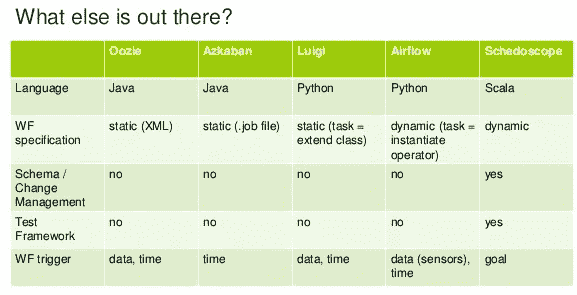
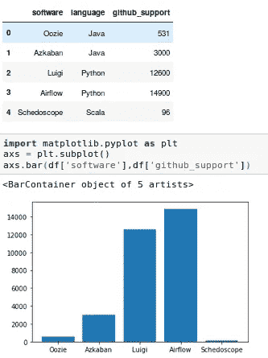
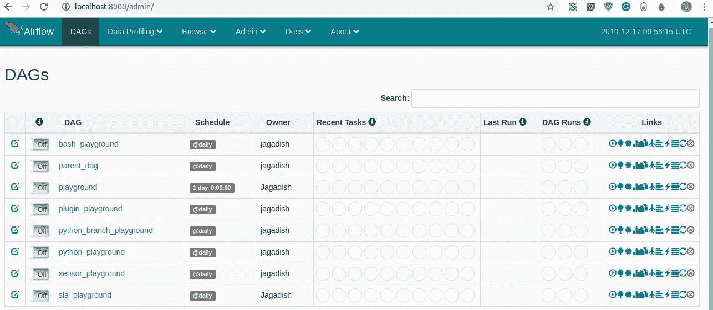

# 阿帕奇气流第 1 章

> 原文：<https://medium.com/analytics-vidhya/apache-airflow-chapter1-2145900f6960?source=collection_archive---------13----------------------->

我刚刚开始了一个新项目，在那里我曾经为一个客户项目构建管道并完成 Apache-airflow 设置。所以我已经花了两个星期的时间阅读 airflow 官方文档，以全面了解自下而上。现在我打算为气流创建完整的章节。这里的第一章都是关于基本气流及其背后的历史。

## 气流

Airflow 是一个基于 python 语言构建的开源工作流管理系统。它是由现任 CEO &和 ***Present 创始人 **Maxime Beauchemin** 在 Airbnb 创建的。***



来源于谷歌图片

在 airflow 之前，有很多数据工作流管理工具可用，但是由于 python 的发展和良好的社区支持，apache-airflow 现在处于领先地位。



数据工作流管理工具及其 GitHub star 列表

## 阿帕奇-气流快速介绍

让我们开始 Apache-airflow 的快速安装

```
1.To start airflow we have to define home directory (by default ~/airflow)export AIRFLOW_HOME=~/airflow-playground2.Install Apache-airflow python package from pippip install apache-airflow3.Initialize the database(by default sqlite)airflow initdb4.Run webserver and scheduler(run each command in different tabs)airflow webserver -p 8000
airflow scheduler
```

一旦你按照上述步骤，气流将开始运行在您的本地浏览器的 8000 端口[http://localhost:8000/admin/](http://localhost:8000/admin/)。



默认情况下，我们有几个示例任务来练习我们对气流任务和操作符的理解。只是为了让我们回填过去两天的数据

```
# start_date --> -s and end_date --> -e
airflow backfill example_xcom -s 2019-12-12 -e 2010-12-13
```

在进入深入的气流教程之前，让我们设置`virtualenv`

## Virtualenvwrapper

到目前为止，我们经历了一些低水平的阿帕奇气流。让我们潜入更深的地方。对于 python 相关的项目，建议在隔离的环境中处理不同的项目。一个好的选择是`VIRTUALENV`,尽管这是最好的选择，但每次激活环境时，都必须明确指定 env 文件夹。

```
virtualenv -p python3 .env
source bin/activate
```

为了克服在一个目录中管理所有的`virtualenv`包文件夹并使生活更容易，我使用了`virtualenvwrapper`，它是`virtualenv`的一组扩展

按照以下说明在本地系统上安装和配置`virtualenvwrapper`。

```
# Changed to home directory
cd# Make directory to save all your virtualenvs
mkdir .venvs# Install virtualenv package
pip install virtualenv# Install virtualenvwrapper package
pip install virtualenvwrapper# Once virtualenvwrapper installed get source path in my case (/home/jagadish/.local/bin/virtualenvwrapper.sh) 
which virtualenvwrapper.sh# Just add virtualenvwrapper configuration inside of ~/.bashrc
export WORKON_HOME=~/.venvs
source /home/jagadish/.local/bin/virtualenvwrapper.sh
```

一旦`virtualenvwrapper`在本地安装好，我们现在就准备继续前进。这里是`virtualenvwrapper`的备忘单，里面有基本的有用命令。

虚拟包装的备忘单

现在是时候开始设置`virtualenv`并为我们的项目安装所有相关的 pip 包。我保留我的环境名作为`playground,`你可以选择任何你喜欢的。

```
# To create env
mkvirtualenv -p python playground# Activate virtualenv by 
workon playground# Install airflow and postgres packages
pip install apache-airflow[postgres]
```

创建一个目录，所有与项目相关的文件都应该放在这个目录下，并创建一个文件夹作为项目报告。

```
mkdir playgroundcd playgroundsetvirtualenvproject
```

通过做`setvirtualenvproject`将使，而运行`workon`跳转目录以及激活环境。现在我们已经准备好完全运行我们的 airflow，但是最佳实践是我们必须将我们的 airflow 主目录路径添加到`~/.bashrc`或`~/.zshrc`文件中(以 sudo 模式打开)。通过添加它将不会反映我们当前终端的变化，所以我们必须重新启动，只需关闭所有终端并从头开始或使用`source ~/.bashrc`或`source ~/.zshrc`

```
export AIRFLOW_HOME=~/airflow-playground
```

现在通过跑步启动气流

```
airflow webserver -p 8000airflow scheduler
```

到目前为止，我们已经了解了 airflow 的基本工作流程以及项目环境设置。让我们在下一章更深入地了解气流的每个组成部分。

如果你遇到任何与气流有关的问题，请告诉我。谢了。