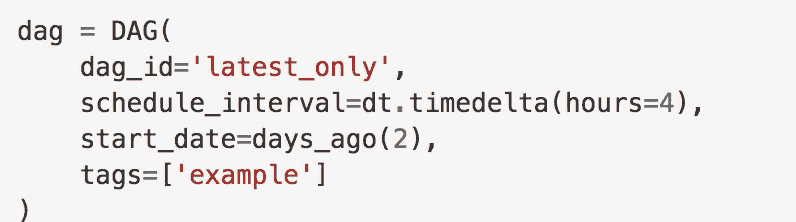

# 数字银行生产中的 Apache 气流

> 原文：<https://medium.com/analytics-vidhya/apache-airflow-in-a-digital-bank-production-8003fb66e6ca?source=collection_archive---------7----------------------->

**生产背景:**我们在生产中有数百条数据管道(主要是 Apache spark ),用于将原始数据增量接收到基于更新的数据仓库中，这些管道还应定期运行(每小时或每天),并应满足 SLA 要求，以便向下游团队提供数据。输入的原始数据将由上游团队在预定时间后的任何时间放置在数据湖的登陆位置。Apache Airflow 是一个开源的工作流管理平台，可以方便地调度、监控和重新运行生产中失败的任务。

Apache Airflow 是基于 python 构建的，可以很容易地扩展它来满足我们的需求。简而言之，为了执行我们的管道，我们需要通过编写模板化的 python 代码来创建 dag，并将其放在“dag 包”(主节点上的＄AIRFLOW _ HOME/DAGs 目录)中，之后 airflow 调度程序将自动拾取该 DAG，解析它并将所有任务发送到任务队列中，以便在 air flow 工作节点上独立执行。Airflow web 服务器将从元数据数据库中获取所有 DAG 元数据信息，并在 WebUI 中显示它们。


以下是气流 DAG 的构建模块:

1.  导入 python 包


2.通过传递 dag 名称、默认参数、开始日期、计划间隔、类似玉米的计划表达式、电子邮件到警报等来创建 Dag 对象



3.通过将参数传递给特定的操作员来创建任务(即操作员实例)。


4.使用 bitshift 操作符("<> ")或通过 python 方法 **set_upstream** ()或 **set_downstream** ())设置任务之间的依赖关系。


生产环境中的气流架构示例(设计遵循组织的文化和标准)。

**部署策略**:在创建了 Airflow DAG 之后，开发人员将在版本控制存储库中维护 DAG 以及数据管道的源代码(在本例中为 Bitbucket)。CI/CD 管道将使用 Jenkins 从 repo 中提取和构建源代码，并将所有 airflow worker 节点中的可执行 jar 及其依赖项和 DAG 文件部署到所有 Airflow master 节点的“dagbag”位置(通常为$AIRFLOW_HOME/dags/)。

**传感器的利用:**如管线背景所述，上游团队将在预定时间后的任何时间将待处理的**原始数据**复制到登陆地点(此处为 S3)。在这里，我们使用 S3Sensor 和 S3PrefixSensors 操作符创建了传感器任务，以持续地探测 S3 位置，只要输入位置中存在具有匹配命名格式的文件，传感器就会返回布尔值“true ”,然后 DAG 中的实际 Spark 任务就会启动。


**Worker node setup** :由于我们知道同一个 DAG 的所有任务可能会在不同的 Worker node 上独立执行，所以任务会在可用的节点上随机执行。为了正确地完成这项工作，我们应该用相同的配置、元数据和目录结构维护所有工作节点。

例如，task“T2”是 BashOperator 的一个实例，通过调用一个 Bash 脚本并使用下面的`bash_command`参数。


任务“t2”可以在任意一个工作者节点上随机执行。因此，脚本文件“test.sh”应该可以在同一位置的每个 worker 节点上使用(“/home/batcher/test.sh”)，并且具有读取权限。

如前所述，气流目标是在工作节点上独立运行任务，因此不可能在任务之间共享数据/信息。然而，如果任务需要从其他任务获取一些元数据或信息，为了满足这种需求，airflow 将拥有 Xcoms 来从一个任务向另一个任务共享信息。其中源任务是通过调用`xcom_push()`方法随时将信息推送到 XComs。任务将调用`xcom_pull()`来检索 XComs。

**气流工作者和火花限制**:要在任何工作者节点上执行任何特定的任务，需要呈现该操作者的所有依赖关系。由于大多数管道都是基于 spark 的，所以在 spark 网关节点上配置了气流工作节点，通过执行气流任务在 spark 集群上启动 spark 作业。但是这里的限制是 spark 作业应该处于客户端模式，这使得 airflow 能够获得 spark 日志和作业状态。如果集群模式强制启动 spark 作业，则气流将无法获取 spark 日志和作业状态。

**Airflow CLI:** Airflow 具有非常丰富的命令行界面，允许在 DAG 上进行多种类型的操作、启动服务以及支持开发和测试。

此外，我们可以通过命令独立测试 DAG 中的每个任务

```
airflow test dag_id task_id execution_date
airflow run dag_id task_id execution_date
```

**回填:** Airflow 将在回填日期范围内自动重新运行先前失败的任务实例。

```
airflow backfill [-h] [-t TASK_REGEX] [-s START_DATE] [-e END_DATE] [-m] dag_id
```

**远程日志和指标可视化:**用户可以使用`base_log_folder`设置在`airflow.cfg`中指定一个日志文件夹。默认情况下，它位于`AIRFLOW_HOME`目录中。

此外，用户可以在云存储中提供一个远程位置来存储日志和日志备份。要启用此功能，`airflow.cfg`必须配置有“ **remote_logging = True** ”，然后 Airflow 可以在 AWS S3、谷歌云存储或弹性搜索中远程存储日志。

在 Elastic Search 中，如果我们可以将 id 为“{ { Dag _ id } }-{ { task _ id } }-{ { execution _ date } }-{ { try _ number } }”并且 json_fields = asctime，filename，lineno，levelname，message 的日志存储起来，那么我们就可以通过在 Elastic Search 上查询来可视化 Kiband 或 Grafana 上的完整气流指标。

**挑战:**在 Airflow 平台中最大的挑战是维护调度程序和 web 服务器守护进程。如果 webserver 守护进程被终止或崩溃，那么用户将无法使用 WebUI，但这不会影响任何任务执行计划。我们可以通过用多个 web 服务器守护进程维护多个主服务器来管理这个问题。要解决这个问题，也可以重启 airflow webserver。

但是万一调度程序被终止或崩溃，它将停止调度任务，并在集群中造成混乱。需要注意的是，我们不能在同一个集群中维护多个调度器，如果我们这样做，将会发生任务重复。当当前运行的 Dag 数量很大时，调度程序的机会更多，因为它无法查询 airflow 元数据数据库(在我们的例子中是 MariaDB)。为了缓解这个问题，我们使用了一个数据库代理(在我们的例子中是 MaxScale)来处理来自调度器的查询。该代理将对请求进行负载平衡，从而向气流元数据数据库的主节点发送写查询，向工作节点发送读查询。

如有任何疑问，请通过 Linkedin 联系我:【www.linkedin.com/in/anilpalwai 