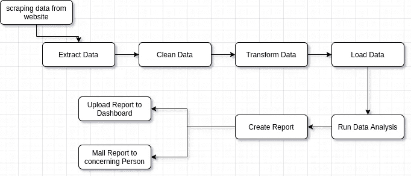
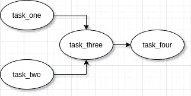
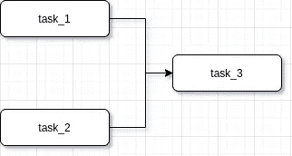

# 阿帕奇气流—第 1 部分

> 原文：<https://medium.com/analytics-vidhya/apache-airflow-part-1-8844113bda5e?source=collection_archive---------10----------------------->

每个程序员都喜欢自动化他们的工作。学习和使用任何自动化工具对我们来说都很有趣。几个月前，我偶然发现了一个很棒的开源项目，叫做[*Apache-air flow*](https://github.com/apache/airflow)*。我试图发现这个开源项目，并在我现有的代码库中使用它。这个博客系列只是我最近学习这个工具的总结。在本系列的第一部分，我们将讨论工作流、气流安装、Dag 以及在气流中实施 Dag 等主题。所以让我们从头开始。*

**什么是工作流？**

在开始讨论 apache airflow 之前，让我们通过一个简单的例子来理解什么是工作流。



我们经常遇到这种类型的用例，我们需要运行一组步骤来创建预期的输出。完成给定数据
工程任务的这组步骤称为**工作流**。我们可以使用许多工作流工具来安排这些类型的任务。使用`Cron Job`是解决方案之一，但是管理几个`Cron Jobs`是一项繁琐的任务。世界正在选择其他几个工作流工具，如 Apache-Airflow、Luigi、SSIS 等。我们将关注阿帕奇气流。


**什么是气流？** Airflow 是一个编程工作流的平台，包括:

*   创造
*   行程安排
*   监视

我们可以用任何语言实现程序，但是工作流是用 Python 在 apache-airflow 中编写的。它将工作流实现为 DAG，即可以通过命令行或 web 界面访问的直接非循环图。

什么是 DAG？
DAG 代表有向无环图，通过下图我们可以很容易理解。



*   定向的，有一个内在的流程表示组件之间的依赖关系。
*   非循环，不循环/循环/重复。

在 Airflow 中，这代表了构成我们工作流的任务集。我们可以使用下面的代码结构定义一个简单的 DAG。

```
from airflow.models import DAG
dag = DAG(
    dag_id='first_dag',
    default_args={"start_date": datetime(2020, 7, 25)}
)
```

在 Airflow 中，dag 是用 Python 编写的，但是它可以使用用任何其他语言编写的组件(通常是任务)。我们可以使用`airflow list_dags`命令列出气流中出现的所有 Dag。

现在，我们已经了解了气流的基本原理。让我们尝试将它安装到我们的虚拟环境中，以便进一步理解和使用。

# 快速安装指南。

我们将使用 python 虚拟环境在我们的本地系统中安装`apache-airflow`。

*   创建一个名为`airflow_sandbox`的目录，并在其中创建一个名为`backend`的目录
*   在您的`backend`目录中打开您的终端。
*   在您的`backend`目录中，创建一个 python 虚拟环境，并激活它以备将来使用。
*   运行` export air flow _ HOME = ` pwd `/air flow _ HOME '
*   跑`pip install apache-airflow`
*   通过`airflow initdb`初始化数据库
*   启动 web 服务器，默认端口是 8080 `airflow webserver -p 8080`
*   通过`airflow scheduler`启动调度程序

如果你卡住了，那么请参考[Apache-air flow 的官方文档](https://airflow.apache.org/)。安装完成后，在`airflow_home`文件夹中创建一个名为`dags`的目录。Dag 总是在这个`dags`文件夹中创建。

# 实施气流 Dag

## 气流操作员

Dag 定义了如何运行一个工作流，而*操作符*决定了一个任务实际上完成了什么。一个操作符代表一个单一的幂等任务，它们通常(但不总是)是原子的。它们可以独立存在，不需要与任何其他运营商共享资源。DAG 将确保操作符以正确的顺序运行；除了这些依赖性，操作符通常独立运行。事实上，它们可能运行在两台完全不同的机器上。
总结以上关于气流算子的讨论:

*   代表工作流中的单个任务。
*   独立运行(通常)
*   一般不共享信息

气流为许多常见任务提供了操作符，一些最常用的操作符如下。

*   ***python operator:***调用 python 函数
*   ***bash operator:***执行 bash 命令或调用 bash 脚本
*   ***SimpleHttpOperator:***发送 HTTP 请求
*   ***电子邮件操作员:*** 发送电子邮件

气流提供了许多其他操作符，我们可以从其[文档](https://airflow.apache.org/docs/stable/)中查看。

让我们试着通过一个简单的例子来发现 *BashOperator* 和*python operator*。

生成随机数的简单 BashOperator。

```
from airflow.operators.bash_operator import BashOperatortask_1 = BashOperator(
    task_id='generate_random_number_by_bash',
    bash_command='echo $RANDOM',
    dag=dag
)
```

一个简单的生成随机数的 python 运算符。

```
import random
from airflow.operators.python_operator import PythonOperator def generate_random_number():
    return random.randint(0, 100)task_2 = PythonOperator(
    task_id='generate_random_number_by_python',
    python_callable=generate_random_number,
    dag=dag
)
```

## 任务

任务是:

*   运算符的实例
*   赋给 python 变量(通常)
*   气流中的`task_id`所指。

如果我们看上面的例子，那么 python 变量`task_1`和`task_2`就是任务的两个例子。

## 任务相关性

*   定义任务完成的给定顺序。
*   在 Airflow 或以上版本中，它是由位移位运算符定义的。
    * > >或上游运算符(简单来说就是之前)
    * < <或下游运算符(简单来说就是之后)


如果我们在气流中定义`task_1 >> task_2`，那么`task_1`将在`task_2`之前执行。



如果我们定义`task_1 >> task_3 << task_2`，那么这意味着`task_1`和`task_2`将在`task_3`之前执行。

## 气流调度

**达格运行**

*   工作流在某个时间点的特定实例。
*   可以手动运行，也可以通过`schedule_interval`运行。
*   可以有多种状态，如`running`、`failed`、`success`等。

在计划 DAG 时，这些属性会派上用场。

*   `start_date`:最初安排 DAG 运行的日期/时间。
*   `end_date`:何时停止正在运行的 DAG 实例(可选参数)。
*   `max_tries`:停止前的最大尝试次数(可选参数)
*   `schedule_interval`:多长时间安排一次 DAG？您可以通过任何类似`*/5 * * * *`的`cron`语法进行定义，即每 5 分钟定义一次。你可以检查这个[网站](https://crontab.guru/)来生成任何正确的`cron`语法。

**schedule _ interval gotcha:** 调度 DAG 时，气流会一直，在
`start_date + schedule_interval`调度任务。

例如

```
task_2 = PythonOperator(
    task_id='generate_random_number_by_python',
    python_callable=generate_random_number,
    start_date=datetime(2020, 7, 28),
    schedule_interval='0 0 * * *',
    dag=dag
)
```

这意味着启动 DAG 的最早开始时间是 7 月 29 日午夜 00:00

太棒了。！！我们已经安装了 Apache-Airflow，并讨论了 Apache-Airflow 的一些介绍性概念。让我们在本系列的下一部分见面，并尝试发现更多关于这个令人惊奇的开源软件的信息。直到那时再见，继续学习。