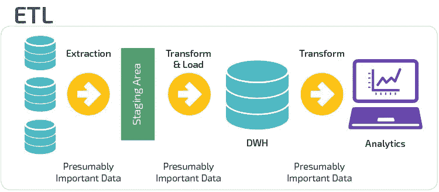
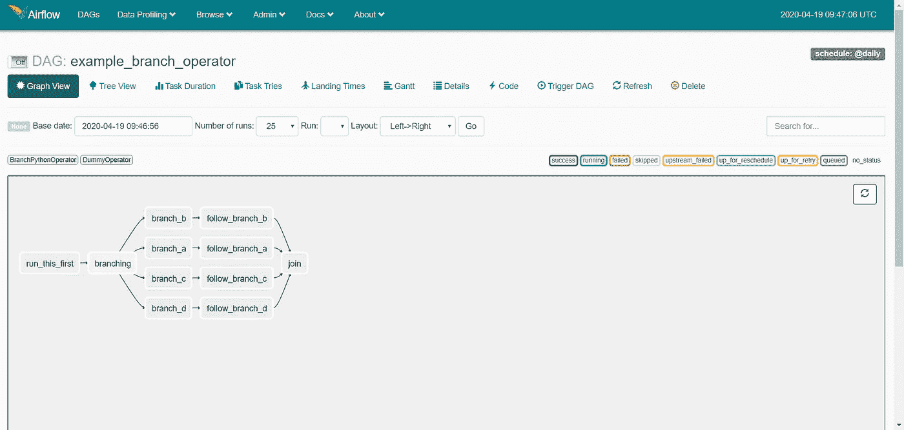
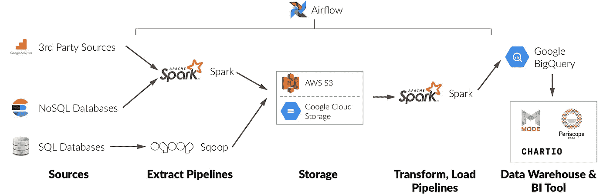

# Apache Airflow —数据管道和 ETL/ELT 工作流的编程平台

> 原文：<https://medium.com/analytics-vidhya/apache-airflow-programmatic-platform-for-data-pipelines-and-etl-elt-workflows-b9e4d8346541?source=collection_archive---------20----------------------->

在当前数据驱动的世界中，数据管道和 ETL(提取、转换和加载)工作流在收集和处理来自不同来源的数据方面起着重要作用。许多数据科学家和小公司依赖这些工作流的质量和性能来处理和分析下游的数据，以获得业务洞察力。

来源:Panoply.io

市场上有许多 ETL 平台/工具可以帮助更快更容易地构建简单和静态的工作流。尽管 ETL 平台提供了简单的拖放 UI 组件来构建工作流，但对于小公司或数据科学家来说，由于成本或限制，总是存在是选择 ETL 平台还是从头构建工作流的问题。ETL 工具的最大限制之一是它们大多是接口驱动的，这使得调试和导航变得困难，并且它们引入了可复制性问题。关于 ETL 工具的缺点已经说得够多了，我将把探索 ETL 的优点和缺点留给你，让我们进入主题。

# **什么是阿帕奇气流？**

来自网站(【https://airflow.apache.org/】T2):

> Airflow 是一个以编程方式创作、调度和监控工作流的平台。
> 
> 使用 airflow 将工作流创作为任务的有向无环图(Dag)。airflow scheduler 在遵循指定依赖关系的同时，对一组工作线程执行您的任务。丰富的命令行实用程序使在 Dag 上执行复杂的手术变得轻而易举。丰富的用户界面使得可视化生产中运行的管道、监控进度以及在需要时解决问题变得容易。

基本上，借助 Airflow，我们可以通过 python 脚本创建动态工作流，并对其进行调度和监控。Airflow 为管理 Dag 提供了一个不错的 UI(除了工作流什么都没有)。让我们看看气流的一些关键方面:

1.  气流是可伸缩的、可扩展的、优雅的，并且具有用于管道的动态配置
2.  它是开源的，完全用 Python 编写
3.  它有大量的集成，包括谷歌云平台，亚马逊网络服务，微软 Azure

# 气流是如何工作的？

气流构建的基本概念是有向无环图(DAG)。在计算机科学和数学中，DAG 是一个有向图，没有连接其他边的圈。这意味着不可能从一条边开始遍历整个图。在 Airflow 的 DAG 中，每个节点都是一个代表 bash 命令或 python 函数的任务。

样本气流 DAG

DAG 开始于“run_this_first”节点，结束于“join”节点。任务“加入”依赖于所有上游任务，即只有在执行了“加入”任务之前的所有节点/任务后，才会执行“加入”任务。这使得气流工作流程更加高效和可靠。

**基本概念:**

**DAG** —任务/使用的图形。

**操作符** —操作符是指转换步骤，例如 bash_operator，python_operator。这些操作符基本上是我们任务的组成部分。

**传感器** —这种类型的操作员执行频率/超时轮询功能，以监控工作流程

**执行器** —这类操作员执行触发操作，例如 HiveOperator，Pig Operator。

**任务** —任务是 DAG 的主要实体。这里的主要内容是在某个时间点运行的任务实例。

**HOOK** —被认为是 JDBC、HTTP 等外部系统的接口。

Airflow 非常简单，创建 DAG 只需要 Python 编程知识。如果按照 DAG 参数中的指定自动失败，Airflow 支持任务的重新执行。

# 简单的使用案例

让我们看一个简单的气流用例:

**问题陈述:**我们需要从新闻 API 源获取数据，并执行某些 NLP 转换，然后将其存储在数据库中以供进一步分析。

**解决方案:**

1.  安装并初始化气流网络服务器和调度程序
2.  编写三个 python 函数，一个用于连接和从新闻 API 源获取数据，第二个用于转换获取的数据，第三个用于将转换后的数据存储在数据库中
3.  导入气流并使用您自己的计划间隔和参数创建 DAG
4.  使用 Python_Operator 和三个 Python 函数创建任务
5.  创建任务相关性并执行文件
6.  转到 web 用户界面并启动 DAG

就这样，你的狗就可以跑了。

# 为什么阿帕奇气流很重要？

表明阿帕奇气流重要性的主要原因是

*   最重要的优势是，它提供了调度分析工作流和数据仓库的能力，也可以在单个平台下进行管理，以便访问一个全面的视图来检查状态。
*   执行的日志条目集中在一个位置。
*   气流的使用也很重要，因为它具有自动化工作流开发的优势，因为它有一种将工作流配置为代码的方法。
*   在 Dag 中，它提供了依赖关系的清晰描述。
*   生成元数据的能力为重新生成独特的上传提供了优势。

Apache Airflow 支持与 PySpark 的集成，这使得它也可以用于大数据管道。参考下图

来源:[https://medium . com/@ natekupp/getting-started-the-3-stages-of-data-infra structure-556 DAC 82 e 825](/@natekupp/getting-started-the-3-stages-of-data-infrastructure-556dac82e825)

# 结论

在这篇文章中，我讨论了什么是 airflow，它的优点，以及 Apache Airflow 如何帮助在 Python 中以编程方式构建快速、动态而高效的 ETL 工作流。在我的下一篇关于 Airflow 的文章中，我将举一个 ETL 工作流的真实例子，向您展示如何设置 Airflow 并在 Airflow 中开发工作流。