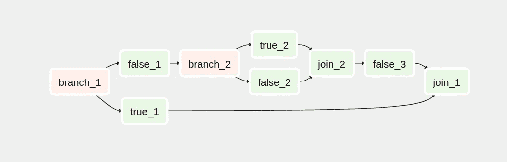
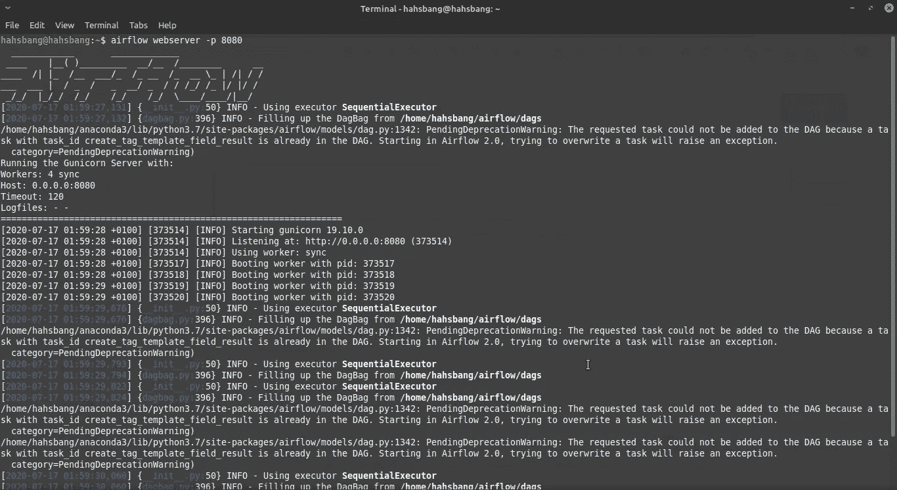
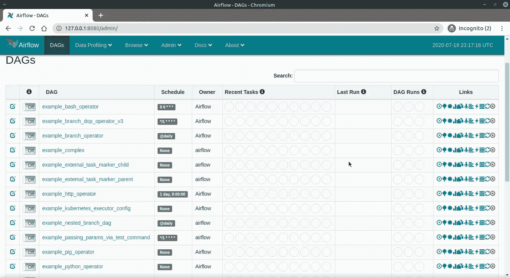

# 阿帕奇气流简介

> 原文：<https://medium.com/analytics-vidhya/apache-airflow-what-it-is-and-why-you-should-start-using-it-c6334090265d?source=collection_archive---------14----------------------->


## 介绍

什么是阿帕奇气流？

> Apache Airflow 是一个开源平台，用于创作、调度和监控**工作流**。它是 2015 年在 Airbnb 创建的(作为快速创作、迭代和监控批处理数据管道的更好方式，处理 Airbnb 正在处理的大量数据)。
> 
> 目前，Apache Airflow 是 Apache 软件基金会的一部分。由于使用 Python 带来的健壮性和灵活性，Airflow 获得了广泛的欢迎

正如 J [AREK POTIUK](https://www.linkedin.com/in/jarekpotiuk) 所指出的，气流是一个指挥者(它可以被比作管弦乐队中的指挥，它不做太多，但控制着一切的流动，他在那里控制和同步做这项工作的所有其他人)

**好吧，酷，既然 apache airflow 管理工作流，那么工作流到底是什么？**

> 简单来说，工作流是按计划开始或由事件触发的一系列任务



气流工作流程被设计成一个[有向无环图(DAG)。](https://en.wikipedia.org/wiki/Directed_acyclic_graph)创作工作流时，它被划分为可独立执行的任务。然后，您可以通过将这些任务组合成一个图形，将它们合并成一个逻辑整体。工作流中的每个任务都是[等幂](https://en.wikipedia.org/wiki/Idempotence)

> 在你徘徊的思绪中，你可能会想使用气流有什么好处

## 气流的好处

1.  它可以优雅地处理上游/下游数据
2.  轻松访问历史数据(回填和重新运行历史数据)
3.  简单的错误处理(失败时重试)
4.  它有一个很棒的社区([你可以在 slack](https://apache-airflow-slack.herokuapp.com/) 加入气流社区)
5.  可扩展思想使用[运算符](https://github.com/apache/airflow/tree/master/airflow/contrib/operators)
6.  它拥有出色的日志记录能力
7.  可伸缩性和依赖性管理
8.  强大的监控功能您可以实时运行和查看工作流执行情况
9.  以编程方式创作、安排和监控工作流或数据管道
10.  伟大的警报系统
11.  通过 REST API 访问
12.  它可以在本地使用，也可以在云中使用(云是其他人的计算机😆 😜)

airflow 的主要云服务提供商是[天文学家。IO](https://www.astronomer.io/) 和 [google cloud composer](https://cloud.google.com/composer/docs/concepts/overview)

## 气流的使用案例

阿帕奇气流可以用于各种目的

1.  ETL(提取、转换、加载)作业
2.  从多个来源提取数据
3.  机器学习管道
4.  数据库
5.  编排自动化测试

[这里有一些值得注意的提及](https://airflow.apache.org/use-cases/)

## 气流中的概念

1.  经营者
2.  十克
3.  任务
4.  连接器
5.  钩住
6.  变量
7.  XCOM
8.  实施者

# 1)运营商

> 操作员描述工作流中的单个任务。操作员通常(但不总是)是原子的，这意味着他们可以独立工作，不需要与任何其他操作员共享资源。
> 
> 操作符只是一个带有“execute()”方法的 Python 类，当它运行时就会被调用。

## 气流中操作者的类型

> 一.行动
> 二。转移
> 三。传感器

# 2.十克

> Dag 描述*如何*运行工作流。
> 
> DAG 只是一个包含一组任务及其依赖关系的 Python 脚本。每个任务做什么由任务的操作员决定
> 
> 简而言之，DAG 是具有定义的依赖性和关系的任务的集合

一个 *DagRun* 是一个 DAG 的实例，它由调度程序创建，或者可以手动触发 ut

# 3.任务

> 任务是在 Dag 中定义的，两者都是用 Python 代码编写的，用来定义你想做什么。
> 
> 每个任务做什么由任务的[操作符](https://airflow.apache.org/docs/stable/_api/airflow/operators/index.html)决定

# 4.连接器

> 连接外部系统所需的信息存储在其 metastore 数据库中的 Airflow stores 所有连接器中，
> 
> ⭐️变量部分也可以保存这些“所谓的连接数据和参数”,但是根据最佳实践，它们应该作为连接器存储。但是你猜怎么着？如果你是那些不喜欢阅读文档的开发人员之一，你可以把它们存储在你喜欢的任何地方

# 5.钩住

> 钩子用于与外部系统交互，如 S3、HIVE、SFTP、数据库等。
> 
> 所有与外部服务的通信都是使用钩子完成的

```
operator <->hooks <-> externalAPI
```

# 6.变量

> 变量是以简单的键值对形式存储和检索任意内容或设置的通用方式
> 
> 这可以比作 ***环境变量***

# 7.XCOM

> 即使操作员是等幂的，他们仍然需要共享信息或少量数据(**操作员交叉通信**)，这就是 XCOM 的用武之地
> 
> XComs 让任务交换消息，名字是“cross-communication”的缩写。

# 8.实施者

> **执行器**是任务实例开始运行的机制。**气流**支持各种**执行者**。
> 
> **遗嘱执行人的种类**
> 1 .DebugExecutors(在单个进程中运行任务，简单但不利于生产)
> 2。LocalExecutors(在单独的进程中运行任务)
> 3。CeleryExecutor(向芹菜工人发送任务，很难设置，但最适合生产)
> 4。KubernetesExecutor(产生带有气流的新吊舱，运行最适合繁重任务的任务)
> 
> 执行者非常重要，起初，这个概念可能看起来很复杂，但是天文学家提供了一个全面的解释

# 结论

airflow 的最大好处之一是它允许您以编程方式定义工作流。它让用户可以自由地编写在管道的每一步要执行的代码。

Airflow 也有一个非常强大且配置良好的 UI。这使得跟踪作业、回填作业和配置平台变得非常简单


[Alexander Redl](https://unsplash.com/@alexanderredl?utm_source=medium&utm_medium=referral) 在 [Unsplash](https://unsplash.com?utm_source=medium&utm_medium=referral) 上拍摄的照片

## 准备好开始使用 APACHE AIRFLOW 了吗？

这里有一个关于如何在本地机器上加速 apache 气流的快速纲要

💡气流是基于 Python 的。安装它的最佳方式是通过工具。

```
# airflow needs a home, ~/airflow is the default,
# but you can lay foundation somewhere else if you prefer
# (optional)
export AIRFLOW_HOME=~/airflow
```

使用 pip 从 PyPI 安装

```
pip install apache-airflow
```

#启动 web 服务器，默认端口是 8080

```
airflow webserver -p 8080
```



Apache Airflow 服务器日志

现在当你访问`0.0.0.0:8080`🚀



Apache 气流用户界面

天文学家 CLI 也是一个很好的工具(实际上是运行阿帕奇气流最简单的方法)

请关注更多教程，在那里我将使用天文学家 CLI 来创造魔法

**保重，保持安全🌊愿心流与你同在**

✌️ ✌️ 🚀 🚀 ✌️ ✌️

**延伸阅读**

一股[帕切气流](https://github.com/apache/airflow)

A [stronomer.io 气流介绍/](https://www.astronomer.io/guides/intro-to-airflow/)