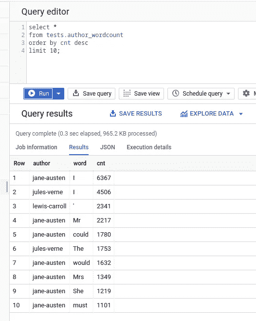

# 阿帕奇光束-从零到英雄 Pt。1:批处理管道

> 原文：<https://medium.com/analytics-vidhya/apache-beam-from-zero-to-hero-pt-1-batch-pipelines-ee117c37abc8?source=collection_archive---------4----------------------->


Emile Guillemot 在 [Unsplash](https://unsplash.com?utm_source=medium&utm_medium=referral) 上拍摄的照片

在[的上一篇文章](https://ilanuzan.medium.com/building-a-data-pipeline-with-python-generators-a80a4d19019e)中，我谈到了我们如何使用 Python 生成器来创建简单的数据管道。在这篇文章中，我将介绍用于构建生产级数据管道的 Apache Beam 框架，并用它构建一个批处理管道，同时解释它的一些主要概念。

# 介绍

> Apache Beam 是一个开源的统一模型，用于定义批处理和流数据并行处理管道。

使用 Apache Beam，我们可以以简洁、清晰的方式实现复杂且可伸缩的数据管道。Apache Beam 有 3 个 SDK——Python、Java & Go(这里我们要用 Python)。使用该框架编写的管道可以通过不同的运行器在不同的平台上运行——一些可用的运行器是 Spark、Flink 和 Google Cloud Dataflow。默认情况下，正在使用的 runner 是 DirectRunner，它用在开发阶段。

管道的典型结构如下所示:

```
import argparse
import apache_beam as beam
from apache_beam.options.pipeline_options import PipelineOptionsdef run(argv=None, save_main_session=True):
  **# Defining the pipeline's arguments**
  parser = argparse.ArgumentParser()
  parser.add_argument(
    --input',
    default='#SOME GCS PATH#,
    help='Input file pattern to process.')
  ... known_args, pipeline_args = parser.parse_known_args(argv)
  pipeline_options = PipelineOptions(pipeline_args) **# Defining the pipeline's steps**
  with beam.Pipeline(options=pipeline_options) as p:
    (p
      | 'ReadData' >> ReadFromText()
      ....if __name__ == '__main__':
  run()
```

现在我们已经知道了什么是 Apache Beam 管道，并且或多或少知道了它的样子，让我们开始编写管道。

我们将要实现的管道是一个基本的 wordcount 管道，但有所改变。我们将使用三位著名作家的九本教科书——儒勒·凡尔纳、简·奥斯汀和刘易斯·卡罗尔。管道需要执行以下操作:

1.  从谷歌云存储(GCS)中读取书籍的文本文件，同时保持文本与其作者之间的关联——这里我们将了解**连接器。**
2.  拆分每行中的单词并过滤掉连接词——这里我们将学习**有界集合&帕尔多变换。**
3.  统计每个作者和单词的出现次数——这里我们将了解一些内置的转换—**Map&Aggregation****转换。**
4.  将结果写入 BigQuery —我们将了解 **BigQuery 连接器。**

我们的第一步是从 GCS 桶中读取文本文件。我们通过使用连接器来实现，所以让我们首先解释什么是连接器，以及它们在管道中扮演什么角色。

# 连接器

连接器是 Apache Beam 的组件，用于从 GCS、BigQuery、Snowflake、Hadoop 等外部数据源读取和写入数据——关于所有可用连接器的信息可以在这里找到。

通常，管道中的第一个和最后一个步骤将使用连接器——我们需要从某个地方获得管道的初始数据，并且我们通常希望将管道的结果保存在某个地方。

我们将使用 TextIO 连接器，它允许我们从本地文本文件或 GCS 路径中读取数据。我们需要从 GCS 中读取带有我们正在读取的文件名的文本文件(以便我们知道将文本与作者联系起来)。每个作者的文本文件都位于一个单独的目录中，因此以后提取作者的名字相当容易:

```
gs://blog-data-resources/books_txt_files/**jane-austen**/
gs://blog-data-resources/books_txt_files/**jules-verne**/
gs://blog-data-resources/books_txt_files/**lewis-carroll**/
```

我们将使用 *ReadFromTextWithFilename* 函数获取文本和文件名:

```
import argparse
import apache_beam as beam
from apache_beam.options.pipeline_options import PipelineOptions
from apache_beam.io.textio import ReadFromTextWithFilenamedef run(argv=None, save_main_session=True):
  parser = argparse.ArgumentParser()
  parser.add_argument(
    '--input',
    default='gs://blog-data-resources/books_txt_files/**',
    help='Input file pattern to process.')
  known_args, pipeline_args = parser.parse_known_args(argv)pipeline_options = PipelineOptions(pipeline_args)
with beam.Pipeline(options=pipeline_options) as p:
  (p 
    **| 'Read files' >> ReadFromTextWithFilename(known_args.input))**if __name__ == '__main__':
    run()
```

该函数返回一个在整个框架中使用的名为*p 集合*的对象，在我们开始实现管道的下一步之前，我们需要知道什么是*p 集合*。

# 有界集合

PCollection 是作为 Apache 射束操作的管道数据的对象。这是连接器(以及框架的其余组件)接收、返回或接收和返回的对象。如果我们将它与我上一篇文章中的生成器进行比较，PCollection 对象的作用与数据管道中的 Generator 对象相似——数据流入和流出它。

我们可以使用一个可用的连接器从数据源创建一个初始 PCollection，或者手动创建它，如下所示:

```
beam**.**Create([
          'To be, or not to be: that is the question: ',
          "Whether 'tis nobler in the mind to suffer ",
          'The slings and arrows of outrageous fortune, ',
          'Or to take arms against a sea of troubles, ',
      ])
```

PCollection 的大小可以是有界的，也可以是无界的。根据经验，有界 p 集合用于批处理数据流，无界 p 集合用于流式数据流。

我们下一步要做的是将这一行拆分成单词。为了做到这一点，我们首先需要了解变换——特别是 ParDo 变换。

# 帕尔多变换

转换是管道中的不同操作。如果我们想以任何方式修改、聚合或扁平化数据，都可以通过转换来完成。

框架中内置了几个转换(我们将在下一节讨论其中的 3 个)，但是这里我们需要自己实现一个。为了构建一个自定义转换，您需要创建一个 DoFN 的子类，如下所示:

```
class WordExtractingDoFn(beam.DoFn):
  def process(self, element):
    pass
```

我们的 ParDo 变换需要做 3 件事。将行中的单词分开。
2。过滤掉连词。
3。从文件名中提取作者的名字。

我们这样拆分单词:

```
import reclass WordExtractingDoFn(beam.DoFn):
  def process(self, element):
    author, line = element
    for word in re.findall(r"[\w']+", line, re.UNICODE):
      **yield** word
```

注意这里——我们使用的是我们在上一篇文章中学过的关键字 *yield* ,所以 *process* 函数直到该行中的所有单词都被生成后才完成执行。

我们使用 NLTK 模块过滤掉合取词，如下所示:

```
import re
from nltk.corpus import stopwordsclass WordExtractingDoFn(beam.DoFn):
  def __init__(self):
    **self.stopwords = set(stopwords.words('english'))**def process(self, element):
    filename, line = element
    for word in re.findall(r"[\w']+", line, re.UNICODE):
      **if word not in self.stopwords:**
        yield word
```

现在我们要做的就是从文件名中提取作者的名字，并把它和每个单词一起作为一个元组:

```
class WordExtractingDoFn(beam.DoFn):
  def __init__(self):
    self.stopwords = set(stopwords.words('english'))**def __extract_author_from_filename(self, filename):
    pattern = re.compile(r'.*\/([\w\-]+)\/[\w\-]+\.txt')
    match = pattern.match(filename)**if match is not None:
      return match.group(1)return Nonedef process(self, element):
    filename, line = element
    for word in re.findall(r"[\w']+", line, re.UNICODE):
      if word not in self.stopwords:
        yield (**self.__extract_author_from_filename(filename)**, word)
```

这是我们将转换添加到管道的方式:

```
with beam.Pipeline(options=pipeline_options) as p:
  (p
    | 'Read files' >> ReadFromTextWithFilename(known_args.input)
    **| 'Split lines' >> beam.ParDo(WordExtractingDoFn()))**
```

管道中的下一步是统计每个单词和作者的出现次数——为此，我们将学习 3 个内置转换。

# 映射和聚合转换

我们可以使用两种变换来计算单词出现的次数—*group by key*&*combine perkey*。我们可以在这里互换使用两者(下一步将需要对每一个稍有不同)，但是作为一般规则，我们更喜欢使用 *CombinePerKey* ，因为它的伸缩性更好——详细解释为什么可以在这里找到。

这两个函数都接收一个由两个值组成的元组，并将它们视为键-值对，按键分组并对值执行聚合函数。在我们的例子中，我们的键由单词和作者组成，我们的聚合函数应该是 *sum。*我们可以通过将每个元组映射到 1，然后对每个元组的 1 值进行汇总来统计每个(作者，单词)元组出现的次数(这是实现 wordcount 的标准方式)。它要求我们添加一个初步的步骤，使用 *Map* 转换，将每个元组映射为 1 值。

*映射*转换通过 lambda 函数将其每个输入元素映射到输出元素。我们包含两个新步骤的管道如下所示:

```
(p
  | 'Read files' >> ReadFromTextWithFilename(known_args.input)
  | 'Split lines' >> beam.ParDo(WordExtractingDoFn())
 **| 'Pair with 1' >> beam.Map(lambda x: ((x[0], x[1]), 1))
  | 'Sum per author & word' >> beam.CombinePerKey(sum))**
```

我们差不多完成了——现在我们要做的就是使用 BigQuery 连接器将结果写入 BigQuery。

# BigQuery 连接器

首先，让我们在 BigQuery 中添加一个指定目标表名的参数:

```
parser = argparse.ArgumentParser()
    parser.add_argument(
        '--input',
        dest='input',
        default='gs://blog-data-resources/books_txt_files/**',
        help='Input file pattern to process.')
 **parser.add_argument(
        '--table_spec ',
        dest='table_spec',
        default='ilan-uzan-297514:tests.author_wordcount',
        help='Destination BigQuery table.')**
    known_args, pipeline_args = parser.parse_known_args(argv)
```

现在我们需要为目的表定义我们的模式(您可以在这里的[中了解更多关于如何在 BigQuery 和 Apache Beam 中定义模式的信息)。我们的模式非常简单:](https://beam.apache.org/documentation/io/built-in/google-bigquery/#schemas)

```
table_schema = {
  'fields': [
    {'name':'author','type': 'STRING', 'mode': 'NULLABLE'}, 
    {'name': 'word', 'type': 'STRING', 'mode': 'NULLABLE'},
    {'name': 'cnt', 'type': 'INTEGER', 'mode': 'NULLABLE'}
  ]
}
```

*WriteToBigQuery* 函数接受字典作为值，因此为了使用它，我们首先需要将元素从元组转换为字典——最简单的方法是再次使用 *Map* 转换:

```
**def to_json_row(element):
  key, cnt = element
  author, word = key****return {"author": author, "word": word, "cnt": cnt}**(p
  | 'Read files' >> ReadFromTextWithFilename(known_args.input)
  | 'Split lines' >> beam.ParDo(WordExtractingDoFn())
  | 'Pair with 1' >> beam.Map(lambda x: ((x[0], x[1]), 1))
  | 'Sum per author & word' >> beam.CombinePerKey(sum)
 ** | 'Format records to JSON' >> beam.Map(to_json_row))**
```

太好了，现在我们终于可以给 BigQuery 写信了！如果需要，我们选择创建表(根据我们定义的模式)***并在每次加载之前清空数据—这样我们可以多次运行管道，并且结果不会重复。

```
(p
  | 'Read files' >> ReadFromTextWithFilename(known_args.input)
  | 'Split lines' >> beam.ParDo(WordExtractingDoFn())
  | 'Pair with 1' >> beam.Map(lambda x: ((x[0], x[1]), 1))
  | 'Sum per author & word' >> beam.CombinePerKey(sum)
  | 'Format records to JSON' >> beam.Map(to_json_row)
 **| 'Write to BigQuery' >> beam.io.WriteToBigQuery(
                             known_args.table_spec,
                             schema=table_schema,
                             write_disposition=..WRITE_TRUNCATE,
                             create_disposition=..CREATE_IF_NEEDED))**
```

***如果我们想使用*CREATE _ IF _ NEEDED*CREATE disposition，我们只需定义一个模式——如果表已经存在，也可以不提供模式，如下所示:

```
| 'Write to BigQuery' >> beam.io.WriteToBigQuery(
                           known_args.table_spec,
                           write_disposition=..WRITE_TRUNCATE,
                           create_disposition=..CREATE_NEVER))
```

就这样——我们的管道完工了。我们像运行 python 中的任何模块一样运行管道:

```
$ python -m main --temp_location gs://tests_tmp/tmp
```

因为我们正在将数据加载到 BigQuery 中，所以我们还需要指定 *temp_location* 参数——这是一个 GCS 路径，Apache Beam Runner 会在将文件加载到 BigQuery 之前将它们存放在这个路径中。

运行管道后，数据将在 BigQuery 中可见:



# 结论

帖子中的所有代码都可以在[这里](https://github.com/SockworkOrange/blog-posts/tree/main/apache-beam-batch-pipelines)找到。我希望您喜欢阅读，熟悉 Apache Beam 框架，并了解如何用它编写批处理管道。如果有不清楚的地方，当然欢迎你在评论中提问。

在下一篇文章中，我们将实现一个流管道，我们将学习一些新概念，如无边界 p 集合、窗口和触发器。