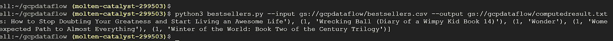

# Apache Beam-Google 云平台上的 Python(GCP)-构建和运行数据管道-逐步指南

> 原文：<https://medium.com/analytics-vidhya/apache-beam-python-on-google-cloud-platform-gcp-building-and-running-data-pipelines-a-step-by-8afaec3e8e1?source=collection_archive---------4----------------------->

这篇文章的重点是:

a)在 GCP 创建一个项目

b)建立项目环境

c)使用 Apache Beam 和 Python 构建数据管道

d)运行管道

e)附加注释

# **A)在 GCP 创建一个项目**

1.使用您的 gmail 帐户登录 [GCP 控制台](https://console.cloud.google.com/)。新客户可以使用谷歌云 90 天免费试用和 300 美元积分

2.创建新项目。输入项目名称，然后单击创建。在项目名称下面记下项目 id(您可以通过单击项目名称下面的编辑按钮来编辑项目 ID)。ID 用于向 Google Cloud tools 标识您的项目，因此最好使其可读。

如你所见，我的项目 id 是 ***gcpproject-id***


3.启用[计费账户](https://console.cloud.google.com/billing?_ga=2.192057002.1043866382.1609189417-891824868.1600960180&_gac=1.120468218.1609189893.Cj0KCQiAoab_BRCxARIsANMx4S5Oi4Zbcx0jxtiJ0snaO6k1Hrrh8CBUsgJULwB5jKkbbCh2a4pfFWwaAkUnEALw_wcB)

4.单击 Google Cloud 控制台顶部的“激活云外壳”按钮。如果需要，参考[https://cloud.google.com/shell/docs/using-cloud-shell](https://cloud.google.com/shell/docs/using-cloud-shell)。确保所选项目是您想要处理的项目。

使用下拉按钮选择您的项目


5.创建一个[服务账户](https://console.cloud.google.com/apis/credentials/serviceaccountkey?_ga=2.20739325.457761025.1609201108-978686323.1601309429)。从**服务账户**列表中选择**新服务账户。**在**服务帐户名称**字段中，输入一个名称。从**角色**列表中，选择**项目** > **所有者。下载 json 文件并保存，我们以后会用到它。*我已经把它重命名为 gcpdataflowkey.json***


6.在 [**云存储浏览器**](https://console.cloud.google.com/storage/browser?_ga=2.263886665.457761025.1609201108-978686323.1601309429) 页面。点击**创建桶**。指定以下属性:名称、默认存储类(标准)和位置，然后单击创建

# b)建立项目环境

1.  要从云控制台启动云外壳会话，请使用您的[控制台](http://console.cloud.google.com/)中的**激活云外壳**按钮。
2.  在云外壳中，为您的项目 ID 分配一个项目变量

```
export PROJECT=gcpproject-id
```


2.从云 Shell 终端，您可以运行以下命令来启动云 Shell 编辑器:

```
cloudshell edit .
```

也可以点击云壳窗口工具栏上带铅笔图标的打开编辑器按钮来启动编辑器。

更多信息请点击这里:[https://cloud . Google . com/shell/docs/launching-cloud-shell-editor](https://cloud.google.com/shell/docs/launching-cloud-shell-editor)

3.为您的项目创建一个目录(文件夹)(在我的例子中为 gcpdataflow ),并在该目录中创建一个 python 文件(在我的例子中为 bestsellers.py ),可以通过访问 file 菜单从编辑器中创建，也可以使用以下命令从云 shell 终端创建

```
mkdir gcpdataflow
cd gcpdataflow/
touch bestsellers.py
```

4.虚拟环境:

Virtualenv 让您创建和管理虚拟 Python 环境。关于它的更多信息，请点击这里:[https://don-be-fear-to-commit . readthedocs . io/en/latest/virtualenv . html](https://dont-be-afraid-to-commit.readthedocs.io/en/latest/virtualenv.html)

在云 shell 终端的项目目录(在我的例子中是 gcpdataflow，用于设置虚拟环境)中运行以下命令

```
**python3 -m pip install — user venv
virtualenv -p python3 venv
source venv/bin/activate
pip install 'apache-beam[gcp]'**
```

注意: **venv** 是我给我的虚拟环境起的名字。你可以用你的来代替。

5.导航到编辑器并将服务帐户密钥(在“在 GCP 创建项目”下的第 5 点中创建)上传到您的项目文件夹。

下面是我的文件夹结构供比较:


# **C)使用 Apache Beam 和 Python 构建数据管道**

在这篇文章中，我使用的是 kaggle 数据集:[https://www . ka ggle . com/sootersaalu/Amazon-top-50-best-selling-books-2009-2019](https://www.kaggle.com/sootersaalu/amazon-top-50-bestselling-books-2009-2019)。这是亚马逊 2009-2019 年前 50 本畅销书的数据集。，它包含 550 本书，并使用 Goodreads 分类为小说和非小说。

下载这个 csv 并进行数据清理(我已经用分号替换了 Name 列中的逗号)。将此 csv 上传到桶中(在 GCP 创建项目的第 6 点中创建)。你可以在我的 github 中找到干净的 csv 文件(链接在附加注释中给出)

csv 的快照在这里:


# **问题陈述:**

1.  找出小说类图书、非小说类图书以及所有图书的平均用户评分，并将结果写入单独的文件中
2.  按字母顺序对书籍和最后 5 本书进行排序，并打印输出

## **导入库和 JSON 密钥**

1.  将 Python 代码中的 GOOGLE_APPLICATION_CREDENTIALS 环境变量设置为 key.json 文件路径

```
from __future__ import absolute_import
import argparse
import logging
import re
import apache_beam as beam
from apache_beam.options.pipeline_options import PipelineOptions
import os# set GOOGLE_APPLICATION_CREDENTIALS environment variable in Python code to the path key.json fileos.environ[‘GOOGLE_APPLICATION_CREDENTIALS’] = “/home/annapooraniks/gcpdataflow/gcpdataflowkey.json”
```

## **创建/配置管道**

管道代表从开始到结束的整个数据处理任务。**流水线=读取输入+转换数据+写入输出**

创建 Beam SDK 类管道的实例。当您构造 PipelineOptions 对象时，将配置选项设置为从命令行读取选项，如下所示:

```
# instantiate the pipeline
options = PipelineOptions()
with beam.Pipeline(options=options) as p:
```

除了标准 PipelineOptions 之外，要构建自己的定制选项，请使用`add_argument()`方法

```
# defining custom arguments - To add your own options, use the add_argument() method# specify a description which appears when a user passes --help as a command-line argument, and a default value.class MyOptions(PipelineOptions):
@classmethoddef _add_argparse_args(cls, parser):parser.add_argument('--input',
                    help='Input for the pipeline',
                    dest='input',
                    required=False,
                    default='gs://gcpdataflow/bestsellers.csv')
parser.add_argument('--output',
                    help='Output for the pipeline',
                    required=False,
                    default='gs://gcpdataflow/computedresult.txt')
```

## p 集合

PCollection 是一个**不可变的**分布式数据集，Beam pipeline 在其上运行，它充当 pipeline 中每一步的输入和输出。

## **管道输入/输出**

Read transforms 从外部源读取数据，并返回数据的一个`PCollection`表示。在这里，我阅读了文件的内容——畅销书收藏中的畅销书. csv

```
# reading the csv and splitting lines by elements we want to retain
bestsellers = (
     p | beam.io.ReadFromText(input_filename, skip_header_lines=1)
       | beam.ParDo(Split())
)
```

请注意，我已经将 skipped header 设置为 TRUE (1)。如果你需要标题，你可以把它设置为 0

写转换将`PCollection`中的数据写入外部数据源

```
"Write results to Fiction_Results file" >>beam.io.WriteToText('gs://gcpdataflow/Fiction_Result')
```

## **变换**

转换是管道中的操作。它将 PCollection 作为输入，并返回一个 PCollection 作为输出。使用|管道运算符调用多个转换。

通用示例:

```
[Final Output PCollection] **=** ([Initial Input PCollection] 
              **|** [First Transform]
              **|** [Second Transform]
              **|** [Third Transform])
```

例如，畅销书集合包含所有畅销书的列表。我正在创建一个新的管道，使用“流派”列只过滤“小说”书籍，然后使用 MyTransform()计算所有小说书籍的平均用户评级，然后将结果打印在一个文件中

```
Fiction_pipeline = ( bestsellers
  | beam.Filter(lambda record: FilterBasedonGenre('Fiction',record))
  | "Composite Transformation for Fiction elements" >> MyTransform()
  | "Write results to Fiction_Results file"   >>beam.io.WriteToText('gs://gcpdataflow/Fiction_Result'))
```

## **复合变换**

当您需要重复执行多个简单的转换时，那么您可以将许多简单的转换放在一个“复合”转换中。

例如，这里 MyTransform()是一个复合转换。我需要表演 1。提取评分 2 .计算平均评分 3 .格式化小说书籍、非小说书籍和所有书籍的结果。所以我将这三个简单的转换嵌套成一个复合转换。


**GroupByKey :** 用于聚合有共同点的数据。它接受键、值对作为输入。当我们拥有包含多个具有相同键但不同值的对的数据时，要收集与每个唯一键相关的所有值，可以使用 GroupByKey()

ExtractRating:返回包含 1(键)和评级值的元组列表。这形成了 GroupByKey 的输入，它将(Key，value)对作为输入

```
class ExtractRating(beam.DoFn):
      def process(self, element):
            result = [(1, element['Rating'])]
            return result
```

## **帕尔多和 DoFn**

ParDo 变换独立地并且可能并行地处理输入 p 集合中的每个元素，并且向输出 p 集合产生零个或多个元素。DoFn 是 ParDo 处理输入 PCollection 元素的参数。


Split()的调用如下:

```
beam.ParDo(Split())
```

# **D)运行管道**

运行程序:



输出以降序显示前 5 本书的名字，按照我们使用 beam 时的字母顺序排序。地图(印刷)

您将看到桶中有 3 个新文件，上面印有平均值


```
#Fiction Result File
AVERAGE RATING OF BOOKS:4.648333333333334#Non Fiction Result File
AVERAGE RATING OF BOOKS:4.595161290322581#computedresults
AVERAGE RATING OF BOOKS:4.618363636363635
```

# **E)附加说明**

1.  Github 链接:[https://github . com/annapooranik/Apache beam-Python-data pipeline](https://github.com/annapooranik/ApacheBeam-Python-Datapipeline)

> ***希望这篇文章对你有用。如果你做到了，欢迎鼓掌或关注我:)***