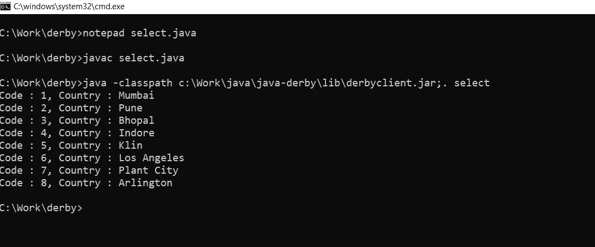
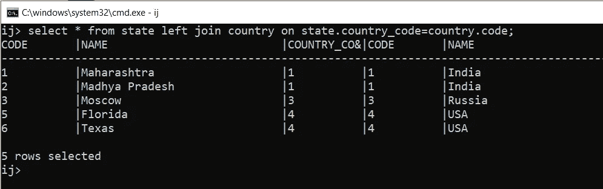
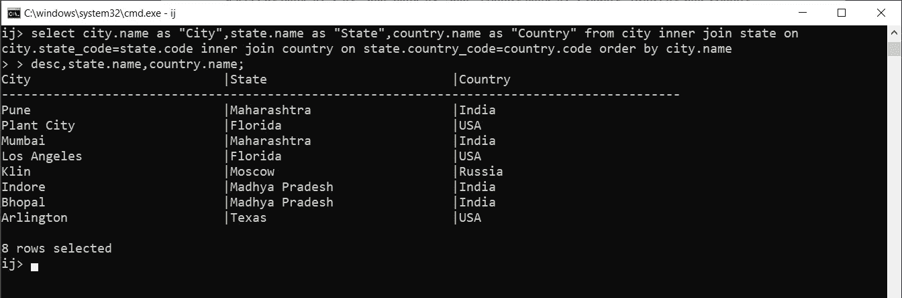

# 使用 JAVA 的 Apache Derby

> 原文：<https://medium.com/analytics-vidhya/apache-derby-using-java-3c09100e9128?source=collection_archive---------6----------------------->

与数据库交换信息是任何单个桌面或基于 web 的应用程序的主要关注点之一。在本文中，我们将获得更多关于使用 Java 管理 Apache Derby 的知识。如果对阿帕奇德比了解不多，可以阅读[**阿帕奇德比入门**](/swlh/getting-started-with-apache-derby-9f6ca8dea873?source=friends_link&sk=c7eec246693c80ba6982c32522acee8a) 。在那里，您将了解关于控制 Apache Derby 的所有先决条件和基础知识。现在，由于我们通常使用数据库来支持我们的应用程序，我们需要知道如何使用后端技术与数据库通信，众所周知的后端技术是 JAVA。因此，让我们开始探索 Java 实用程序。

# 涉及的操作:

1.  加载 Apache Derby 的 JDBC 客户端驱动程序类，用于堆叠实用程序。
2.  使用连接字符串从驱动程序管理器检索连接，指定预期的数据库。
3.  从所需的连接初始化语句，并执行 SQL 语句。
4.  迭代结果集(如果产生的话)。
5.  结束基本要素，如结果集、语句，以及最重要的连接。

通过应用这些步骤，我们将通过 Java 程序控制数据库。

# 使用 JAVA 执行 CRUD 操作:

在本节中，我们将实施上面讨论的步骤。而且，如果您计划在一台机器上使用 Apache Derby 的所有功能，那么就使用嵌入式驱动程序。或者，如果 JDBC 客户机连接到远程机器上的 Apache Derby 服务器，使用网络客户机驱动程序。每次执行下面详述的代码时，一定要将 derby 客户机 jar 文件包含到类路径中。这个 jar 文件用于网络客户机驱动程序。

## 插入记录:

为了插入记录，我们将只使用先前使用的 SQL 语句，并使用上述过程对其进行编译，以获得所需的结果。

**语法:**

```
insert into [table name] (column names) values (desired values);
```

**完整的 Java 实现:**

```
import java.sql.*;
class insert { public static void main(String args[]) { 
try { //Loading the Driver class
Class.forName("org.apache.derby.jdbc.ClientDriver");//Establishing a connection with desired database
Connection connection = DriverManager.getConnection
("jdbc:derby://localhost:1527/database/places"); //Initializing statement and executing the an Insert SQL
Statement statement = connection.createStatement(); 
statement.executeUpdate
("insert into city (name, state_code) values('Lonavla' , 1)"); //Terminating statement and connection
statement.close(); 
connection.close(); System.out.println("Record inserted"); 
}
catch(SQLException sqlException) 
{ System.out.println(sqlException); } 
// Raised either if the connection is refused, or some other technical issuecatch(ClassNotFoundException cnfe) 
{ System.out.println(cnfe); } 
// Raised in case the Driver class is  not found}
}
```

现在像往常一样编译上面的代码，但是在执行的时候要确保将 derby 客户端 jar 包含到类路径中，如下所示:

```
java -classpath [complete path to derby client jar file] insert
```

在执行之前，不要忘记启动网络服务器。现在，一旦完成，您将会看到消息**“Record Inserted”**，请确保通过 Apache Derby 客户端提示对其进行交叉验证。

因为在插入时，我们经常需要获得对应于新添加记录的 id。因此，您可以用预准备语句来修改该语句。只需初始化 **PreparedStatement** 而不是 Statement，并迭代 resultSet 以获得生成的键，如下所述:

```
//Initializing the prepared statement with SQL and specifying argument for returning key
PreparedStatement preparedStatement = connection.prepareStatement
("insert into city (name,state_code) values(?, ?)" , Statement.RETURN_GENERATED_KEYS); //Setting up the prepared Statement
preparedStatement.setString(1, name); 
preparedStatement.setInt(2, stateCode); //Executing the prepared statement
preparedStatement.executeUpdate(); //Maintaining Result set for receiving the generated key
ResultSet resultSet = preparedStatement.getGeneratedKeys(); 
if(resultSet.next()) { 
int code = resultSet.getInt(1); //retrieving generated code
System.out.println("Assigned Code : "+code); 
} //Terminating Result set and prepared Statement
resultSet.close(); 
preparedStatement.close();
```

像前面一样编译并执行这个代码，现在您将获得与新添加的城市相对应的 id。现在，类似地，我们将理解使用 Java 进行更新、删除和获取操作。

## 更新记录:

为了更新，我们将使用一个 **"where"** 子句启动一个查询，该查询将首先搜索满足约束的记录，然后用新信息更新该记录。下面是更新记录的语法和代码:

**语法:**

```
update [table name] set [column name]=[new value] where [condition];
//multiple column names can be specified consecutively, separated by ","
```

**完整的 Java 实现:**

```
import java.sql.*;
class update { 
public static void main(String args[]) { 
try { //Loading the Driver class
Class.forName("org.apache.derby.jdbc.ClientDriver"); 
Connection connection = DriverManager.getConnection
("jdbc:derby://localhost:1527/database/places");//Initializing the prepared statement with an Update SQL
PreparedStatement preparedStatement = connection.prepareStatement
("update city set name = ? where name = ?"); 
//Setting up the prepared Statement//preparing the statement
String oldName = "Lonavla";
String newName = "Nagpur";
preparedStatement.setString(1,newName); 
preparedStatement.setString(2,oldName); //Executing the prepared statement
preparedStatement.executeUpdate(); //Terminating prepared Statement and connection
preparedStatement.close();
connection.close(); 
System.out.println("Record updated"); }catch(SQLException sqlException) 
{ System.out.println(sqlException); } 
// Raised either if the connection is refused or some other technical issuecatch(ClassNotFoundException cnfe) 
{ System.out.println(cnfe); } 
// Raised in case the Driver class is  not found}
}
```

像前面一样编译并执行上面的代码。只要确保在执行时将 derby 客户机 jar 包含到类路径中。编译代码时不需要类路径。执行后，通过 **ij** 提示符连接，交叉验证记录是否被正确修改。

类似地，对于更复杂的查询结构， **"where"** 子句后面可以跟随许多约束。但是，为了更好地理解，所有的查询总是可以被分割成单独的小查询。现在，我们将期待使用 Java 删除一个记录。

## 删除记录:

为了删除一条记录，我们将使用一个**“where”**子句再次启动一个查询，它将首先搜索满足约束的记录，然后从表中删除该记录。下面是删除记录的语法和代码:

**语法:**

```
delete from [table name] where [condition];
```

**完整的 Java 实现:**

```
import java.sql.*;
class delete{ 
public static void main(String args[]) { 
try { //Loading the Driver class
Class.forName("org.apache.derby.jdbc.ClientDriver"); 
Connection connection = DriverManager.getConnection
("jdbc:derby://localhost:1527/database/places");//Initializing the prepared statement with SQL
PreparedStatement preparedStatement = connection.prepareStatement
("delete from city where name = ?"); //Setting up the prepared Statement
preparedStatement.setString(1,"Nagpur"); //Executing the prepared statement
preparedStatement.executeUpdate(); //Terminating prepared statement and connection
preparedStatement.close();
connection.close(); 
System.out.println("Record deleted");

}catch(SQLException sqlException) 
{ System.out.println(sqlException); } 
// Raised either if the connection is refused or some other technical issuecatch(ClassNotFoundException cnfe) 
{ System.out.println(cnfe); } 
// Raised in case the Driver class is  not found}
}
```

像前面一样编译并执行上面的代码。同样，确保在执行时将 derby 客户机 jar 包含到类路径中。如果在执行时没有包含 derby 客户机 jar，就会引发一个 Class not found 异常。执行后，通过 **ij** 提示符进行连接，并交叉验证所需记录已被准确删除。

现在，我们只剩下最后一个也是唯一一个 CRUD 操作，即从表中检索数据，我们将在下一节研究这个问题。

## 正在检索记录:

使用类似于 **where** 、 **order by** 、 **group by、**的子句以及更多使用子查询的子句，可以对该操作进行多种修改。下面是从表中检索记录的语法和代码:

**语法:**

```
select [column name] from [table name] where [condition];
//where clause is optional. If not given, all the records will be retrieved and if given, only records following the constrain will be retrieved
//if all columns are required, use "*" in place of column name
```

**完整的 Java 实现:**

```
import java.sql.*;
class select {
public static void main(String args[]) {
try{//Loading the driver class
Class.forName("org.apache.derby.jdbc.ClientDriver"); 
Connection connection = DriverManager.getConnection
("jdbc:derby://localhost:1527/database/places");//Initializing the prepared statement with select SQL
PreparedStatement preparedStatement = connection.prepareStatement
("select * from city"); //Executing the prepared statement and retrieving results
ResultSet resultSet = preparedStatement.executeQuery();int code;
String name;
while(resultSet.next())
{
code = resultSet.getInt("code");
name = resultSet.getString("name").trim();
System.out.printf("Code : %d, Country : %s\n", code, name);
}//Terminating result set, prepared statement and connection
resultSet.close();
preparedStatement.close();
connection.close();}catch(SQLException sqlException) 
{ System.out.println(sqlException); } 
// Raised either if the connection is refused or some other technical issuecatch(ClassNotFoundException cnfe) 
{ System.out.println(cnfe); } 
// Raised in case the Driver class is  not found}
}
```

像前面一样编译并执行上面的代码，您的提示应该是这样的:



执行时指定的路径是我机器上 derby 客户机 jar 的路径

现在，我们已经完成了使用 Java 控制 Apache Derby。但是下面是一些关于检索信息模式的有趣信息。这些操作是从 Apache Derby 客户机提示符下执行的，但是可以毫不费力地针对 Java 实现进行修改。

## 加入:

以下是一些联接及其简洁的描述:

```
Inner Join: This is a join between two tables with an explicit join clause.Left Join: This is a join between two tables with an explicit join clause, conserving unmatched rows from the first table.Right Join: This is a join between two tables with an explicit join clause, conserving unmatched rows from the second table.Natural Join: This is an inner or outer join between two tables. It has no explicit join clause. Instead, one is created implicitly using the common columns from the two tables.
```

一些连接和相应的输出如下所示:

```
select * from state left join country on state.country_code = country.code;
```



左连接应用于州和国家表

```
select city.name as "City", state.name as "State", country.name as "Country" from city inner join state on city.state_code = state.code inner join country on state.country_code = country.code order by city.name desc, state.name, country.name;
```



# 结论:

在本文中，我们了解了使用 Java 控制 Apache Derby 的过程。这被认为是至关重要的，因为通过它我们可以在任何应用程序中与数据库进行通信，这些应用程序由 Apache Derby 和 Java 作为后端技术支持。

一定要留意其他文章，以获得关于各种主题的知识，并随时对疑问或建议发表评论。

> [下划线. js 的 10 大有用功能是什么？](/nerd-for-tech/underscore-js-top-10-most-useful-functions-with-examples-24b822a3e0b1)
> 
> [Python 中的装饰者是什么？](/swlh/decorators-in-python-dbd35c32c00a)
> 
> [Java 中的多线程](/swlh/java-multithreading-48a21a361791)
> 
> [使用 Java 理解 Apache Derby】](/analytics-vidhya/apache-derby-using-java-3c09100e9128)
> 
> [Java 中的 TCP/IP 套接字编程](/swlh/tcp-ip-socket-programming-in-java-fc11beb78219)
> 
> [如何使用 React JSX 发送 HTTP 请求？](/swlh/reactjs-sending-http-requests-using-jsx-5cf9c20a9e1c)