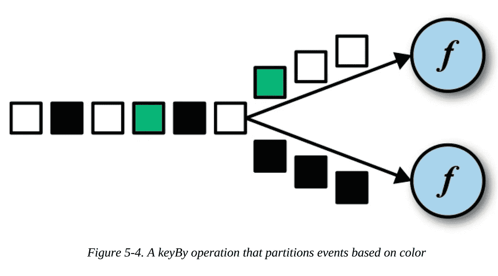
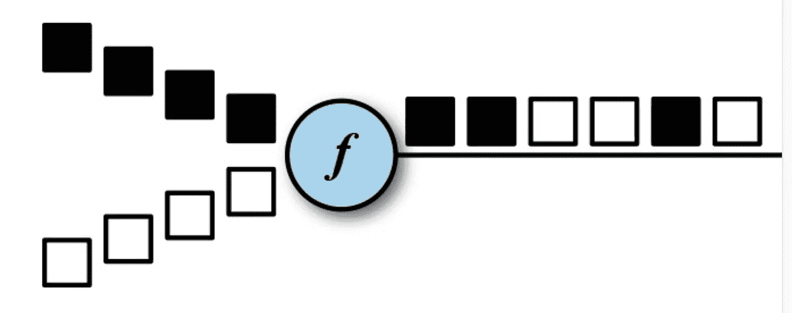

# Apache Flink 系列 4 —数据流 API

> 原文：<https://medium.com/analytics-vidhya/apache-flink-series-4-datastream-api-21ffdd8f2bc0?source=collection_archive---------6----------------------->


在这篇文章中，我将解释 Flink 中的数据流 API。

> (你可以参考我之前关于弗林克 的 [**架构的博客)**](/@mehmetozanguven/apache-flink-series-3-architecture-of-flink-a1ae34f0a8d2)

当我们把 Flink 看作一个软件时，Flink 是作为分层系统构建的。其中一层是位于运行时层之上的数据流 API。

让我们深入了解带有 Flink 中的转换的数据流 API

# 转换

*   流**变换**应用于一个或多个流，并将它们转换成一个或多个输出流
*   大多数流转换都基于用户定义函数。函数定义了如何将输入流的元素转换成输出流的元素。
*   大多数函数(也许是全部，我不确定)都被设计成单一抽象方法(SAM)，因此你也可以使用 lambda 表达式。
*   我们可以将转换分为 4 个部分:

1.  基本转换

2.键控流转换

3.多数据流转换

4.分布变换

## 1.基本转换

*   处理单个事件，这意味着每个输出记录都是由单个输入记录生成的

## 基本变换—地图

*   使用 DataStream.map()调用它，并使用定义的函数生成新的数据流

数据流映射转换

## 基本转换—过滤器

*   用“DataStream.filter()”调用它，并产生相同类型的新数据流
*   过滤器转换通过评估每个输入的布尔条件来丢弃(移除)流的事件。
*   返回值 true 意味着事件将转发到新的数据流
*   返回值 false 表示事件将被丢弃。

过滤流

## 基本转换—平面图

*   类似于地图转换，但它可以产生零个、一个或多个结果
*   因为它可能产生更多的结果，所以它的输出类型将用收集器<t>包装，收集器收集记录并转发它。</t>

平面地图

## 2.键控转换

*   大多数情况下，您希望将共享某个属性的事件分组在一起。例如，您可能想要查看“每种颜色的无效令牌的计数”。这可以通过 sql 来完成，如下所示:(假设如果令牌不为空，那么它是有效的)

```
SELECT tableName.color, count(token) AS countOfValidToken
FROM tableName
WHERE tableName.token IS NOT NULL
GROUP BY tableName.color;
```

*   同样的事情可以通过键控转换在 Flink 中完成。DataStream API 提供了这个称为 KeyedStream 的特性。
*   注意:小心使用 KeyedStream。如果键域持续增长(每个事件可以有唯一的键)，那么不要忘记清理不再活动的键的状态，以避免内存问题

## 键控转换—键控

*   keyBy 转换通过指定密钥将数据流转换为 KeyedStream。
*   基于密钥，相同的密钥由相同的任务处理。



基比

```
DataStream<LogObject> yourLogs =... // kafka topic, file etc..// Note: assumed that LobObject has attibute called color, this one way of the defining key in the Flink, we will touch this later
DataStream<LogObject, String> eachColorStream = yourLogs.keyBy(color)
```

## 键控转换—滚动聚合

*   滚动聚合应用于 KeyedStream 并生成聚合的数据流。
*   滚动聚合不需要用户定义的函数
*   滚动聚合方法: **sum()、min()、max()、minBy()、maxBy()**

## 键控转换—减少

*   将当前元素与最后一个减少的元素合并，并发出新值。

```
keyedStream.reduce(new ReduceFunction<Integer>(){
    @override
    public Integer reduce(Integer value1, Integer value2){
        return value1+value2;
    }
}
```

## 3.多数据流转换

*   用于合并不同的流或将流分成不同的流

## 多数据流转换—联合

*   合并两个或多个**相同类型**的数据流，产生一个新的**相同类型的数据流。**
*   事件以 FIFO 方式合并，操作符不产生事件的特定顺序。
*   union 运算符不执行重复消除。



联合变换

## 多数据流转换—拆分

*   拆分是联合转换的逆转换
*   它将一个输入流分成两个或多个与输入流类型相同的输出流。

## 4.分布变换

*   这些操作定义了如何将事件分配给任务。
*   如果你不指定一个，数据流 API 将自动选择一个策略，这取决于并行性等..

## 分布变换—随机

*   随机分发记录
*   用 **dataStream.shuffle()** 调用

## 分销转型—循环法

*   以循环方式分发事件
*   用**datastream . rebalance()**调用

## 分布变换-重新缩放

*   以循环方式分发事件，但只分发到后续任务的子集
*   用 **dataStream.rescale()** 调用

## 分发转换—广播

*   复制输入数据流，以便将所有事件发送给下游操作符的所有并行任务。
*   用 **dataStream.broadcast()** 调用

# 定义键

*   我们可以用 3 种方式定义 keyedStream 的键

## 1.现场位置

*   如果数据类型是 tuple，只需使用相应 tuple 元素的字段位置就可以定义键。

```
DataStream<Tuple3<Integer,String,Long>> input = // defined DataStream as Tuple which has 3 objectsKeyedStream<Tuple3<Integer,String,Long>,Tuple> keyed = input.keyBy(0) // keyed stream with integer input of the tuple
```

## 2.字段表达式

*   使用基于字符串的字段表达式定义键。
*   字段表达式适用于元组、POJOs 和 case 类

```
public class LogObject{
    private String color;
}DataStream<LogObject> input = // ...KeyedStream<LogObject, String> keyed = input.keyBy("color") 
```

## 3.按键选择器

*   用 KeySelector 函数指定键。
*   KeySelector 函数从输入事件中提取一个键。

```
KeyedStream<LogObject, String> keyed = input.keyBy(new KeySelector<LogObject, String>(){
    public String getKey(LogObject logObject){
        return logObject.token;
    }
});
```

# 丰富的功能

*   当需要在函数处理第一条记录之前初始化函数，或者需要检索函数执行时的上下文信息时，我们使用丰富函数
*   rich 函数的名称以 **Rich** 开头，后面是转换名称 **RichMapFunction、RichFlatMapFunction** 等…
*   当我们使用 rich 函数时，我们有 2 个额外的方法:

**open() = >** 是富函数的一种初始化方法。每个任务调用一次**。**

**close()= >** 是一种终结方法。在转换的最后一次调用之后，每个任务都会调用一次

# **设置平行度**

**众所周知，Flink 应用程序是在分布式环境中并行执行的。**

**让我们记住它是如何发生的:**

*   **当一个数据流程序提交给作业管理器时(可以通过仪表板或命令行完成)，系统创建一个数据流图，并准备好**操作符**用于执行**
*   **每个操作员将被转换到**并行任务****
*   **每个任务将处理操作员输入流的子集**
*   **一个操作符的# **并行任务**称为**操作符的并行性****

**现在我们可以在编写数据流程序时控制这种并行性。我们还可以控制执行环境或每个操作员的并行性。**

**不要忘记，默认情况下，所有操作符的并行性都被设置为应用程序执行环境的并行性**

**让我们看看这个例子**

```
StreamExecutionEnvironment env = StreamExecutionEnvironment.createLocalEnvironment();int defaultParallelism = env.getParallelism();// the source will runs with the default parallelism
DataStream<LogObject> source = env.addSource(YourApahceFlinkKafkaConsumer);// the map parallelism is set to double the defaul parallelism
DataStream<LogObject> mappedLog = source.map(...).setParallelism(defaultParallelism*2);// the filterLog is fixed to 2
DataStream<LogObject> filterLog = source.filter(...).setParallelism(2);
```

**如果我们提交并行度为 16 的应用程序，那么**

*   **源代码将运行 16 个任务**
*   **Mapper 将运行 32 个任务**
*   **过滤器将与 2 项任务一起运行**

**最后但同样重要的是，等待下一个帖子…**