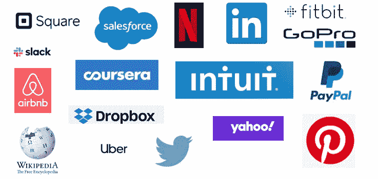
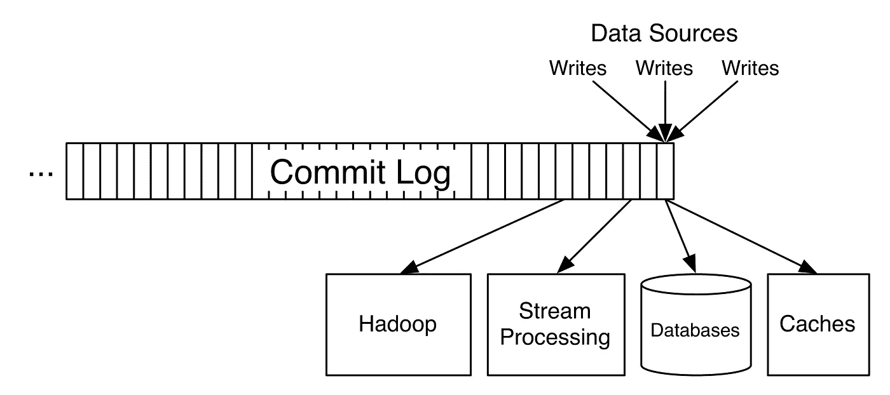
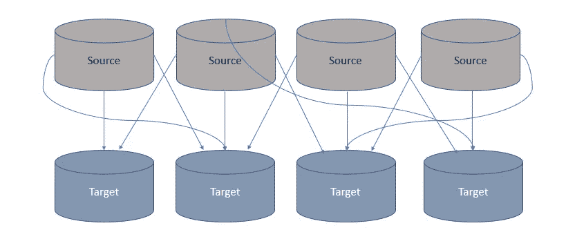
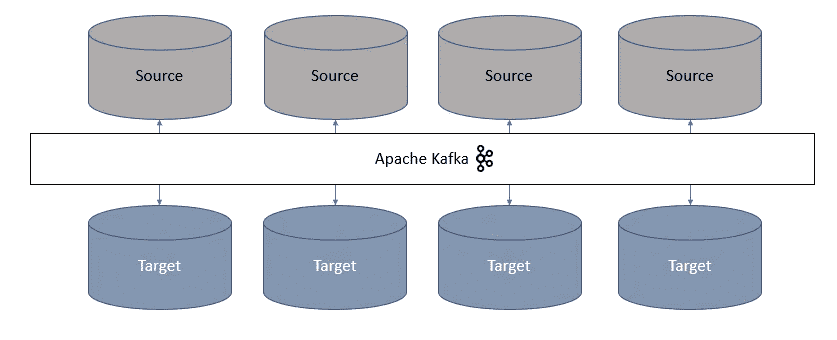
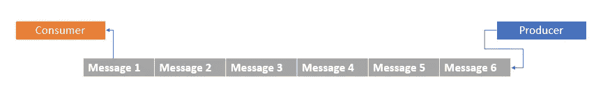
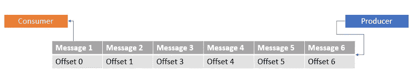
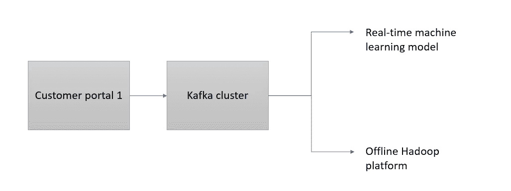
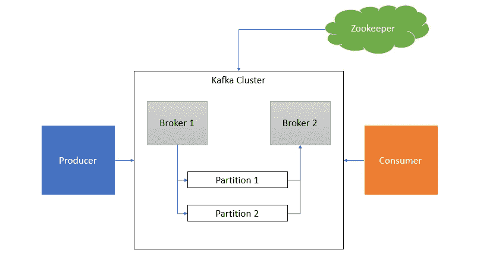

# 阿帕奇·卡夫卡——导论

> 原文：<https://medium.com/analytics-vidhya/apache-kafka-an-introduction-beaaaedb6cfa?source=collection_archive---------16----------------------->

在我们开始之前，下面的图片显示了目前正在使用 Apache Kafka 的公司列表。如你所见，大多数顶级玩家都榜上有名。事实上，在 60%的财富 500 强公司中，Kafka 是数据管道中不可或缺的一部分，并且已经成为事件流中事实上的标准。

现在我已经引起你的注意了，让我们深入研究卡夫卡吧！

## 卡夫卡是什么？

Kafka 是一个分布式消息/流媒体平台，由 LinkedIn 开发。它是水平可扩展的、容错的，并且可以被认为是结构化的提交日志。哇哦哇哦，太多词了。让我们把它分解一下。

**分布式—** 简而言之，分布式计算就是一组计算机，它们在后台协同工作，同时对最终用户表现为一个整体。它们同时工作，大大减少了延迟并提高了处理速度。Apache Kafka 建立在并行处理的概念上，几秒钟后我们将看到如何实现。

**容错—** 这种特性可以确保一台计算机发生故障不会导致整个系统受损。

**水平扩展—** 您可以向资源池中添加更多的机器来提高可扩展性，在我看来(您完全可以不同意)，这肯定比垂直扩展(增加更多的能力— CPU/RAM)要好。

提交日志(Commit log)—简单地说，它只不过是事务的记录。图片比文字更有说服力。提交日志看起来会像这样。

[https://confluent Inc . WordPress . com/2015/02/25/stream-data-platform-1/](https://confluentinc.wordpress.com/2015/02/25/stream-data-platform-1/)

如果你像我一样喜欢类比，就把卡夫卡想象成一家船运公司。确保包裹总是准时送达的公司(在这种情况下，是实时的，更像是《哈利·波特》中的运输公司，你不觉得吗？)并提供备用运输选项，以防出现潜在故障，并且您的包裹不会受损。多酷啊。如果这个类比不太适合你，并且如果你是一个视觉型的人(尤其是一个足球极客),看看这个由詹姆斯·库塔加制作的[惊人的视频](https://www.youtube.com/watch?v=Ch5VhJzaoaI),它给出了卡夫卡的一个快速概述。

现在你知道卡夫卡是什么了。但是为什么要用卡夫卡呢？好问题。请继续阅读！

# 为什么是卡夫卡？

让我们从传统架构开始。

随着数据以最高速度爆炸，我们可以很快想出一百万个理由来说明为什么这种天真的架构会成为失败之路。只要有几个源和目标，这个架构就可以无缝地工作。但是，随着时间的推移，系统之间将会有更多的交互、更多的数据读写、对更具弹性的存储的需求等等。这种体系结构无法横向扩展，计算、存储和可靠性都会受到严重影响。

让我们稍微修改一下，以适应卡夫卡，然后看看会发生什么。

正如你所看到的，卡夫卡成功地将源和目标解耦，并作为它们之间的接口。这如何使事情变得更简单？首先，箭变少了，这绝对不是坏事。严肃地说，随着 Kafka 的引入，我们迎来了一个新的范例，它利用了传统 ETL 和消息传递系统的优点，并有效地避开了这些传统架构中的缺点。

# 关键术语

Kafka 结合了两种传统的消息传递方法，排队和发布-订阅，为消费者提供了两个世界的最佳选择。Kafka 中的数据以主题(提交日志)的形式存储。生产者向主题发布消息，消费者从他们订阅的主题中读取消息。

**消息—** 消息可以被认为是一个事件，例如:点击流事件，或者实时体育更新。

**主题** —消息被分组到主题中。例如，点击流事件可以被分组到一个名为 user _ behaviour _ data 的主题中，而体育更新可以被分组到一个不同的主题中，比如 live_scores。

主题通过使用分区来合并并行性。消息被写入不同的分区(通常以循环方式)。现在逻辑问题出现了，卡夫卡如何在数据中保持固有的秩序。进来的是**【抵消】**。

**Offset** —这是一个帮助消费者识别他们必须以什么顺序消费消息的指示器。

**生产者** —生产者负责生成消息并将它们发送到各自的主题。

**消费者** —消费者接收生产者生成的消息。一旦消费者订阅了某个主题，他们就可以访问发布到该主题的所有消息。

1.  卡夫卡的一个关键特征是它的回放能力。消费者可以离线，他们可以随时阅读来自经纪人的消息。
2.  Kafka 中的消息可以在策略基础上持久化。换句话说，它们可以永久保存，或者根据需要保存特定的天数。这确保了容错。
3.  多个消费者可以不受任何干扰地阅读同一主题。与传统的排队系统相比，这是一个很大的优势，在传统的排队系统中，消费者必须等待轮到他们来消费消息。

例如:点击流数据可以由离线 Hadoop 平台用于存档，也可以由机器学习模型用于根据用户最近的活动向用户提供实时建议。

**代理—** 我们现在从高层次上理解了生产者发送消息，消费者消费这些消息。但是制作人怎么写题目呢？经纪人进来了。主题由 Kafka 集群中的经纪人撰写。他们向消费者提供信息。

## 卡夫卡建筑

我偷偷在建筑图中引入了一个新角色。动物园管理员。

**动物园管理员—** 我个人觉得动物园管理员需要一整篇文章来真正理解它的功能。但在高层次上，动物园管理员承担了确保资源之间协调的责任。它会跟踪:

*1。Kafka 集群节点的状态*

*2。分区*

*3。主题*

Kafka 代理是无状态的(输出仅取决于输入，而不取决于内部状态)，集群状态由 zookeeper 维护。看起来动物园管理员做了很多工作，对吗？还有哦！没有动物园管理员，卡夫卡服务就无法运行。所以，动物园管理员很像那个骑马的人。

**常见的卡夫卡用例**

1.  信息发送
2.  活动跟踪
3.  应用程序日志收集
4.  流处理
5.  解耦系统依赖性
6.  大数据集成

就这样，伙计们。这是对这种新的事件流范例的简要介绍。感谢阅读。

在下一篇文章中，我将带你参观卡夫卡装置。我向你保证，不会超过 3 分钟！！是的，你没看错。在那之前，祝您短信愉快！