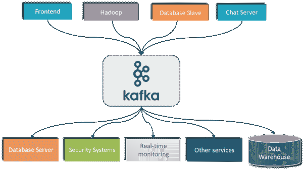
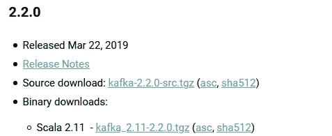
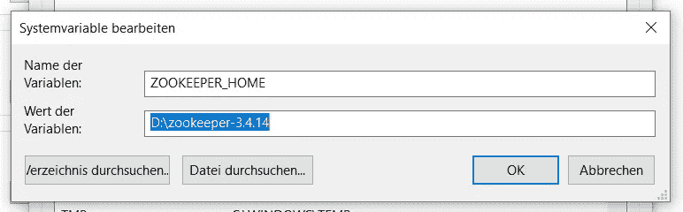
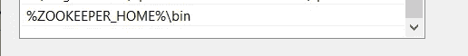
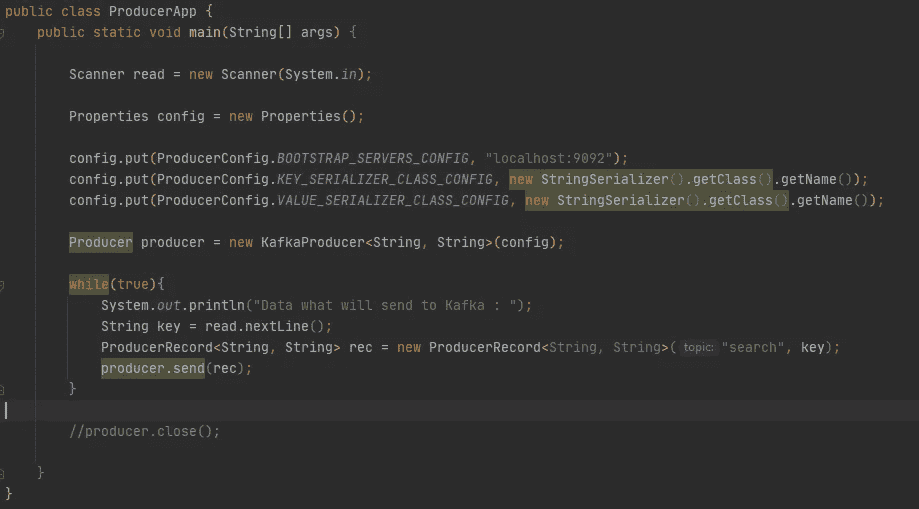

# 带有示例项目的 Apache Kafka Starter

> 原文：<https://medium.com/analytics-vidhya/apache-kafka-starter-with-sample-project-c43f89e395df?source=collection_archive---------3----------------------->

大家好，今天我将向大家展示如何学习 Apache Kafka，以及如何制作一个简单的 Java 项目。

我们开始吧..

**阿帕奇卡夫卡是什么？**

卡夫卡有很多功能..我就不说什么是卡夫卡了。基本上你可以连接两个不同的服务或者你可以处理发送者和接收者之间的数据。

更多信息:【https://kafka.apache.org/intro 

**什么是动物园管理员？**

这是卡夫卡的管理工具。

更多信息:[https://zookeeper.apache.org/](https://zookeeper.apache.org/)

**安装 Apache Kafka**

我用的是 Scala 2.11 的 2.2.0 版本。

下载链接:[https://kafka.apache.org/downloads](https://kafka.apache.org/downloads)

下载并解压到任何地方，您的本地 C 或 d。

更改配置文件夹中的 kafka-config-server 属性:

> log . dirs = D:\ Kafka _ 2.11–2 . 2 . 0 \ Kafka-logs

在你的 kafka 路径中创建 kafka-logs 文件夹。

**安装动物园管理员**

我使用 2019 年 4 月 2 日的版本:3.4.14 版

下载链接:

 [## Apache 下载镜像 3.4.14

### Apache 软件基金会主页

www.apache.org](https://www.apache.org/dyn/closer.lua/zookeeper/zookeeper-3.4.14/zookeeper-3.4.14.tar.gz) 

提取任何地方，您的本地 C 或 d。

之后，将动物园管理员添加到环境中:

然后，在路径环境中添加:

将 zoo_sample.cfg 文件更改为 zoo.cfg，并在此文件的 dataDir 列中:

> dataDir = D:\ zookeeper-3 . 4 . 14 \ data

在 zookeeper 路径上创建数据文件夹。

**启动动物园管理员和卡夫卡**

首先:在命令行上启动 Zookeeper:

> c:\ Users \用户名> zkserver

第二:在你的道路上开始卡夫卡:

> d:\ Kafka _ 2.11–2 . 2 . 0 \ bin \ windows > Kafka-server-start . bat..\..\config\server.properties

添加关于卡夫卡的 manuel 主题:

> d:\ Kafka _ 2.11–2 . 2 . 0 \ bin \ windows > Kafka-topics . bat-create-zookeeper localhost:2181-partitions 3-replication-factor 1-topic bigdatatopicsample

在命令行上显示主题列表:

> d:\ Kafka _ 2.11–2 . 2 . 0 \ bin \ windows > Kafka-topics . bat-list-zookeeper localhost:2181

根据命令管理生成器:

> d:\ Kafka _ 2.11–2 . 2 . 0 \ bin \ windows > Kafka-console-consumer . bat-bootstrap-server localhost:9092-主题搜索-从头开始

根据命令管理消费者:

> d:\ Kafka _ 2.11–2 . 2 . 0 \ bin \ windows > Kafka-console-producer . bat-broker-list localhost:9092-主题搜索

使用此命令，您可以进行添加、列表、显示操作。

**让我们开始 Java 项目**

创建 Java Maven 项目并添加依赖项:

 [## maven Repository:org . Apache . Kafka“Kafka-clients”2 . 2 . 0

### 编辑描述

mvnrepository.com](https://mvnrepository.com/artifact/org.apache.kafka/kafka-clients/2.2.0) 

我们将启动消费者和生产者应用程序。

可以用 ProducerApp 添加数据，在 ConsumerApp 上检查数据。

消费者应用程序:

制作人应用程序:

**结果:**我们开发了一个简单的 App。您可以按照自己的意愿发展这个应用程序。很简单，其他操作有教程就够了。

项目的 GitHub 链接:

 [## crony community/Kafka-Java-集成-消费者-生产者-样本

### 此时您不能执行该操作。您已使用另一个标签页或窗口登录。您已在另一个选项卡中注销，或者…

github.com](https://github.com/cronycommunity/kafka-java-integration-consumer-producer-sample) 

我希望这是有用的，下次见..