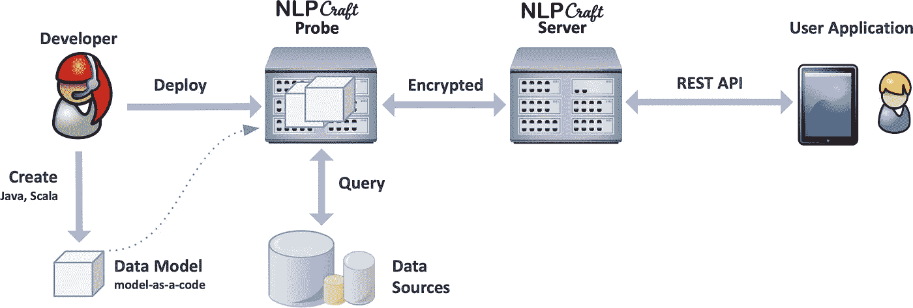

# Apache NLPCraft

> 原文：<https://medium.com/analytics-vidhya/apache-nlpcraft-2a705b4c30f1?source=collection_archive---------19----------------------->

沃洛季米尔·赫里先科在 [Unsplash](https://unsplash.com/s/photos/communication?utm_source=unsplash&utm_medium=referral&utm_content=creditCopyText) 上的照片

NLPCraft 是一个开源库，用于为任何应用程序添加自然语言接口。基于语义建模，它不需要 ML/DL 模型训练或现有的文本语料库。

NLPCraft 使用起来很简单:定义一个语义模型和意图来解释用户输入。安全地部署这个模型，并使用 REST API 从您的应用程序中使用自然语言来探索数据。

# 为什么是 NLI

自然语言接口(NLI)使用户能够使用自然语言探索任何类型的数据源，增强了现有的 UI/UX 与对话式人工智能的保真度和简单性。

没有学习曲线，没有需要掌握的特殊规则或应用程序，没有需要记住的语法或术语——只是您的用户已经使用的自然语言和工具。

# 关键特征

**语义建模**

高级语义建模和基于意图的匹配支持确定性自然语言理解，而无需 ML/DL 训练或文本语料库。

**强大的安全性**

HTTPs、模型部署隔离、256 位加密和仅入口连接是 NLPCraft 中的关键安全特性。

**任何数据源**

任何数据源、设备或服务—公共或私有。从数据库和 SaaS 系统到智能家居设备、语音助手和聊天机器人。

**代码模式**

模型作为代码的约定在 Java 生态系统中支持任何系统开发生命周期工具和框架。

**Java 优先**

REST API 和基于 Java 的实现本身支持世界上最大的开发工具、编程语言和服务生态系统。

**开箱即用的集成**

NLPCraft 与 [OpenNLP](https://opennlp.apache.org/) 、 [Google Cloud 自然语言 API](https://cloud.google.com/natural-language/) 、 [CoreNLP](https://stanfordnlp.github.io/CoreNLP/) 和 [spaCY](https://spacy.io/) 原生集成，用于基础 NLP 处理和命名实体识别。

# 它是如何工作的

有三个主要的软件组件:

**数据模型**指定如何解释用户输入，如何查询数据源，以及如何将结果格式化。开发人员使用模型即代码的方法，使用任何 JVM 语言(如 Java 或 Scala)来构建模型。

**Data probe** 是一个部署在 DMZ 上的应用程序，旨在安全地部署和管理数据模型。每个探测器可以管理多个模型，并且可以有多个探测器。

**REST 服务器**为用户应用程序提供 REST 端点，通过部署在数据探测器中的数据模型，使用 NLI 安全地查询数据源。

# NLI 应用

尽管 NLI(自然语言接口)对许多应用程序和软件系统有着广泛的适用性，但在一些特定的领域，NLI 已经得到了广泛的应用，并展示了其独特的能力。

**NLI 增强型搜索**

NLI 增强的搜索、过滤和排序是 NLI 已经成功多年的一个领域。看看 Google Analytics、Gmail、JIRA 或其他许多应用程序，它们允许你用自然语言查询来搜索、过滤或排序它们的内容。这个用例是 NLI 的一个完美应用，因为它通过用一个简单的文本框替换通常繁琐和难以使用的搜索/过滤/排序 UX，自然地增强了现有的 UI/UX。

事实上，今天所有主要的通用搜索平台(如 Google、Bing 或 Siri)都使用 NLI 增强的方法来处理搜索查询。

**聊天机器人**

NLI 显然是任何聊天机器人实现的核心。尽管大多数聊天机器人的幼稚实现都没有获得显著的牵引力，但 NLI 技术的进步正在让现代聊天机器人变得越来越复杂，并超越了早期“童年”问题，即寄生对话、缺乏上下文意识、无法理解口语、自由形式的语言和原始的基于规则的逻辑。

**数据报告**

NLPCraft 等完全确定性 NLI 系统为基于 NLI 的数据报告提供了关键技术。与数据洞察分析或数据探索不同，数据报告通常不能依赖于基于 ML/DL 的方法的概率性质，因为它必须在所有情况下提供 100%的正确性。

NLPCraft 采用高级语义建模，提供完全确定的结果和 NL 理解。

**临时数据浏览**

NLI 最令人兴奋的应用之一是即席数据分析或数据探索。在这个领域，适当的 NLI 应用程序可以为我们探索数据和从中发现真知灼见的方式带来根本性的变革。

如今，大多数数据都被隔离在独立的、不兼容的数据系统的孤岛中，除了少数“高级”用户之外，大多数人都无法访问这些数据。很少有人能够访问一个典型公司的所有不同系统，学习所有不同的方法来分析数据，并掌握不兼容和完全不同的用户界面。

基于 NLI 的方法可以通过允许用户使用自然语言来探索和分析数据，用一个统一的 UX 来民主化对分散的孤岛数据的访问。自然语言是唯一一种每个人都已经知道的 UX/UI，不需要培训或学习，并且不管数据源是什么，都是通用的。

**设备控制**

随着亚马逊 Alexa、苹果 HomeKit、梅赛德斯 MBUX 等消费技术的普及，NLI 对各种设备和系统的控制成为一种常态。

虽然今天这些系统中的大多数只能理解基本的 2-3 个单词命令，但 NLI 技术的进步正迅速导致更复杂的界面。企业世界开始迎头赶上，基于 NLI 的系统如今出现在各种制造、石油和天然气、制药和医疗应用中。

NLPCraft 已被 Apache 孵化器接受，我将成为 Apache NLPCraft 项目的导师。我将监督 NLPCraft 社区，以便与 Apache 方式保持一致。

[1]https://nlpcraft.org/index.html

[2][https://medium . com/@ furkankamaci/open-source-software-development-and-Apache-incubator-372 cc 90081 AE](/@furkankamaci/open-source-software-development-and-apache-incubator-372cc90081ae)