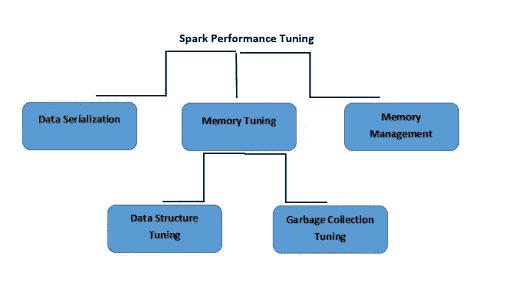

# 阿帕奇火花——速度与激情。

> 原文：<https://medium.com/analytics-vidhya/apache-spark-fast-and-furious-2f9e34f4601b?source=collection_archive---------12----------------------->

[Apache Spark](https://spark.apache.org/) 是一个数据处理框架，可以在非常大的数据集上快速执行处理任务，也可以将数据处理任务分布在多台计算机上，既可以单独使用，也可以与其他分布式计算工具协同使用。这两个品质是大数据和机器学习世界的关键，这需要汇集巨大的计算能力来处理大型数据存储。Spark 还通过一个易于使用的 API 减轻了开发人员的编程负担，该 API 抽象出了分布式计算和大数据处理的大量繁重工作。

要以最大功率运行 spark 作业，正确配置和调优它们非常重要。单一的公共配置或风格可能不适合所有的用例，所以首先理解一个用例，然后基于这个用例配置 spark 作业是非常重要的。

本文将关注 Apache spark 推荐的常见配置，以及有助于决定这些配置的因素。我们还将介绍如何以更有效的方式编写/编码 spark 作业，以提高速度并优化内存利用率。

当您编写 Apache Spark 代码并浏览公共 API 时，您会遇到像*转换*、*动作*和 *RDD* 这样的词。在这个层面上理解 Spark 对于编写 Spark 程序至关重要。类似地，当事情开始失败时，或者当你冒险进入 web UI 试图理解为什么你的应用程序需要这么长时间时，你会遇到一个新的词汇，比如 *job* 、 *stage* 和 *task* 。在这个层次上理解 Spark 对于编写好的 Spark 程序是至关重要的，当然这里所说的好，我指的是快。要编写一个能够高效执行的 Spark 程序，理解 Spark 的底层执行模型是非常非常有帮助的。

在我们开始之前，让我们了解一些重要的 spark 术语

1.  SPARK CONTEXT : SparkContext 是 spark core 的主要入口。它允许我们访问 spark 的更多功能。这有助于建立到 spark 执行环境的连接。它提供了对 spark 集群的访问，甚至可以使用资源管理器。Sparkcontext 充当 spark 应用程序的主人。它提供了各种功能，如:获取 spark 应用程序的当前状态、取消作业、取消阶段、同步运行作业、异步运行作业等。
2.  **SPARK 应用程序**:即使没有作业运行，SPARK 应用程序也可以代表它运行进程。它是一个独立的计算，运行用户提供的代码来计算结果。
3.  **TASK** :是一个工作单元，我们发送给执行者。每个阶段都有一些任务，每个分区一个任务。
4.  任务:并行处理由多个任务组成的计算。
5.  **阶段**:每项工作都被划分成小的任务集，这些任务集被称为阶段。
6.  **动作**:动作用于将结果保存到某个位置或显示结果。
7.  **RDD** :弹性分布式数据集(RDD)是 Spark 的基础数据结构。它是一个不可变的分布式对象集合。

> RDD(*)是不可变的分布式对象集合。***【RDD】****是一个* `*dataset*` *的逻辑引用，它跨集群中的多个服务器机器进行分区。***RDD 是不可变的，并且在失败的情况下可以自我恢复。RDD 可以来自任何数据源，例如文本文件、通过 JDBC 的数据库等。***
> 
> ****分区** : RDD 是各种数据的集合，如果它不能放入单个节点，它应该被分区到各个节点。也就是说，分区数量越多，并行性越强。RDD 的这些分区分布在网络中的所有节点上。**
> 
> ****转换**:转换是在 RDD 上创建一个或多个新 rdd 的懒惰操作，例如`map`、`filter`、`reduceByKey`、`join`、`cogroup`、`randomSplit`**
> 
> **在高层次上，有两种变换可以应用于 RDDs，即**窄变换和宽变换**。宽变换基本上导致阶段边界。**

****窄转换** —不需要数据在分区间混洗。例如，地图、过滤器等..**

****宽转换** —要求数据被混洗，例如，reduceByKey 等..**

**通过应用转换，您可以用最终 RDD 的所有父 RDD 逐步构建一个 [RDD 谱系](https://jaceklaskowski.gitbooks.io/mastering-apache-spark/spark-rdd-lineage.html)。转换是惰性的，即不会立即执行。只有在调用一个动作后，才会执行转换。**

# **了解用户提交 spark 作业时会发生什么**

**当作业进入时，驱动程序将代码转换成逻辑有向无环图(DAG)。之后，驱动程序执行某些优化，如流水线转换。此外，它将 DAG 转换成具有一组阶段的物理执行计划。同时，它在每个阶段下创建称为任务的小执行单元。然后，它收集所有任务并将其发送到集群。**

**驱动程序与集群管理器对话并协商资源。在此之后，集群管理器代表驱动程序启动执行器。此时，基于数据，放置驱动器将任务发送到集群管理器。执行者在开始执行之前向驱动程序注册自己。这样司机就能看到所有执行者的全貌。**

****

**Spark 作业执行的内部机制**

**现在，Executors 执行驱动程序分配的所有任务。同时，应用程序正在运行，驱动程序监控运行的执行器。在 spark 体系结构中，驱动程序计划未来的任务。通过基于数据放置跟踪缓存数据的位置来完成所有任务。当它调用 sparkcontext 的 stop 方法时，它终止所有的执行器。之后，它从集群管理器中释放资源。**

# **调整和调试 Spark 应用程序**

**Spark 的设计使得默认设置在许多情况下“开箱即用”;但是，仍有一些配置用户可能想要修改。配置对于调整应用程序的性能也很有用。Spark 的用户界面、工具和日志机制在您进行性能调优或故障排除时也很有用。**

****

# **执行的组成部分:工作、任务和阶段**

**作为调优和调试 Spark 的基础步骤，有必要更深入地了解系统的内部设计。通过将多个操作合并到任务中，Spark 在执行时将逻辑表示转化为物理执行计划。虽然理解 Spark 执行的每个方面超出了本文的范围，但是理解相关的术语和更深入地理解所涉及的步骤在调优和调试作业时是很有帮助的。**

**为了演示 Spark 的执行阶段，我们将遍历一个示例应用程序，看看用户代码如何编译到一个较低级别的执行计划。我们将考虑的应用程序是 Spark shell 中的一个简单的日志分析。对于输入数据，我们将使用一个文本文件，其中包含不同严重程度的日志消息，以及一些穿插的空行。**

**基于 Spark 的执行，我们将举例说明一个示例应用程序，其中用户代码组装到一个较低级别的执行计划。这里我们以 Spark shell 中一个简单的日志分析应用为例。一个由严重程度不确定的日志消息组成的文本文件，以及一些交错的空行将被视为输入数据。**

****

**示例输入文件— input.txt**

**需要在 Spark shell 中打开该文件，并计算每个严重级别出现多少条日志消息。让我们创造几个 RDD 来更好地回答这个问题。**

****

**火花应用代码**

**RDD 是一系列命令和计数的结果，包括每个严重级别的日志条目数量。在 shell 中执行这些行后，程序不会导致任何动作。它间接定义了 RDD 对象的有向无环图(DAG)。一旦动作发生，这将在以后使用。**

**维护指向一个或多个父节点的指针以及定义它们之间关系的元数据是 RDD 的特征。以这个例子为例，当您在 RDD 上调用 **val b = a.map()** 时，RDD b 会保留一个对其父节点 a 的引用。这些指针对于 RDD 追溯到其祖先是必不可少的。**

> **为了显示 RDD 的血统，Spark 提供了一个 toDebugString()方法。**

****

**在第一张图中，我们可以看到输入 RDD。这个 RDD 是通过调用 sc.textFile()创建的。ancestory 让我们了解了 sc.textFile()的基本功能，因为它揭示了哪些 rdd 是在 textFile()函数中创建的。它创建一个 HadoopRDD，然后对其执行映射以创建返回的 RDD。伯爵的祖先故事更加扭曲。这个特殊的 RDD 有几个祖先，因为在输入 RDD 之上执行了其他操作，如附加地图、过滤和简化。**

**此处显示的计数谱系也以图形方式显示在下图的左侧。**

****

**图— 1**

**在执行一个动作之前，这些 rdd 只存储将帮助我们以后计算它们的元数据。在计数 RDD 上调用一个动作并收集()它到驱动程序激活计算。**

****

**Spark 的调度程序创建一个物理执行计划，以确定执行动作所需的 rdd。在这部分中，当我们在 RDD 上调用 collect()时，RDD 的每一个分部都必须生成，然后转移到驱动程序中。调度器从最终确定的 RDD 开始(在这种情况下，计数)，并向后工作以找到它必须计算的内容。它调用 RDD 的父母，其父母的父母，并继续，循环地形成计算所有祖先 rdd 所需的物理计划。在简单的情况下，调度器为该图中的每个 RDD 输出一个计算阶段，其中该阶段为该 RDD 中的每个分部具有特定的任务。然后，反向执行这些阶段，以计算最终所需的 RDD。**

# **流水线操作和谱系截断**

**在复杂的情况下，阶段的物理集合与 RDD 图不是严格的 1:1 对应关系。**流水线**，或者由调度器执行的将多个 rdd 折叠成单个阶段是造成这种情况的原因。**

> **当 rdd 可以在不移动数据的情况下从其父级计算出来时，就会出现流水线操作。**

**在物理执行的时候，RDD 现有的与他们的父辈处于同一水平的腔将被流水线化。让我们考虑这个例子——在计算计数时，尽管有大量的父 rdd，但只显示了两个级别的缩进。这表明物理执行将只需要两个阶段。这种情况下的流水线操作是因为顺序有几个过滤和映射操作。上面图-1 的右半部分显示了计算 RDD 计数所需的两个执行阶段。**

**如果一个现有的 RDD 已经保存在集群内存或磁盘上，Spark 的内部调度程序可能会随流水线一起截断祖先史。在这种情况下，Spark 可以“短路”,并基于持久的 RDD 开始计算。在另一种情况下，当 RDD 作为早期洗牌的副作用已经形成时，即使它没有被显式地持续，截断也可能发生。这是一种底层优化，它利用了 Spark shuffle 输出被写入磁盘的事实，并利用了 RDD 图的许多部分被重新计算的事实。**

****

**一项工作可以被定义为一个特定的行动产生的一组阶段。一个工作的创建是由一个或多个阶段组成的，每次我们非法的行动，如计数。一旦设置并定义了阶段图，任务就会形成并发送到内部时间表，该时间表会根据使用的部署模式而变化。它们将按照特定的顺序执行，因为根据 RDD 的历史，物理计划中的各个阶段相互依赖。例如，输出混洗数据的阶段必须出现在依赖于该数据存在的阶段之前。物理阶段将启动任务，每个任务做相同的事情，但针对特定的数据部分。每个任务在内部执行相同的步骤:1 .从数据存储(如果 RDD 是输入 RDD)、现有的 RDD(如果舞台基于已缓存的数据)或随机输出中获取其输入。2.执行计算它所代表的 RDD 所必需的操作。例如，对输入数据执行 filter()或 map()函数，或者执行分组或归约。3.将输出写入 shuffle、外部存储或写回驱动程序(如果它是 count()等操作的最终 RDD)。**

**Spark 中的大多数日志记录和插装都是用阶段、任务和洗牌来表示的。理解用户代码如何编译成物理执行是一个高级的概念，但它将极大地帮助您调优和调试应用程序。**

**总而言之，在火花执行期间发生以下阶段:**

**1.用户代码定义了 rdd 的 DAG(有向无环图)。对 rdd 的操作创建了新的 rdd，这些 rdd 引用回它们的父 rdd，从而创建了图。**

**2.操作强制将 DAG 转换为执行计划。当您在 RDD 上调用操作时，必须对其进行计算。这也需要计算它的父 rdd。Spark 的调度程序提交一个任务来计算所有需要的 rdd。该作业将有一个或多个阶段，这些阶段是由任务组成的并行计算波。每个阶段将对应于 DAG 中的一个或多个 rdd。由于流水线操作，单个阶段可以对应于多个 rdd。**

**3.任务在群集上调度和执行，阶段按顺序处理，单个任务启动以计算 RDD 的各个部分。一旦工作的最后一个阶段完成，动作就完成了。在给定的 Spark 应用程序中，随着新 rdd 的创建，整个步骤序列可能会以连续的方式发生多次。**

# **从 Spark UI 中获得洞察力**

**Spark 的内置 web UI 是了解 Spark 应用程序的本质、行为和性能的基础。默认情况下，在端口 4040 上运行驱动程序的机器上，这是可用的。**

****

**Spark UI**

**此页面通常用于评估职务的绩效。查看构成一个作业的各个阶段，并确定在同一作业的多次运行中，这些阶段的响应时间是否很慢或波动很大。要了解该阶段与什么用户代码相关联，您可以点击进入，特别是如果您有一个昂贵的阶段。一旦感兴趣的阶段被缩小，如图 2 所示，它可以帮助隔离或突出性能问题。Spark 是性能问题的一个常见来源，它在数据并行系统中是不对称的，当任务比其他任务花费更长时间时就会发生。要识别不对称，stage 页面可以通过查看不同指标在所有任务上的分布来提供帮助。任务的运行时间——如果一些任务比其他任务长，这是一个好的开始。找出少数任务是否比其他任务读取或写入更多的数据，或者在某些节点上运行的任务是否非常慢——这些可以被认为是调试作业的有用的第一步。**

****

**图 2**

**除了查看任务偏差之外，确定任务在任务生命周期的各个阶段投入的时间是很有帮助的，例如阅读、计算和写作。如果任务花费很少的时间来读取或写入数据，用户代码可能被认为是昂贵的，但是它总体上花费了很长时间。**

# **最佳性能的关键考虑因素**

**为了提高性能以及优化 Spark 运行的集群和环境，您可以进行代码级的更改。**

****并行级别(代码级)**:一个 RDD 在逻辑上由一个对象集合表示。它为存储在一个部门中的数据创建一个任务，默认情况下，当 spark 调度或运行任务时，该任务将需要一个内核来执行。Spark 将根据自己的想法推断出 rdd 的良好并行度，对于大多数用例来说，这已经足够了。基于底层存储系统，输入 rdd 通常选择并行性。考虑这个例子，HDFS 输入 rdd 对于底层 HDFS 文件的每个部分都有一个分部。rdd 中的并行度设置基于父 rdd 的大小(当它们是通过洗牌其他 rdd 得到的时)。并行性的数量可能会从两个方面影响性能。如果并行性太强，资源可能会闲置。如果您为一个应用分配了 1，000 个内核，并且正在运行 30 个任务，那么通过利用更多内核，您可能能够提高并行度。如果有太多的并行性，与每个部门相关的小开销会累积起来，变得很大。当您的任务在几毫秒内完成，或者它们既不读也不写数据时，就表明了这一点。**

**Spark 提供了两种方法来调整操作的并行度。首先，在混洗数据的操作过程中，您可以始终将生成的 RDD 的并行度作为参数给出。第二，任何现存的 RDD 都可以被重新分配成更多或更少的分区。**

> ****coalesce()vs re partition()** re partition()操作符会将一个 RDD 随机洗牌到所需数量的分区中。如果知道正在收缩 RDD，可以使用 coalesce()运算符；这比 repartition()更有效，因为它避免了洗牌操作。**

****序列化格式(代码级)**:当使用 Spark 在网络上传输数据或将数据溢出到磁盘时，需要将对象按顺序合并成二进制格式。这种情况发生在随机操作期间，此时会传输大量数据。Spark 将默认使用 Java 的内置序列化器。它还支持使用 Kyro，这是一个第三方序列化库，改进了 Java 的序列化，提供了更快的序列化时间，具有更机敏和更紧凑的二进制表示，但它不能序列化“开箱即用”的对象。Kyro 方便了所有转移到它的应用程序进行序列化。如果您计划序列化，则需要向 Kyro 注册类。它允许 Kyro 避免为单个对象编写完整的类名，这是一种空间节省，可以增加数千或数百万的序列化记录。如果想强制这种类型的注册，可以将**spark . kryo . registration required**设置为 **true** ，Kryo 遇到未注册的类就会抛出错误。**

> **无论是使用 Kryo 还是 Java 的序列化程序，如果您的代码引用的类没有扩展 Java 的可序列化接口，您可能会遇到 NotSerializableException。在这种情况下，很难找出是哪个类导致了这个问题，因为可以从用户代码中引用许多不同的类。许多 JVM 支持一个特殊的选项来帮助调试这种情况:“**-dsun . io . serialization . extended debug info = true**”。您可以使用 **— driver-java-options** 和 **— executor-java-options** 标志来启用此选项**

****内存管理(代码级)**:内存被 Spark 以不同的方式使用，所以如果你想优化你的应用，理解和调整 Spark 的内存使用是很重要的。在每个执行器内部，内存用于不同的目的，即 RDD 存储。当您在 RDD 上调用 persist 或 cache 时，它的分部将存储在内存缓冲区中。当缓存到 JVM 总堆的一定数量时，Spark storage memory Fraction 将限制使用的内存量。当超过此限制时，旧的分部将从内存中删除。**混洗和聚合缓冲器-** 在执行混洗操作时，Spark 将在创建输出混洗数据时创建即时缓冲器。聚合的中间结果与将作为混洗的一部分直接输出的缓冲数据一起存储在这些缓冲区中。在混洗相关缓冲器中使用的存储器总量将受到火花到火花混洗存储器部分的限制。任何用户代码都是由用户代码 Spark 执行的，所以用户函数本身就需要大量的内存。例如，如果用户应用程序分配了大型数组或其他对象，这些对象将会争用全部内存。**

> **默认情况下，Spark 将为 RDD 存储器留出 **60%的空间，为随机存储器**留出 **20%的空间，为用户程序**留出**剩余的 20%空间。在某些情况下，用户可以调整这些选项以获得更好的性能。如果您的用户代码正在分配非常大的对象，那么减少存储和洗牌区域以避免耗尽内存可能是有意义的。****

****动态资源分配(硬件级)** : Spark 提供了一种机制，可以根据工作负载动态调整应用程序占用的资源。这意味着您的应用程序可以将不再使用的资源归还给集群，并在以后需要时再次请求它们。**

**为了支持动态分配，必须将群集配置为具有外部随机播放服务。这是必要的，以便在删除执行器时保留洗牌信息。Spark 使用的所有集群管理器都支持外部洗牌机。**

**为了在 Spark standalone 上配置外部洗牌机，将键`spark.shuffle.service.enabled`设置为`true`启动工作机。**

**此外，必须将`spark.dynamicAllocation.enabled`键设置为`true.`来启动火花应用程序**

****附加配置****

1.  ****限制资源**:每个应用程序可以设置集群应该分配的最小和最大资源。这是通过设置最小和最大数量的执行者。控制这些数字的配置键是`spark.dynamicAllocation.minExecutors`(默认值:零)和`spark.dynamicAllocation.maxExecutors`(默认值:无穷大)。**
2.  ****资源移除**:当没有任务要执行时，执行器空闲。默认情况下，60 秒的空闲执行器将被删除。该值可以通过`spark.dynamicAllocation.executorIdleTimeout`键控制。**

****集群设置的配置清单**:关于配置 spark 集群配置的好读物在此—[https://c2fo . io/c2fo/spark/AWS/EMR/2016/07/06/Apache-spark-config-cheat sheet/#:~:text = If % 20 your % 20 local % 20 machine % 20 has，out % 20 the % 20OS % 20 reserved % 20 settings。](https://c2fo.io/c2fo/spark/aws/emr/2016/07/06/apache-spark-config-cheatsheet/#:~:text=If%20your%20local%20machine%20has,out%20the%20OS%20Reserved%20settings.)**

**总之你可以下载这个 excel 文件 [config-cheatsheet.xlsx](https://c2fo.io/img/apache-spark-config-cheatsheet/C2FO-Spark-Config-Cheatsheet.xlsx) 。在 excel 中，只需更改以绿色突出显示的字段，rest 就会自动计算出来。**

# ****参考文献****

1.  **[https://spark.apache.org/docs/latest/tuning.html](https://spark.apache.org/docs/latest/tuning.html)**
2.  **学习火花:奥雷利的闪电般的大数据分析**
3.  **[https://c2fo . io/c2fo/spark/AWS/EMR/2016/07/06/Apache-spark-config-cheat sheet/#:~:text = If % 20 your % 20 local % 20 machine % 20 has，20the % 20OS % 20Reserved % 20settings。](https://c2fo.io/c2fo/spark/aws/emr/2016/07/06/apache-spark-config-cheatsheet/#:~:text=If%20your%20local%20machine%20has,out%20the%20OS%20Reserved%20settings.)**
4.  **[https://towards data science . com/how-does-Facebook-tune-Apache-spark-for-large-scale-workloads-3238 ddda 0830](https://towardsdatascience.com/how-does-facebook-tune-apache-spark-for-large-scale-workloads-3238ddda0830)**

**这些是我在阅读其他媒体文章、技术博客和我自己的工作经验时发现的一些事实。**

**希望你们觉得有帮助。**

**谢了。**