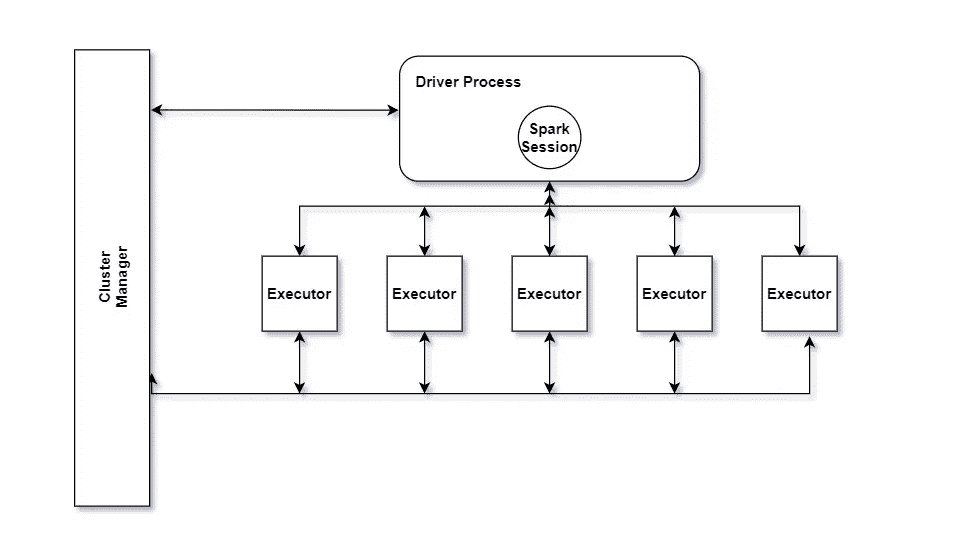
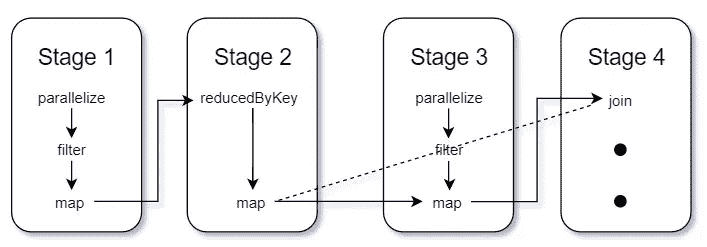

# 不耐烦的阿帕奇火花

> 原文：<https://medium.com/analytics-vidhya/apache-spark-for-the-impatient-8bb6f86d38e1?source=collection_archive---------5----------------------->

下面列出了 Spark 中最重要的主题，对于那些没有时间阅读整本书，但希望发现这种分布式计算框架的惊人能力的人来说，在开始之前绝对应该阅读这些主题。

# 体系结构

*星火架构图*

# MapReduce 与 Spark

尽管 Apache Spark 和 MapReduce 之间存在许多低级差异，但以下是最显著的差异:

*   Spark 在内存中的运行速度比在磁盘上快 100 倍。
*   一个用于对 100 TB 数据进行排序的排序应用程序比运行在 Hadoop MapReduce 上的应用程序快三倍，而使用的是十分之一的机器。
*   Spark 在机器学习应用程序上的速度尤其快，如朴素贝叶斯和 K-Means。
*   但是，如果 Spark 在带有其他共享服务的 YARN 上运行，性能可能会下降，并导致 RAM 开销内存泄漏。出于这个原因，如果用户有批处理的用例，Hadoop 被认为是更高效的系统。

# 驱动者和执行者

运行您的`main()`函数的**驱动程序**进程位于集群中的一个节点上，负责三件事情:

1.  维护关于 Spark 应用程序的信息。
2.  响应用户的程序或输入。
3.  在执行者之间分析、分配和调度工作。

驱动程序进程是绝对必要的——它是 Spark 应用程序的核心，在应用程序的生命周期中维护所有相关信息。

**执行者**负责实际执行司机分配给他们的工作。这意味着每个执行者只负责两件事:

1.  执行由驱动程序分配给它的代码。
2.  将该执行器上的计算状态报告回驱动节点。

# 划分

为了允许每个执行器并行执行工作，Spark 将数据分成称为**分区**的块。分区是位于集群中一台物理机上的行的集合。数据帧的分区表示数据在执行期间如何在机器集群中物理分布。

如果你有一个分区，Spark 的并行度只有一个，即使你有几千个执行程序。如果有许多分区，但只有一个执行器，Spark 的并行度仍然只有一个，因为只有一个计算资源。

# 执行模式:客户端、集群或本地

执行模式使您能够在运行应用程序时确定上述资源(如驱动程序和执行器)的物理位置。

您有三种模式可供选择:

1.  集群模式。
2.  客户端模式。
3.  本地模式。

**集群模式**可能是运行 Spark 应用程序最常见的方式。在集群模式下，用户向集群管理器提交预编译的代码。然后，除了执行器进程之外，集群管理器还在集群内部的一个工作节点上启动驱动程序进程。这意味着集群管理器负责管理所有与 Spark 应用程序相关的进程。

**客户端模式**与集群模式几乎相同，除了 Spark 驱动程序保留在提交应用程序的客户端机器上。这意味着客户机负责维护 Spark 驱动程序进程，而集群管理器维护执行器进程。我们运行 Spark 应用程序的机器不在集群上，通常被称为网关机器或边缘节点。

**本地模式**可以被认为是在你的电脑上运行一个程序，你告诉 spark 在同一个 JVM 中运行驱动程序和执行程序。

# RDD、数据框和数据集

Spark 提供的主要抽象是一个**弹性分布式数据集** (RDD)，这是一个跨集群节点划分的元素集合，可以并行操作。rdd 是通过从 Hadoop 文件系统(或任何其他 Hadoop 支持的文件系统)中的一个文件，或驱动程序中的一个现有 Scala 集合开始，并转换它而创建的。

在单个 RDD 应该被多次使用的情况下，用户可以请求 spark 持久化一个 RDD，有多个持久化级别，这将指示 Spark 应用程序保存 RDD 并允许有效使用。最后，rdd 会自动从节点故障中恢复。

一个 ***Dataframe*** 是最常见的结构化 API，简单地表示一个包含行和列的数据表。这些列和它们的数据类型组合起来就形成了数据帧的模式。您可以将*数据框架*想象成一个带有命名列的电子表格。

尽管有一个基本的区别:一个电子表格驻留在一台计算机的一个特定位置，而一个 Spark *数据帧*可以跨越数千台计算机。将一个文件放在多个节点上可能有各种原因:数据太大，一台机器无法容纳，或者在一台机器上执行计算需要太长时间。

从 Spark 2.0 开始， ***数据集*** 具有两种截然不同的 API 特征:强类型 API 和非类型 API。从概念上讲，将 *Dataframe* 视为通用对象数据集[Row]集合的别名，其中一行是通用的非类型化 JVM 对象。相比之下，数据集是强类型 JVM 对象的集合，由您在 Scala 中定义的 case 类或 Java 中的类决定。

# 共享变量

Spark 中的第二个抽象是**共享变量**，在并行操作期间，这些变量可以在所有参与节点之间使用。尽管通常情况下，Spark 会提供任务执行其功能所需的变量的副本。然而，有时候，一个变量需要跨任务共享，或者在任务和驱动程序之间共享。Spark 支持两种类型的共享变量:

1.  **广播变量**，可用于在所有节点的内存中缓存一个值。
2.  **累加器**，是只“相加”的变量，如计数器和总和。

# 火花会议

任何 Spark 应用程序的第一步都是创建一个`SparkSession`。一些遗留代码可能会使用新的`SparkContext`模式。鉴于可能有多个库试图在同一个 Spark 应用程序中创建一个会话，应该使用`SparkSession`上的 builder 方法来避免这种情况，它更健壮地实例化 Spark 和 SQL 上下文，并确保没有上下文冲突:

有了`SparkSession`之后，你应该可以运行你的 Spark 代码了。从`SparkSession`中，您也可以相应地访问所有低级和遗留的上下文和配置。

**注意**:只有在 Spark 2.X 中添加了`SparkSession`类。您可能会发现更老的代码会直接为结构化 API 创建一个`SparkContext`和一个`SQLContext`。

`SparkSession`中的`SparkContext`对象表示与火花簇的连接。这个类是您与 Spark 的一些低级 API(如 rdd)通信的方式。通过一个`SparkContext`，您可以创建 rdd、累加器和广播变量，并且可以在集群上运行代码。如果你想初始化`SparkContext`，你应该以最普通的方式创建它，通过`getOrCreate`方法:

# 懒惰评估

**懒求值**表示 Spark 会等到最后一刻才执行计算指令图。在 Spark 中，不是在表达某个操作时立即修改数据，而是构建一个希望应用于源数据的转换计划。

通过等到最后一分钟才执行代码，Spark 将这个计划从原始数据帧转换编译成一个精简的物理计划，该计划将在集群中尽可能高效地运行。这提供了巨大的好处，因为 Spark 可以端到端地优化整个数据流。这方面的一个例子是数据帧上的谓词下推。

如果我们构建了一个大的 Spark 作业，但是在最后指定了一个过滤器，只要求我们从源数据中获取一行，那么最有效的执行方式就是访问我们需要的单个记录。Spark 将通过自动按下过滤器来为我们优化这一点。

# 行动和转变

**转换**允许我们建立逻辑转换计划。为了触发计算，我们运行一个动作。一个动作指示 Spark 计算一系列变换的结果。最简单的操作是 count，它给出 DataFrame 中记录的总数:divisBy2.count()前面代码的输出应该是 500。

当然，计数不是唯一的动作。有三种操作:在控制台中查看数据的操作将数据收集到相应语言的本机对象的操作写入输出数据源的操作在指定此操作时，我们启动了一个 Spark 作业，它运行我们的过滤转换(窄转换)，然后是一个聚合(宽转换)，它在每个分区的基础上执行计数，然后是一个收集，它将我们的结果带到相应语言的本机对象。

您可以通过查看 Spark UI 来了解所有这些，Spark UI 是 Spark 中包含的一个工具，您可以使用它来监视集群上运行的 Spark 作业。

在 Spark 中，核心数据结构是不可变的，这意味着它们在创建后不能更改。乍一看，这似乎是一个奇怪的概念:如果你不能改变它，你应该如何使用它？要“改变”一个数据帧，您需要指示 Spark 您希望如何修改它以达到您的目的。这些指令被称为转换。

转换是使用 Spark 表达业务逻辑的核心。有两种类型的转换:指定窄依赖关系的转换和指定宽依赖关系的转换。由窄依赖关系组成的转换(我们称之为窄转换)是指每个输入分区只贡献给一个输出分区的转换。在前面的代码片段中，where 语句指定了一个**窄依赖项，其中只有一个分区贡献至多一个输出分区**。

**宽依赖(或宽转换)风格的转换将使输入分区贡献给许多输出分区**。您经常会听到这被称为洗牌，Spark 将在集群中交换分区。对于窄转换，Spark 将自动执行一个称为流水线的操作，这意味着如果我们在*数据帧*上指定多个过滤器，它们都将在内存中执行。洗牌就不一样了。当我们执行洗牌时，Spark 将结果写入磁盘。

# 阶段和任务

Spark 中的**阶段**表示可以在多台机器上一起执行以计算相同操作的任务组。一般来说，Spark 会尝试将尽可能多的工作(即，在您的作业中尽可能多的转换)打包到同一个阶段中，但是引擎会在称为 shuffles 的操作之后开始新的阶段。

shuffle 表示数据的物理重新分区，例如，对数据帧进行排序，或者按键对从文件加载的数据进行分组(这需要将具有相同键的记录发送到相同的节点)。这种类型的重新分区需要跨执行器协调来移动数据。Spark 在每次洗牌后开始一个新的阶段，并跟踪这些阶段必须以什么顺序运行来计算最终结果。

Spark 中的阶段由**任务**组成。每个任务对应于数据块的组合和一组将在单个执行器上运行的转换。如果我们的数据集中有一个大分区，我们将有一个任务。如果有 1000 个小分区，我们将有 1000 个可以并行执行的任务。任务只是应用于一个数据单元(分区)的一个计算单元。将数据划分成更多的分区意味着可以并行执行更多的数据。

# 有向无环图

*有向无环图*

Apache Spark 中的 DAG 是一组顶点和边，其中顶点表示 RDD，边表示要应用于 RDD 的操作。在 Spark DAG 中，每个边在序列中从前面指向后面。

# 资源管理器:独立或纱线或 MESOS

Spark 用来执行任务的机器集群由一个集群管理器管理，比如 Spark 的独立集群管理器、YARN 或 Mesos。然后，我们向这些集群管理器提交 Spark 应用程序，集群管理器将向我们的应用程序授予资源，以便我们能够完成我们的工作。