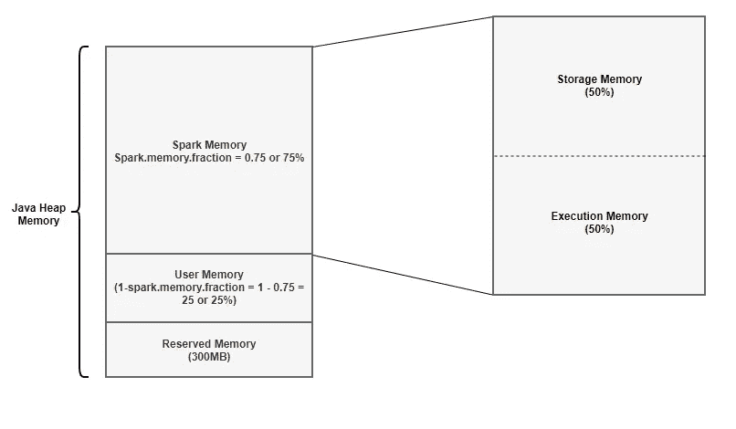

# Apache Spark 内存管理

> 原文：<https://medium.com/analytics-vidhya/apache-spark-memory-management-49682ded3d42?source=collection_archive---------1----------------------->

这个博客描述了 spark 执行器内存管理背后的概念

如果你正在阅读这篇博客，那么你可能知道 spark 的架构，至少在高层次上。简而言之，spark 是一个执行框架，它提供了一种并行处理数据的方法。与 Hadoop 不同，Spark 应用程序占用大量内存。这就需要理解 spark 中的内存管理是如何完成的，这将帮助您调整 spark 的配置，以充分利用可用的资源。在 spark 中，所有的计算都是在 Executor 中完成的，因此这篇博客主要关注 executor 内存管理。

弗兰克·麦肯纳在 [Unsplash](https://unsplash.com?utm_source=medium&utm_medium=referral) 上拍摄的照片

# 执行者记忆崩溃

在 spark 1.6 之前，内存管理的机制是不同的，本文将介绍 spark 1.6 及更高版本中的内存管理。早期的内存管理是使用 StaticMemoryManager 类完成的，在 spark 1.6 及更高版本中，内存管理是由 UnifiedMemoryManager 类完成的。

下图显示了 Spark executor 中的内存是如何隔离的

火花执行器内存分配

为了便于理解，我们以分配给执行器的 4GB 内存为例，保留默认配置，看看每个段得到多少内存。

控制执行器内存分配的两个主要配置:

spark . memory . fraction-默认为 0.75

spark . memory . storage fraction-默认为 0.5

## 1.保留内存

这是系统保留的内存，其大小是硬编码的。从 Spark 1.6.0 开始，它的值是 300MB，也就是说这 300MB 的 RAM 是不能改变的，除非重新编译 Spark。这种记忆储存火花内部物体。需要注意的一点是，如果执行器内存小于保留内存的 1.5 倍，Spark 将失败，并显示“请使用更大的堆大小”错误消息。

*公式* : **预留内存= 300MB**

*4GB*的计算:**保留内存= 300MB**

## 2.用户存储器

这是存储所有用户定义的数据结构、用户创建的任何 UDF 等的存储区域。该内存段不由 spark 管理，spark 不会知道/维护该内存段。这个内存池的大小可以计算为(Java 堆—保留内存)* (1.0 — spark.memory.fraction)，默认情况下等于(Java 堆— 300MB) * 0.25。

*公式* : **用户内存=** **(Java 堆—保留内存)*(1.0—spark . Memory . fraction)**

*4GB 的计算* : **用户内存=(4024 MB—300 MB)*(1.0–0.75)= 949 MB**

## 3.火花记忆

这个内存池由 Spark 管理。它负责在执行任务(如连接)时存储中间状态，或者存储广播变量。所有缓存/持久化的数据将被存储在该段中，具体地说是存储在该段的存储器中。

*公式* : **(Java 堆—保留内存)* spark.memory.fraction**

*4GB 的计算*:**(4096 MB-300 MB)* 0.75 = 2847 MB**

这分为两部分存储内存和执行内存。我们将简要讨论这两个部分:

**存储内存:**

存储内存用于存储所有的缓存数据，广播变量也存储在这里。任何包含内存持久化选项，spark 都会将数据存储在这个段中。Spark 通过基于最近最少使用(LRU)机制删除旧的缓存对象，为新的缓存请求清理空间。一旦缓存的数据超出存储空间，就会被写入磁盘或根据配置重新计算。广播变量以 MEMORY_AND_DISK 持久级别存储在这个段中。

*公式* : **存储内存= (Java 堆—保留内存)* spark . Memory . fraction * spark . Memory . Storage fraction**

*4GB 的计算* : **存储内存=(4096 MB—300 MB)* 0.75 * 0.5 = ~ 1423 MB**

**执行内存:**

Spark 将这个内存区域用于任务执行期间创建的对象。例如，它用于存储哈希聚合步骤的哈希表，它用于存储内存中映射端的混洗中间缓冲区等。如果没有足够的可用内存，该池也支持磁盘溢出，但是该池中的块不能被其他任务强制逐出。

*公式* : **执行内存= (Java 堆—保留内存)* spark . Memory . fraction *(1.0—spark . Memory . storage fraction)**

*4GB 的计算* : **执行内存=(4096 MB—300 MB)* 0.75 *(1.0—0.5)= ~ 1423 MB**

在 spark 1.6 及以上版本中，执行内存和存储内存没有硬性的界限。由于执行内存的性质，块不能从这个池中被强制逐出，否则执行将会中断，因为它所引用的块将不会被找到。但是对于存储内存，可以根据需要将块从内存中逐出，写入磁盘或重新计算(如果持久性级别是 MEMORY_ONLY)。关于存储和执行内存，有几件事需要记住:

*1。只有在执行内存中没有使用块时，存储内存才能从执行内存中借用空间。*

*2。如果存储内存中没有使用块，执行内存也可以从存储内存中借用空间。*

*3。如果来自执行存储器的块被存储存储器使用，并且执行需要更多的存储器，它可以强制驱逐存储存储器占用的多余块*

*4。如果存储内存中的块被执行内存使用，并且存储需要更多的内存，它不能强制驱逐执行内存占用的多余块，它将最终拥有更少的内存区域。它将等待 Spark 释放执行内存存储的多余块，然后占用它们。*

## 4GB 执行程序内存分配的内存故障

保留内存— 300MB — 7.32%

用户内存— 949MB — 23.16%

火花内存— 2847MB —69.5%

如果您想知道可用于存储缓存数据的空间是多少，这是总内存细分(请注意，没有硬性限制，这是初始分配):

初始存储内存(50%的 spark 内存)— 1423MB — 34.75%

该百分比值仅用于 4GB 执行器内存的计算，对于不同的执行器内存配置，这些值不适用。这只是为了便于理解。

感谢阅读本文:)