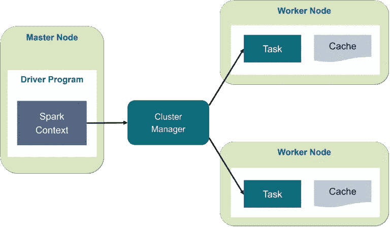
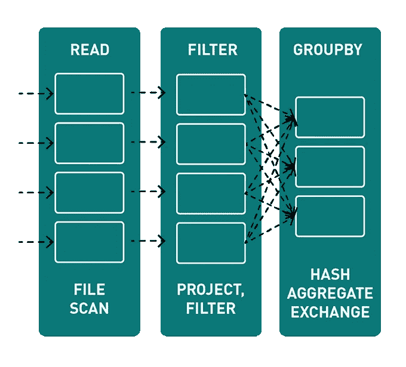
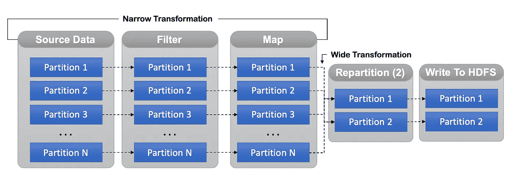

# Apache Spark:优化技术

> 原文：<https://medium.com/analytics-vidhya/apache-spark-optimization-techniques-3e984444ea07?source=collection_archive---------11----------------------->


**Apache Spark** 是目前市场上知名的大数据处理引擎。它在很多用例中都有帮助，从实时处理(火花流)到图形处理(GraphX)。作为一个机构，对星火科技的投资已经成为必然之举。对收养的狂热源于两个主要因素，

1.  大型社区以及与其他知名项目的良好集成
2.  易用性(API 使用起来非常简单和优雅)

与所有大数据项目一样，仅仅使用它们并不能解决您的问题。为了优化您的工作负载，您需要了解它的复杂性及其基本架构。

我试图根据我的学习列出一些 Spark 批处理优化，希望这有助于微调您的过程。:)

# 介绍

要理解 Spark 及其用例，请通读他们的[官方文档](https://spark.apache.org/docs/latest/index.html)。开源项目的最佳文档之一。



演职员表: [Edureka Page](https://www.edureka.co/blog/spark-architecture/#:~:text=Spark%20Architecture%20Overview,Resilient%20Distributed%20Dataset%20(RDD))

为了更快地理解——在阅读这篇文章之前，

1.  [数据块](https://databricks.com/spark/getting-started-with-apache-spark)
2.  [爱德华卡](https://www.edureka.co/blog/spark-tutorial/)
3.  [辅导点](https://www.tutorialspoint.com/apache_spark/apache_spark_introduction.htm)

# 最佳化

让我们跳到优化，

1.  窄转换比宽转换更好
2.  对结构化数据使用列数据格式
3.  在源位置对数据进行分区，以提高整体性能
4.  将数据帧转换为 RDD 数据代价高昂，请不惜一切代价避免
5.  对所有较小的表连接使用**广播**提示
6.  为你的程序使用熟知的**火花配置参数**

## 窄转换比宽转换更好

**洗牌**意味着跨分区移动数据——有时也跨节点移动，这会导致数据通过网络移动

**窄转换**是 *map()* 、 *filter()* 函数的结果，这些计算数据位于单个分区上，这意味着在执行窄转换时分区之间不会有任何数据移动

鉴于，**更广泛的转换**是 *groupByKey()* 和 *reduceByKey()* 函数的结果，这些函数计算驻留在许多分区上的数据，这意味着将在分区之间移动数据以执行更广泛的转换



由于数据驻留在同一个分区上，执行窄转换非常快。因此，尝试在更大范围的转换(洗牌)之前执行大多数小范围的转换

## 对结构化数据使用列数据格式

Spark 数据帧类似于 RDBMS 中的表。它包含数据的模式，这有助于 catalyst optimiser 了解数据的确切大小，进而有助于在特定列上执行计算，而不是读取整个行

柱状形式，如拼花地板、ORC 等。提供了额外的优化，将过滤器下推到文件，而不是将完整的数据加载到内存中，然后只选择所需的列

## 在源位置对数据进行分区，以提高整体性能

source 中存在的数据分区数是 spark 并行执行的任务数。除非我们明确执行 repartition()、coalesce()或任何更广泛的转换，否则并行任务的数量将不会改变。这将有助于使处理更接近较小的数据，并且比在一个大数据集上更快地执行任务

基于数据的域和用途，对数据进行分区，以便更好地查询和处理。有时*重新分区(或)合并*是不可避免的，如果数据在某些转换后有偏差，比如过滤一些数据模式。在下面的示例中，在写入 HDFS 之前，我们执行了重新分区，这使得所有操作都更快，因为没有数据被打乱。为了提高存储中的写入效率，我们执行了重新分区。确保在 DAG 中对进一步处理有效的阶段执行重新分区。



源数据分区

## 将数据帧转换为 RDD 数据代价高昂，请不惜一切代价避免

有一个将数据帧转换为 RDD 并在其上执行处理的选项。但是这个手术很贵，要不惜一切代价避免！！

假设我们有以下数据，

我模拟了直接在数据帧上执行相同的操作，而不是将其转换成 RDD 后再执行

```
Running groupBy using [df]: Time take: 8705 ms
Running groupBy using [rdd]: Time take: 12122 ms
```

使用本地 spark 会话和所有默认配置在 500 万行上执行

## 对所有较小的表连接使用**广播**提示

对于大型表(事实)与相对较小的表(维度)之间的连接，广播连接可能非常有效，这些表可用于执行**星型模式连接**。它可以避免通过网络发送大表的所有数据

这将有助于将表传输给执行者，而不是将数据混在一起连接，这将增加总的执行成本

## 为你的程序使用消息灵通的**火花配置参数**

[**火花配置**](https://spark.apache.org/docs/latest/configuration.html) 在我们进行任何优化的时候，大多数时候都是罪魁祸首。如果配置不好，即使最高效的代码也会降低执行速度。

例如，如果我们有一个巨大的数据—有 200 个分区。如果每个分区的大小达到 10G。

现在，如果我们配置`--executor-memory 2G`，那么每个分区都不适合内存——这将在执行过程中导致大量的 GC。因此，火花配置是寻找优化的相当重要的参数。

**关键配置:**

*   在群集中运行时，默认情况下启用动态分配，以便有效利用空闲节点
*   确保每个内核都有足够的执行器内存

```
(executor-memory / no.of cores) > per partition data size 
// But not at all times, depends on your data and your code
```

*   仅仅增加执行者的数量并不能保证速度

```
(no.of executors * no.of cores) is the parallelism
```

*   序列化和压缩有助于我们混洗或保存数据块。默认情况下，使用“Kryo”序列化并启用压缩。
*   `spark.sql.shuffle.partitions`用于对连接或聚合的数据进行洗牌。因此，请根据您的数据使用所需的并行度(默认值为 200，对于大数据来说非常少)

## 结论

虽然 **Spark** 是非常流行和突出的大数据处理引擎，但优化始终是一个具有挑战性的话题。因此，理解底层数据和您的过程中所有可能的 spark 配置是非常重要的。

没有*银弹* 为任何过程配置火花参数。这完全取决于您的数据和代码。建议在为您的程序决定优化技术之前执行不同的基准测试

## 参考/代码

[](https://spark.apache.org/docs/latest/configuration.html) [## 火花配置

### 火花提供了三个位置来配置系统:火花属性控制大多数应用参数，可以…

spark.apache.org](https://spark.apache.org/docs/latest/configuration.html)  [## 介绍

### 欢迎阅读 Spark SQL 在线手册的内部内容！我很高兴你能来这里，希望你会喜欢探索…

jaceklaskowski.gitbooks.io](https://jaceklaskowski.gitbooks.io/mastering-spark-sql/) [](https://github.com/subashprabanantham/hakuna-matata/tree/master/spark-optimization) [## subashprabanantham/hakuna-matata

### 此时您不能执行该操作。您已使用另一个标签页或窗口登录。您已在另一个选项卡中注销，或者…

github.com](https://github.com/subashprabanantham/hakuna-matata/tree/master/spark-optimization)