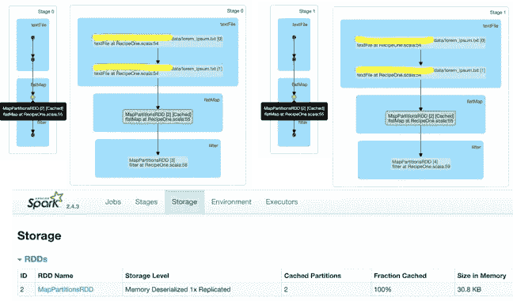

# Apache Spark 性能方法——当从父 RDD 分支时，显式缓存 RDD

> 原文：<https://medium.com/analytics-vidhya/apache-spark-performance-recipe-explicitly-cache-rdd-when-branching-out-from-parent-rdd-48e394f82637?source=collection_archive---------13----------------------->

下面的字数统计示例说明了当 RDD 家族分裂/分支时缓存 RDD 的重要性。

**案例 1:读取输入文件两次**

*loremCountCase1* 和 *ipsumCountCase1* 操作的文件加载可以在日志中验证。根据分区和并行度，您将在日志中显示下面两行两次，指示文件被读取两次。

```
INFO HadoopRDD: Input split: file:/data/lorem_ipsum.txt:1816+1817
INFO HadoopRDD: Input split: file:/data/lorem_ipsum.txt:0+1816
```


从上面的 DAG 可以看出，对于每个 collect()操作，所有操作都执行两次。

[](/@verditer/understanding-tradeoffs-in-designing-real-time-streaming-analytical-applications-f1ddbc852d77) [## 了解设计实时流分析应用的权衡

### 相反，设计没有好坏之分，会有许多权衡要做，希望这些权衡是好的…

medium.com](/@verditer/understanding-tradeoffs-in-designing-real-time-streaming-analytical-applications-f1ddbc852d77) 

**情况 2:使用显式持久化操作仅读取输入文件一次**

*loremCountCase2* 和 *ipsumCountCase2* 操作的文件加载只发生一次，同样可以在日志中验证。

```
INFO HadoopRDD: Input split: file:/data/lorem_ipsum.txt:1816+1817
INFO HadoopRDD: Input split: file:/data/lorem_ipsum.txt:0+1816
```



RDD 周围的绿色斑点和绿色高亮显示表示 RDD 已缓存，缓存的 RDD 可以在用户界面的存储选项卡上看到。

[](/@verditer/a-work-breakdown-structure-wbs-for-big-data-analytics-projects-part-1-db4c2a8179fd) [## 大数据分析项目的工作分解结构(WBS)——第 1 部分

### 有没有想过大数据项目涉及哪些活动？工作分解结构(WBS)有助于选择…

medium.com](/@verditer/a-work-breakdown-structure-wbs-for-big-data-analytics-projects-part-1-db4c2a8179fd) 

**情况 3:只读取输入文件一次，没有显式持久化操作**


*阶段 2* 被跳过，因为默认缓存了*阶段 0* 的结果，在阶段操作的详细视图中没有绿点指示 RDD 是否被缓存。

[](/@verditer/datalake-an-understanding-and-approach-to-extracting-value-569116a82df7) [## 数据湖——理解和提取价值的方法

### 十年大数据& Hadoop 和问题差不多，Hadoop 能代替 RDBMS 吗？大数据技术能否取代…

medium.com](/@verditer/datalake-an-understanding-and-approach-to-extracting-value-569116a82df7) 

**案例 4:只读取输入文件一次，使用显式持久化操作**


ShuffleRDD 上的绿点表示它已被缓存。

来自关于 [RDD 持久性](https://spark.apache.org/docs/latest/rdd-programming-guide.html#rdd-persistence)的 Spark 文档

> Spark 还会在 shuffle 操作中自动持久化一些中间数据(比如 reduceByKey)，即使没有用户调用 persist。这样做是为了避免在洗牌过程中节点失败时重新计算整个输入。如果用户打算重用得到的 RDD，我们仍然建议他们调用 persist。

当 spark 代码在大型数据集上运行时，中间缓存结果往往会由于集群内存的限制而被逐出。正如 Spark 文档中所建议的，当分支 RDD 血统并计划以后重用时，持久化操作必须是显式的。

正如您所看到的，编写 spark 代码很容易，但是编写一个高性能的 spark 代码需要理解 Spark 是如何工作的。在非分布式本地环境中进行测试不会带来很多性能问题。总是用较大的数据集测试集群。

请[在此注册](https://datum.substack.com)或在您的收件箱中直接接收所有更新的双月简讯。

*免责声明:所有表达的观点都是我个人的独立想法，并不归因于我现在或以前的雇主。*