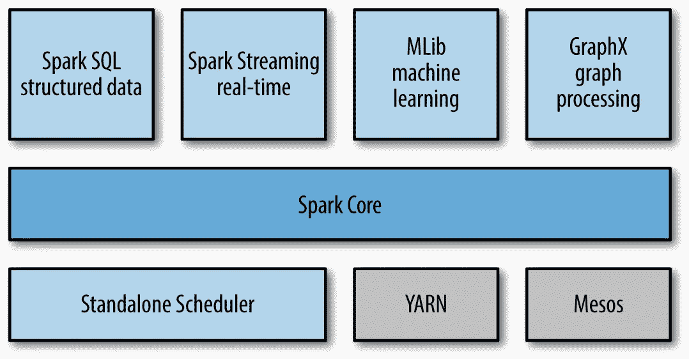
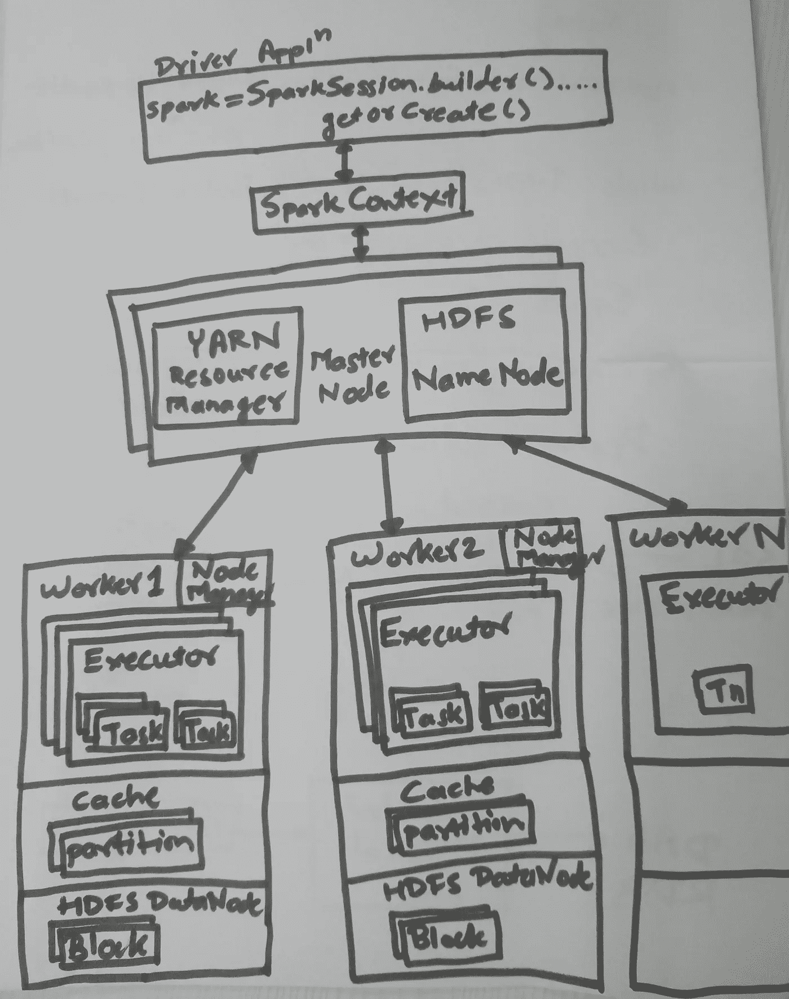
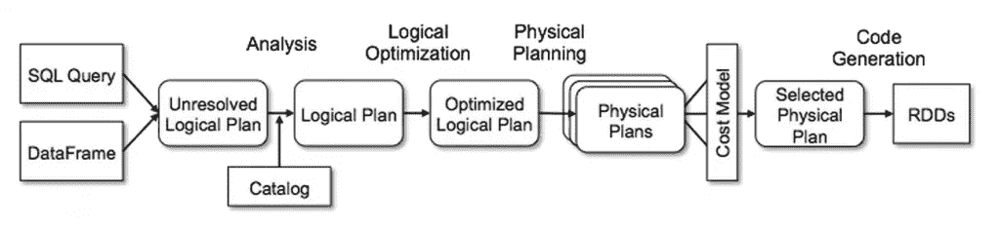

# 阿帕奇火花初级读本

> 原文：<https://medium.com/analytics-vidhya/apache-spark-primer-ca1a6d060fc8?source=collection_archive---------18----------------------->

Apache Spark 是一个用于大规模数据处理的开源、快速、分布式集群计算框架。Spark 是一个执行引擎，不仅可以在 Hadoop YARN 上运行，还可以在 Apache Mesos、Kubernetes、standalone 或云中(AWS/Microsoft Azure/Google Cloud)运行。Spark 可以访问不同的数据源，比如 HDFS、Hive、HBase、Cassandra、S3、本地文件系统等等。

对于任何像 Apache Hadoop 这样的分布式集群计算框架，以下是最重要的组件:

*   存储数据的文件系统:HDFS
*   数据处理框架:MapReduce
*   资源管理器和作业调度器:YARN

总的来说，Spark 是 MapReduce 更快更好的替代品，它将是运行在纱线和 HDFS 上的执行引擎。它也可以在独立(单节点)模式下运行。



阿帕奇火花栈

Apache Spark Stack 具有以下重要组件:

***Spark SQL 和 Dataframes:*** Spark SQL 是一个帮助使用 SQL 查询处理结构化数据的模块。使用 Spark SQL 和 dataframe，您可以对现有的 HiveQL 仓库执行查询，或者使用 JDBC 或 ODBC 连接对 ORC、Avro、Parquet、JSON 执行查询。你可以用 Java、Scala、R 或者 Python 来编写你的 Spark SQL。

***Spark Streaming:***Spark Streaming 帮助我们构建可伸缩、容错的流媒体应用。Spark streaming 支持 Scala、Java 和 Python。您可以对历史数据和流数据运行查询。出现故障时，它会恢复数据，因此具有容错能力。它可以从 HDFS、卡夫卡、Flume、社交媒体 API 和消息服务中读取数据。

***MLlib*** : MLlib 在 Spark engine 之上提供可扩展的机器学习库。它支持许多分类、回归和聚类 ML 算法和许多数据处理实用程序。

***GraphX:***grp ahx 是一个用于图形和图形并行计算的 Spark 组件。

**重要的 Spark 概念:**

*   ***RDD—***rdd(弹性分布式数据集)是 Spark 的基本构建模块，它是*内存中的*对象。rdd 类似于 Java 中的集合对象。RDD 分为*分区*(跨集群的 datanode 拆分)*不可变*(创建后不能更改)和*弹性*(如果 datanode 崩溃，RDD 可以重建为 RDD 的血统，元数据由 Spark 维护)。在 RDD 上只能执行两种类型的操作:*(通过 filter 或 groupby 等处理创建/转换成另一个 RDD)和 ***动作*** (请求结果)。转换有两种类型: ***窄*** 转换(一个输入分区将给出一个输出分区，例如过滤操作)和 ***宽*** 转换(多个输入分区将通过网络在彼此之间传输和共享数据，即*混洗*，例如分组或归约操作)*
*   ***惰性评估—** Spark 在惰性评估模式下工作，即只有在请求结果时才执行转换。因此，Spark 程序将在执行类似获取前 10 条记录的操作时实际执行。由于这种模式，Spark 将创建一个优化的物理执行计划。*
*   ***数据框架—** 如果你使用 Python，你必须习惯使用熊猫数据框架。Spark 还支持 dataframe(从 1.3 版开始)，或者更确切地说，它现在是 Spark 中的标准数据结构，是基于 RDD 类型构建的。Spark 也支持数据集(从 1.6 版开始)，但只在 Scala 和 Java 中存在。数据集是数据帧的扩展，但具有编译时类型安全。从 Spark 2.0 开始，数据集和数据帧的 API 已经合并。*

***Spark 2.0 架构:***

**

*Spark 2.0 架构*

*Spark 集群是一个典型的*主从架构*，其中主节点协调工作节点上的进程。主节点运行一个 ***驱动程序*** 程序，该程序是一个独立的 JVM 进程。驱动程序在单个工作节点上启动任务，该工作节点在特定工作节点上的 rdd 上运行。驱动程序托管着 ***SparkContext*** ，它就像一个通向 Spark 必须提供的所有东西的网关。在驱动程序内部，运行许多其他服务，如 *SparkEnv、DAGScheduler、SparkUI、TaskScheduler、*等。*

*Spark 应用程序将使用 SparkContext 作为入口点，然后在 rdd/data frame 上执行不同的操作(转换和动作)。这些操作被表示为一个*(有向无环图)。创建 DAG 后，spark 在内部分阶段创建了一个物理执行计划。每个阶段被分割成任务，这些任务在工作者节点上的 rdd 的 ***分区*** 上工作。使用钨的 Spark 2.x 比 Spark 1.x 优化得多，速度也快得多。在 Spark 2.x 中，SparkContext 被包装在 ***SparkSession*** 中，它不仅封装了 SparkContext，还封装了 *SQLContext、HiveContext、*等。YARN 或 MESOS 之类的集群管理器负责与工人协调，并协调作业的执行。运行 Spark 应用程序代码的每个 worker 节点(Compute node)将有多个执行任务的 ***执行器*** 。 ***任务*** (基本执行单元)是代码中实际的转换和动作。**

**Spark 附带 Python(pyspark)和 Scala(spark-shell)的交互式 shell**

**要在需要使用外部 jar 的情况下启动 Spark 2.0 PySpark shell，请使用:**

```
**export SPARK_MAJOR_VERSION=2
pyspark --master yarn --jars /usr/hdp/current/sqoop-client/lib/oracle-jdbc-driver.jar**
```

**要运行 python 应用程序，可以使用 spark-submit:**

```
**### Save this as sour_spark_base.py ###
### Import required packages
from pyspark.sql import SparkSession
from pyspark.conf import SparkConf### Set configurations
conf = SparkConf().setAll([('spark.sql.shuffle.partitions', '10'), ('spark.app.name', '"SourSparkApp"'), ('spark.executor.cores', '2'), ('spark.cores.max', '2'), ('spark.driver.memory','2g')])### Create SparkSession instance
spark = SparkSession.builder.config(conf=conf).getOrCreate()### Read data from a Database
df=spark.read.format('jdbc').options(url="jdbc:oracle:thin:USER_NAME/PASSWORD@database_connection:1521/db_name",dbtable="my_db_table",driver="oracle.jdbc.driver.OracleDriver").load()### Apply filter i.e. Narrow transformation to create a new RDD
df_filter=df.filter(df.APPLICATION=='My_app')### Apply groupBy i.e. Wide transformation to create a new RDD
df_group=df_filter.groupBy("CURRENCY","TYPE").agg({"AMOUNT":"sum"}).withColumnRenamed("sum(AMOUNT)","sum_AMOUNT")### Create a global temporary view to execute SQL statements on it
df.createGlobalTempView("GLOBAL_TEMP_DATA_TABLE")### Create a RDD using a SparkSQL query 
spark_table = spark.sql("select CURRENCY,TYPE,sum(AMOUNT)  FROM global_temp.GLOBAL_TEMP_DATA_TABLE where APPLICATION='My_app' group by CURRENCY,TYPE")### Perform Action i.e. Showing the SQL query results
print(spark_table.show())### Perform Action i.e. Write the results to HDFS as a csv
df_group.write.save('/dev/datalake/sour_spark_v2/data_agg_v2', format='csv', mode='append')### Stop the Spark driver
spark.stop()**
```

**现在使用 spark-submit 运行这个 python 程序，如下所示:**

```
**/usr/hdp/current/spark2-client/bin/spark-submit — conf spark.executor.instances=4 — conf spark.executor.cores=2 — conf spark.executor.memory=4g — conf spark.driver.memory=4g — conf spark.cleaner.periodicGC.interval=5min — conf spark.yarn.appMasterEnv.PYSPARK_PYTHON=/SERVICE-DATA/opt/dtl/softwares/anaconda3/bin/python — master yarn — deploy-mode cluster — jars /usr/hdp/current/sqoop-client/lib/oracle-jdbc-driver.jar sour_spark_base.py**
```

***部署模式*指示驱动程序运行的位置，有两种类型:**

*   ***客户端* —驱动程序将在集群之外运行，从集群提交 spark 应用程序，例如从边缘节点或您的笔记本电脑。因此，如果您的会话终止或断开，那么您的 Spark 应用程序也会终止。**
*   ***集群* —驱动程序将在集群内部的一个数据/工作节点上运行。驱动程序作为一个专用的、独立的进程在 Worker 内部运行。**

**为了监视和查看 Spark 作业的日志，您可以使用 ***Spark UI*** (默认情况下在端口 4040 上)。在 Spark 历史服务器上，您的旧作业将可用。**

**因此，您可以用三种方式设置*火花配置*:**

*   **spark-defaults.conf —由集群管理员设置的集群范围的 spark 属性**
*   **spark-submit——使用 spark-submit 执行应用程序时**
*   **SparkConf()。setAll —在您的 spark 计划中**

**设置 spark 属性时，程序中的 SparkConf()优先于 spark-submit，spark-submit 优先于 spark-defaults.conf。**

*****催化剂优化器:*****

**Spark 查询的执行如下所述。首先，您的程序被解析，逻辑计划由数据帧或 SparkSQL 查询上的所有转换创建。Catalyst 优化器将优化计划，以使用不同的方法创建优化的逻辑计划，如谓词下推、投影修剪、空传播、表达式简化等。然后选择基于成本的最佳逻辑计划，并创建多个物理计划。然后，钨执行引擎将根据执行成本模型选择最佳的物理计划。从这个最终的 RDD 和字节码生成。**

****

**火花优化和执行计划**

**因此，我们在这里介绍了是什么让 Spark 成为目前最受欢迎的大数据处理引擎，以及 Spark 2.0 的新功能和架构，这些功能和架构使 Spark 更加强大，更易于使用。**

**在下一章中，我们将介绍[结构化 Spark API](/analytics-vidhya/spark-sql-and-dataframes-72e58fe90f94)，即数据帧、数据集和 Spark SQL。**