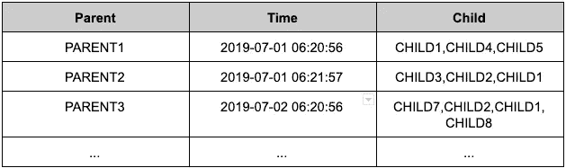
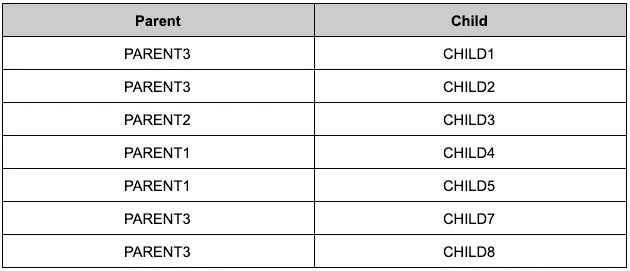

# Apache Spark:窗口函数与结构函数

> 原文：<https://medium.com/analytics-vidhya/apache-spark-window-function-vs-struct-function-9b564a398092?source=collection_archive---------15----------------------->

本文的目标是比较两种数据处理方式的性能。第一种方式是基于[窗口函数](https://spark.apache.org/docs/latest/api/java/org/apache/spark/sql/expressions/Window.html)。第二种方式是基于[结构](https://spark.apache.org/docs/latest/api/java/org/apache/spark/sql/types/StructType.html)。这两种处理数据的方法有时有助于以不同的方式获得相同的结果。

窗口函数对一组被称为**窗口**的记录执行计算，这些记录与当前记录有*某种*关系。

[**struct** 函数](http://spark.apache.org/docs/latest/api/scala/index.html#org.apache.spark.sql.functions$@struct(cols:org.apache.spark.sql.Column*):org.apache.spark.sql.Column)用于将 StructType 列追加到数据帧中。

## 目标是为每个孩子找到最后一个父母。

我们来看一个数据:

**图一。**输入数据

父字段是 *StringType* 。时间字段是 *TimeStampType* 。子字段是*字符串类型*。

每个孩子应该属于几个父母。在这种情况下，我们需要为每个孩子找到最后一个父母。最后一个父代是具有最后时间戳的父代。在结果中，我们将有对父子。

**图二。**输出数据

## 我们试试在 Apache Spark 上实现吧！

有几种方法可以在 Apache Spark 上实现它。从我的角度来看，可以使用两种可读性最强、最优雅的解决方案。

**窗口功能**

解决方案看起来像:

首先，使用 UDF 函数将带有子列表的字符串转换为数组。

之后，如果存在空数组，应该过滤数据。前面的步骤是清理数据所必需的。现在数据准备好了，我们可以 [*展开*](https://spark.apache.org/docs/latest/api/java/org/apache/spark/sql/functions.html#explode-org.apache.spark.sql.Column-) 我们的数组。正因为如此，我们得到了亲子配对，但目标是为我们的孩子找到最后一个父母。窗口功能可以帮助我们完成这笔交易。*max($ " utc _ timestamp ")over by child*返回与当前子代相关的一组记录的最大值 *utc_timestamp* 。一旦为每个孩子找到了最大 utc_timestamp,我们只需要将当前 utc_timestamp 与最大 utc _ timestamp 进行比较。如果它们是一样的，那就意味着我们找到了我们要找的东西。是最后一个家长。

**结构功能**

解决方案看起来像:

这里，我们做了相同的步骤来清除数据。下面的步骤是用 struct 函数准备一对 *utc_timestamp* 与 parent。它类似于元组。之后，我们可以通过一个孩子使用一个简单的 *max* 函数找到一个具有*最大 utc_timestanp* 的父母。在对 struct 列使用 *max* 函数的情况下，该函数通过 struct 中的第一个字段比较值，如果这些值相同，该函数将通过 struct 中的第二个字段进行比较。在最后一步中，可以使用下面的代码从 struct 中获取父级:*select($ " p . parent))*。

就是这样。我们得到了与前一个选项相同的结果。

# 摘要

这个故事显示了转换数据的两个选项，以找到孩子的最后一个父代。两个选项看起来都不错，你可以选择任何你更喜欢的选项。在我看来，第二个选项看起来更具可读性，但是它需要了解 struct 列如何与聚合函数一起工作。