# Apache 超集——丰富的开源可视化平台

> 原文：<https://medium.com/analytics-vidhya/apache-superset-rich-open-source-visualization-platform-a13785944c83?source=collection_archive---------1----------------------->

阿帕奇气流的创造者的另一个雄心勃勃的 Pythonic 项目。

这是一个数据可视化工具，最初由 Airbnb 设计，后来为社区开源。

超集是一个数据探索平台，被设计成可视化、直观和交互式的。它允许切片，切块和可视化数据。

它是用 python 写的，使用 Flask 作为 web 框架库。

Apache Superset 是可视化类别的开源工具，为大数据生态系统中的数据工程师增加了新的功能。

# 关键特征

1.  它支持多种类型的可视化过滤器。
2.  它支持所有支持 SQL 炼金术的数据源。
3.  超集允许缓存以加载和共享仪表板。
4.  允许数据浏览的简单、有吸引力的交互式视图。
5.  支持使用 SQL 查询。
6.  它具有安全特性，如身份验证、用户管理和角色。

# 安装和配置

让我们先看看超集 UI，我最初发现它类似于 Airflow kinda，这是非常明显的，因为它也使用相同的 Flask 库作为 web 框架。

除了安装之外，最后我还会提到我在这个过程中遇到的一些错误。所以这将有助于把安装命令和可能出现的问题放在一篇文章的一个地方。

让我们开始…

我在 GCP 的 Linux 机器上安装 Apache 超集。

Apache 超集有一些操作系统级的依赖项，需要在安装超集之前安装

```
sudo yum upgrade python-setuptoolssudo yum install gcc gcc-c++ libffi-devel python-devel python-pip python-wheel openssl-devel libsasl2-devel openldap-devel
```

我已经安装了 Python 3.6，并为超集安装创建了单独的虚拟环境。

```
python3.6 -m venv superset_virtualenv
```

让我们激活这个虚拟环境，

```
source environments/superset_virtualenv/bin/activate
```

在安装 python 包和超集之前，我们需要将 pip 实用程序升级到最新版本，

```
pip install — upgrade setuptools pip
```

现在，我们将首先下载所有必需软件包的列表，这些软件包是超集的先决条件，否则安装过程会出错。这个需求列表可以在超集 github 存储库中获得。

```
wget [https://raw.githubusercontent.com/apache/incubator-superset/master/requirements.txt](https://raw.githubusercontent.com/apache/incubator-superset/master/requirements.txt)pip install -r requirements.txt
```

现在，是时候安装超集了

```
pip install superset
```

这将安装最新版本的 Apache 超集。如果没有观察到错误，我们可以认为超集安装成功。

现在，初始化超集保存所有元数据的数据库。

```
superset db upgrade
```

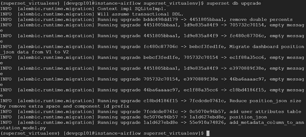

超集数据库初始化

创建一个管理员用户，在设置密码之前，系统会提示我们设置用户名、名字和姓氏。

```
fabmanager create-admin — app superset
```

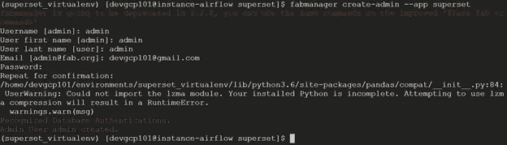

超集用户创建

维护用户和密码详细信息以供将来参考。

如果您使用过 Apache Airflow，它提供了一些示例 DAG 供用户使用。在同一行上，超集还附带了一些我们需要初始加载的例子。我们开始吧，

```
superset load_examples
```

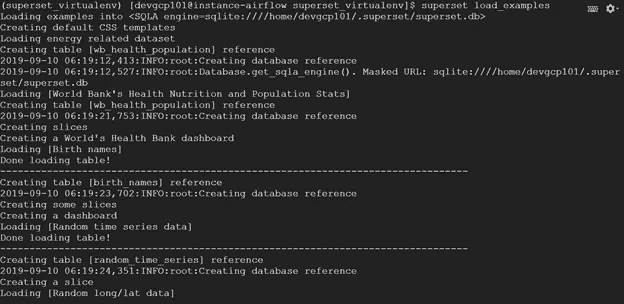

加载示例示例

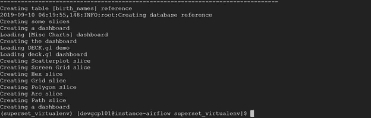

超集还使用基于 fab 的用户认证模型，该模型带有默认角色和权限。让我们进行初始化，以便默认角色可用。

```
superset init
```

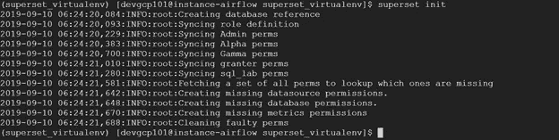

初始化默认角色和权限

现在，我们准备启动超集服务器。

```
superset runserver -d
```

这将在端口 8088 上启动超集开发 web 服务器。要在另一个端口上运行，我们可以使用-p 参数。

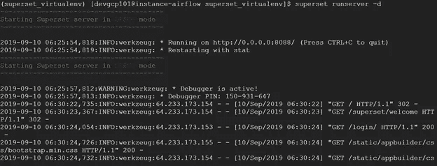

运行超集服务器

超集 web 服务器的 URL 将是[**http://localhost:8088**](http://localhost:8088/)**。**使用创建管理员用户时输入的凭证登录。

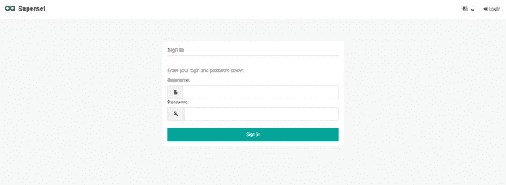

登录屏幕

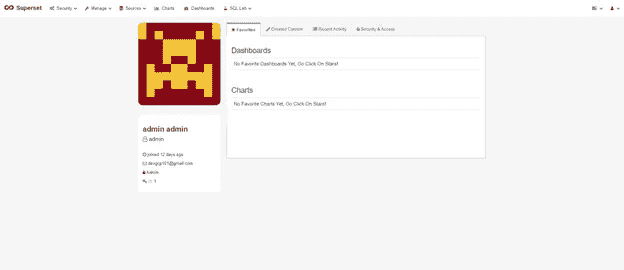

登录后

如果我们转到“Dashboards”选项卡，将会看到我们加载的示例仪表板，例如世界银行数据和出生数据。

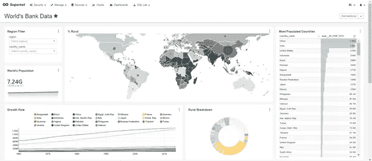

世界银行数据仪表板

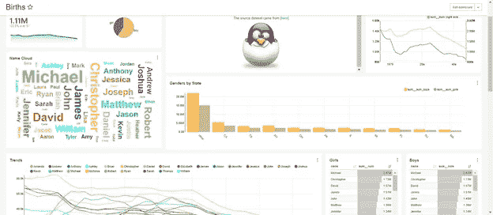

出生仪表板

所以，就这样了。这是一个很好的工具，可以探索它如何适应 BI 生态系统，以满足仪表板和可视化需求，而且它也正被一些公司用于满足他们的要求，因为它是开源的，有很多好处。

但在与 Tableau 等更强大、更有许可的工具竞争时，它又缺少什么呢？

1.  因为它是开源，所以需要依靠社区来修复错误。
2.  目前它不支持 NoSQL 数据库。
3.  Tableau 可以访问和连接来自相同或不同数据库的多个表，而在超集中，我们需要为多个表连接创建视图。所以我们应该知道如何编写 SQL 查询。
4.  由于 Superset 仍在孵化中，它仍在成长和成熟，因此目前它的定制选项和仪表板功能有限，但它正在快速增长。

# 安装时出错

我提到了一些我在超集安装时遇到的错误。希望这对您开始安装过程有用，

1.  使用 fabmanager 命令时，出现 flask 版本冲突。

如果 Flask 版本要求没有得到满足，这个问题会引起很多麻烦。所以升级 pip 实用程序并重新安装 flask。

```
pip install — upgrade setuptools pip
pip install — upgrade flask
```

## 2.错误:创建管理员用户时无法导入名称' _maybe_box_datetimelike '。

转到<path to="" your="" virtual="" env="">/superset _ virtualenv/lib/python 3.6/site-packages/superset。</path>

并将`**dataframe.py**`文件中两次出现的`**_maybe_box_datetimelike**`替换为`**maybe_box_datetimelike**`。现在，重新运行用户创建步骤。

**发行参考:**[https://github.com/apache/incubator-superset/issues/6770](https://github.com/apache/incubator-superset/issues/6770)

## 3.ModuleNotFoundError:没有名为“flask.exthook”的模块

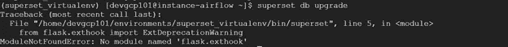

为了避免这个问题，正如我上面提到的，在安装 Superset 之前，首先使用 requirement.txt 安装所有需要的依赖包。

```
wget [https://raw.githubusercontent.com/apache/incubator-superset/master/requirements.txt](https://raw.githubusercontent.com/apache/incubator-superset/master/requirements.txt)pip install -r requirements.txtpip install — upgrade supersetpip install sqlalchemy==1.2.18
```

**发行参考:**[https://www . git memory . com/Issue/Apache/incubator-superset/7861/511873236](https://www.gitmemory.com/issue/apache/incubator-superset/7861/511873236)

我希望，这篇文章将帮助您理解什么是 Apache 超集，以及如何安装它来实现 Apache 超集提供的漂亮的可视化。

有关更多详细信息和路线图，请查看以下链接超集文档:

[](https://superset.incubator.apache.org/) [## Apache 超集(孵化)- Apache 超集文档

### 免责声明:Apache 超集是 Apache 软件基金会(ASF)正在酝酿的一项工作，由…

superset.incubator.apache.org](https://superset.incubator.apache.org/) 

在下面链接找到 github 库代码，

[](https://github.com/apache/incubator-superset) [## Apache/孵化器-超集

### Apache Superset(孵化)是一个现代的、企业就绪的商业智能 web 应用程序

github.com](https://github.com/apache/incubator-superset) 

感谢阅读这篇文章。快乐学习！

**# Apache superset # Python #数据工程**