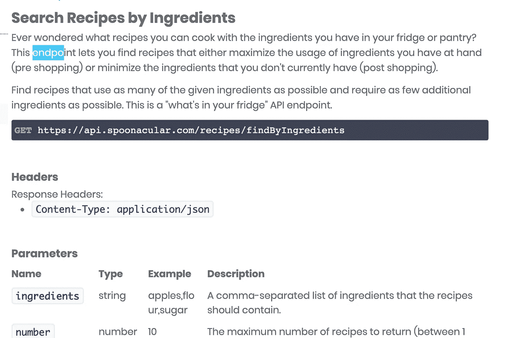
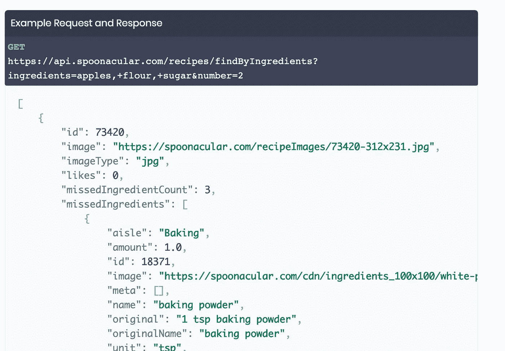

# Ruby 中的 API 和对象交互盛会

> 原文：<https://medium.com/analytics-vidhya/api-and-object-interaction-extravaganza-a0ce928fbc2a?source=collection_archive---------27----------------------->


卢卡·劳伦斯在 [Unsplash](https://unsplash.com?utm_source=medium&utm_medium=referral) 上的照片

API 令人兴奋。我是认真的。别嘲笑我了。

他们有能力把一个沙盒编码项目变成一个应用程序，与你的计算机和本地文件之外的世界进行交互。您将获得大量信息，所以让我先列出各个部分:

*   [思考对象交互&程序间通信。](#51f8)
*   [连接圆点](#de6e)
*   [客户端/服务器模式。](#2955)
*   [使用它或失去它](#02ef)
*   [Ruby API 第一步:理解](#65c0)
*   [Ruby API 步骤 2:搜索&选择](#cd16)
*   [Ruby API 步骤 3:获取访问权限](#ee56)
*   [Ruby API 步骤 4:端点](#b03c)
*   Ruby API 第五步:使用 API
*   [Ruby API 第六步:让它动态化](/analytics-vidhya/api-and-object-interaction-extravaganza-d0328e3f07a6)
*   [结论](/analytics-vidhya/api-and-object-interaction-extravaganza-d0328e3f07a6)

# 思想实验时间

想象一群孩子在田野中间的沙箱里。在远处，孩子们可以看到人、建筑物、汽车等。他们通常知道这些东西是什么，但没有办法与之互动。一天，三个孩子注意到一家面包店。孩子们目不转睛地盯着店面，看着一个典型的互动过程:一个顾客进来，收银员拿走顾客的订单，一个面包师拿出一条面包，收银员要求付款，顾客付款，然后拿着面包离开。


这三个孩子立即开始玩虚拟面包店，他们每个人都扮演面包店的三个角色之一(顾客、收银员、面包师)。当顾客付款时，收银员说“那是一百万美元。”收银员和顾客就面包的真实价格发生了争执。

争论一直持续下去，因为孩子们根本不知道面包的实际价格。厌倦了所有的争吵，面包师离开了她想象中的面包店，并要求一个大孩子走到最初启发了这个游戏的真实面包店，并获得一条面包的真实价格。大孩子照做了，几分钟后带着信息回来了。从而结束了收银员与顾客之间的争吵，并使想象中的生意得以恢复。

# 将这些点连接起来


在 [Unsplash](https://unsplash.com?utm_source=medium&utm_medium=referral) 上由 [Alinenok](https://unsplash.com/@alinenok?utm_source=medium&utm_medium=referral) 拍摄的照片

所描述的虚拟游戏可以被看作是一个有四个类的面包店应用程序:客户、收银员、面包师和 OlderKid。顾客、收银员和面包师是我们面包店引人注目的工作。然而，没有奥尔德基，面包店注定永远漂浮在虚幻中。

想象一下，孩子们在成年后继续经营面包店，并最终决定开设一家名为 Bread.com 的网上商店，允许在线客户从全市的面包店订购面包。bread 将通过连接各种面包店的网站(如 Citybakery.com)并获得他们提供的每种面包的类型和价格来做到这一点。突然间，OlderKid 的重要性更加明显了。OlderKid 将是网上面包店生存能力的决定性因素，因为 OlderKid 的职责是提供来自全市所有面包店的准确信息。

# 客户机/服务器模式


照片由 [Kelvin Ang](https://unsplash.com/@kelvin1987?utm_source=medium&utm_medium=referral) 在 [Unsplash](https://unsplash.com?utm_source=medium&utm_medium=referral) 上拍摄

OlderKid 和面包店网站之间的基本交互类似于我们每次访问网站时使用的交互。这种交互被称为客户机/服务器模型。客户端是你的浏览器，服务器是你试图浏览的网站的主机。这种交互可以被看作是客户端和服务器之间的对话。请将单击链接视为发起对话:

你点击一个链接，告诉你的浏览器访问一个网站。

你的浏览器回答:“太好了，我马上就去做”


两个系统通过 [Mihai 苏尔杜](https://unsplash.com/@mihaisurdu?utm_source=medium&utm_medium=referral)在 [Unsplash](https://unsplash.com?utm_source=medium&utm_medium=referral) 上相互通信

你的浏览器对托管 Google.com 的服务器说:“嗨！你能把显示 Google.com 的相关文件发给我吗？”

服务员回答:“当然可以！在这里"

你的浏览器对你说:“我收到了原始代码，现在我会用像你这样的人容易理解的格式来呈现它”

整个对话可以在不到一秒钟的时间内发生，如果你在网站加载时仔细观察浏览器底部，你甚至可以捕捉到更新:“等待 Google.com 处理请求。”这种请求和响应交互允许服务器控制信息流，并创建一个网关，所有客户端都可以通过该网关发出请求。本质上，服务器使得任何浏览器都可以很容易地联系和请求信息。

将客户机/服务器模式与 Bread.com 和 Citybakery.com 之间的关系相比较，我们可以看到相似之处。然而，Bread.com 不是一个只会显示 Citybakery.com 的网页浏览器。Bread.com 正努力成为满足您所有面包店需求的一站式商店，从全市的面包店提取准确的数据并呈现给用户。对 Bread.com 来说幸运的是，我们可以为它的每个合作伙伴面包店建立一个机制，让 OlderKid 可以随时自动获得最新信息。这个机制就是 API。

# 用进废退

在这一点上，我们将告别 Bread.com，并向“使用它或失去它”问好，这是我的同学[格兰特吉通](https://medium.com/u/9eba2377ff56?source=post_page-----a0ce928fbc2a--------------------------------)和我在参加[熨斗学校](https://medium.com/u/973c5cbfb09b?source=post_page-----a0ce928fbc2a--------------------------------)时为我们的第一个项目制作的应用程序(你可以点击[这里](/@chaserabenn/use-it-or-lose-it-a-debugging-story-825d55cd1ee)阅读更多关于使用它或失去它的信息，从概念到执行)。使用它或失去它(或简称为“UIOLI ”)的主要功能是根据用户选择的食品柜项目向他们提供食谱。在构思 UIOLI 时，我们知道需要一个 API 来执行这个功能。

# 在应用程序中使用 API

## 第一步


照片由[艾米丽·莫特](https://unsplash.com/@emilymorter?utm_source=medium&utm_medium=referral)在 [Unsplash](https://unsplash.com?utm_source=medium&utm_medium=referral) 上拍摄

格兰特和我实现这一目标的第一步是理解 API 到底是什么。

API 代表应用程序接口，是一组允许一个程序或系统与另一个程序或系统通信的规则。通信是通过 GET 请求完成的。还记得客户机/服务模型中的对话吗？当客户机(您的浏览器)向服务器发送消息请求更多信息时，它正在发送一个 HTTP GET 请求。API 与它自己的 GET 请求一起使用，该请求可用于将一个实体的数据或功能集成到另一个实体中。

使用 API 功能的示例包括允许网站访问者使用他们的脸书凭据创建帐户，或者在网站上包含一个小的 Google Maps 小部件。对于 UIOLI，我们需要找到一个 API，它可以提供特定的数据，然后我们的应用程序就可以操作这些数据并呈现给我们的用户。

## 第二步


马库斯·温克勒在 [Unsplash](https://unsplash.com?utm_source=medium&utm_medium=referral) 上的照片

一旦我们在某种程度上理解了我们在处理什么，它就开始搜索和选择一个 API。由于这是我第一次使用 API，我在谷歌上搜索了“易于使用的食品 API”我很快发现有成千上万的选择在你的指尖，但其中许多是付费服务，所以我把搜索改为“易于使用的食品 API 免费”以缩小范围。这个新的搜索提供了一些可供比较的选项。为了做到这一点，您需要查看 API 的文档。

当你访问一个特定的 API 网站时，寻找“文档”或“文档”链接。在这里，您可以找到 API 提供者对您可以访问哪些类型的数据以及如何获得这些数据的解释。我找到的 API 来自一家名为“Spoontacular”的公司下面您将看到特定端点的文档(特定可搜索数据集的 URL)，称为“按成分搜索食谱”



在查看了文档页面上的 GET 请求示例后，我认为 Spoontacular 非常适合 UIOLI。

## 第三步


由[马頔·佩丘林](https://unsplash.com/@pechka?utm_source=medium&utm_medium=referral)在 [Unsplash](https://unsplash.com?utm_source=medium&utm_medium=referral) 上拍摄的照片

是时候访问您选择的 API 了。这可以说是最直接的一步，因为你需要做的就是注册。你要么直接和 API 公司签约，要么和一个 API 数据库签约，比如 RapidAPI，它可以让你通过一次签约访问成千上万的 API。注册后，您将获得一个唯一的 API 密钥来访问该公司的数据。

## 第四步

接下来，我们需要理解端点，它只是我们发送 GET 请求的 URL。换句话说，一个端点就是你要到达的那个东西。让我们在一个 HTTP GET 请求的上下文中来看一下端点，该请求向 Google 的服务器请求关于小狗的信息。


汉娜·格蕾丝在 [Unsplash](https://unsplash.com?utm_source=medium&utm_medium=referral) 上的照片

获取对谷歌主页的请求

```
Endpoint: http://www.google.com
```

获取关于小狗的谷歌信息的请求

```
Endpoint: https://www.google.com/search?q=puppies
```

获取小狗图片的谷歌请求

```
Endpoint: https://www.google.com/search?q=puppies&tbm=isch
```

获取小狗视频的谷歌请求

```
Endpoint: https://www.google.com/search?q=puppies&tbm=vid
```

请注意，我们在 URL 中包含了小狗搜索的所有信息。API 端点以类似的方式运行。主要的区别在于，虽然您可以访问 Google.com 而不附加任何查询，但是您不能使用 API 端点来这样做。API 的目的是发送一个查询。

让我们构建将用于访问 API 的 URL，在构建过程中，看看不同的查询在 URL 中是如何描述的:

"?"标记查询的开始

“&”分隔后续的查询类型

“+”在一个参数类型中分隔搜索项

基于所选配料获取配方的端点。

```
[https://api.spoonacular.com/recipes/findByIngredient](https://api.spoonacular.com/recipes/findByIngredients)s
```

没有任何查询附加到上述 URL，因此响应将是一个错误。始终需要的一个查询是 API 键，因此我们将首先添加它

```
[https://api.spoonacular.com/recipes/findByIngredients?apiKey=123abc123abc](https://api.spoonacular.com/recipes/findByIngredients?apiKey=123abc123abc)
```

精彩！现在，我们已经获得了访问数据的授权，可以通过 GET 请求将数据发送到服务器。可能有一个用于“返回所有食谱”的 API，在这种情况下不需要其他查询。关于这一勺形终点，文件不允许“全部返回”,因此至少需要一个成分查询

```
https://api.spoonacular.com/recipes/findByIngredients?apiKey=123abc123abc&ingredients=onion
```

现在我们正在搜索所有以洋葱为原料的食谱。也许我们应该再加一条:

```
[https://api.spoonacular.com/recipes/findByIngredients?apiKey=123abc123abc&ingredients=onion+garlic](https://api.spoonacular.com/recipes/findByIngredients?apiKey=123abc123abc&ingredients=onion+garlice)
```

Spoontacular 还允许您使用“number”参数来设置希望收到的搜索结果的数量。对于 UIOLI，我们每次搜索只需要 10 个结果:

```
[https://api.spoonacular.com/recipes/findByIngredients?apiKey=123abc123abc&ingredients=onion+garlice&number=10](https://api.spoonacular.com/recipes/findByIngredients?apiKey=123abc123abc&ingredients=onion+garlice&number=10)
```

现在我们的 URL 包括三个搜索参数(apiKey、ingredients 和 number ),我们已经准备好了！

## [点击这里观看第二部分:从执行到整合](/@chaserabenn/api-and-object-interaction-extravaganza-d0328e3f07a6)