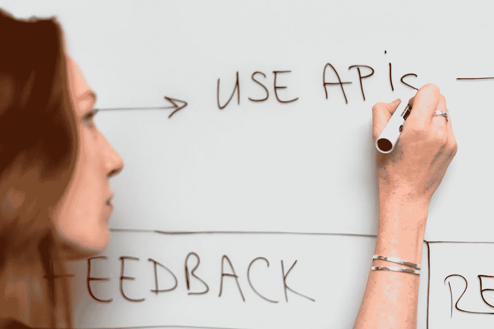

# API 用例

> 原文：<https://medium.com/analytics-vidhya/api-use-cases-362d3b130439?source=collection_archive---------21----------------------->

在编写第一个(下一个)API 之前要考虑的事情。

有了所有可用的教程，构建一个 API 可能很容易，但是支持 API 却很有挑战性。

一些挑战包括

> 管理各种 API 端点。
> 服务器上的 API 负载。
> 以适当的模式/格式管理数据。
> 具有 SSL / TLS 证书的通用安全性。
> 不胜枚举..

这是 pexels 的工程