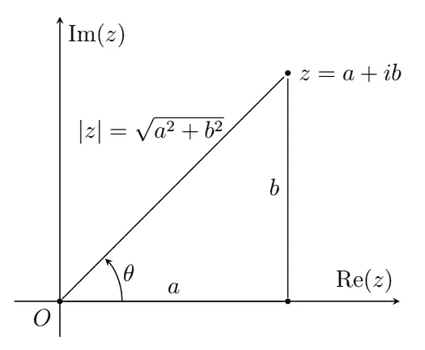

# 附录:复杂变量

> 原文：<https://medium.com/analytics-vidhya/appendix-complex-variables-65ee3861b3c4?source=collection_archive---------10----------------------->

这些笔记旨在为**复变量**提供一个理论定义、定理和概念的“快速”集合，仅作为复习和一些基本定义、定理和推论的集合，并作为我的[“时间序列分析完整介绍”](/analytics-vidhya/a-complete-introduction-to-time-series-analysis-with-r-9882f2d44c9d)系列的附录。

## 基本定义