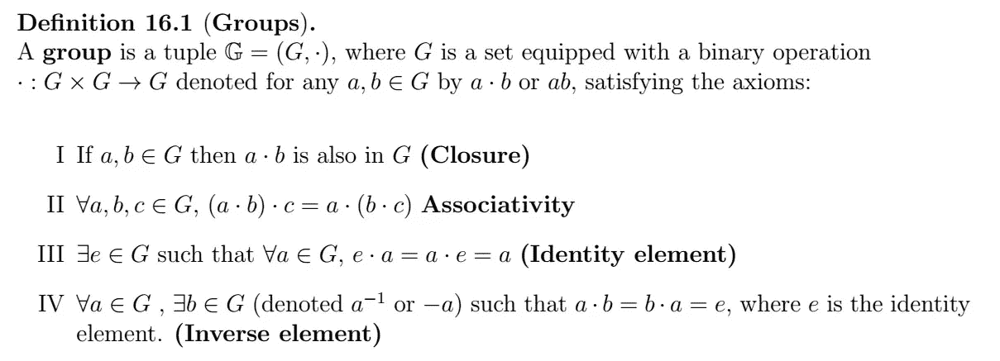

# 附录:线性代数

> 原文：<https://medium.com/analytics-vidhya/appendix-linear-algebra-1a440a25e47a?source=collection_archive---------20----------------------->

这些笔记旨在提供线性代数的理论定义、定理和概念的“快速”收集，仅作为复习，并作为我的[“时间序列分析完全介绍”](/analytics-vidhya/a-complete-introduction-to-time-series-analysis-with-r-9882f2d44c9d)系列的附录。如果你在寻找更全面的指南，请考虑阅读[这本 CS229 线性代数复习](http://cs229.stanford.edu/section/cs229-linalg.pdf)。

## 组

## 菲尔茨