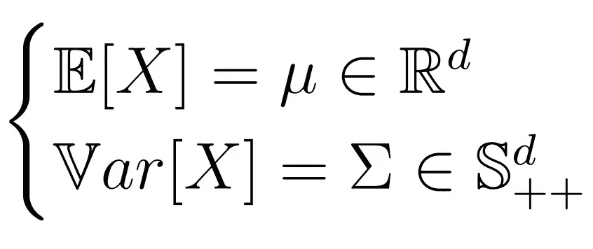

# 附录:概率

> 原文：<https://medium.com/analytics-vidhya/appendix-probability-f65c1160e806?source=collection_archive---------14----------------------->

这些笔记旨在为**概率**提供一个理论定义、定理和概念的“快速”集合，仅作为复习和定义、定理和推论的集合，并作为我的[“时间序列分析完整介绍”](/analytics-vidhya/a-complete-introduction-to-time-series-analysis-with-r-9882f2d44c9d)系列的附录。虽然提供了一些证明，但没有提供例子，所以如果你在寻找更全面的指南，请考虑阅读[这本 C229 概率复习。](http://cs229.stanford.edu/section/cs229-prob.pdf)