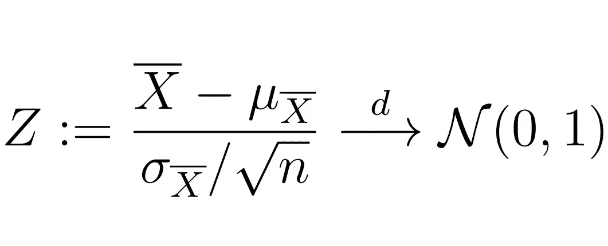

# 附录:统计数据

> 原文：<https://medium.com/analytics-vidhya/appendix-statistics-ee3b02ce031b?source=collection_archive---------26----------------------->

中心极限定理

这些笔记旨在为**统计**提供一个理论定义、定理和概念的“快速”集合，仅作为复习和定义、定理和推论的集合，并作为我的[“时间序列分析完整介绍”](/analytics-vidhya/a-complete-introduction-to-time-series-analysis-with-r-9882f2d44c9d)系列的附录。虽然提供了一些证明，但没有提供例子。一个很好的参考资料是 T4 的书《数理统计及其应用》。