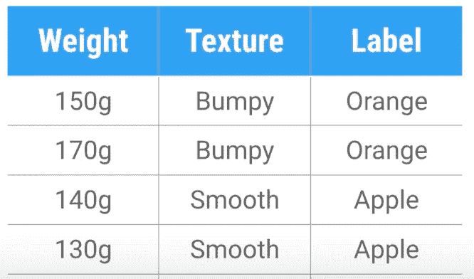

# “苹果”还是“橘子”——建立我们的第一个机器学习模型

> 原文：<https://medium.com/analytics-vidhya/apple-or-orange-building-our-first-machine-learning-model-c430ef0085bf?source=collection_archive---------0----------------------->

经过几个月的训练和阅读，我终于编写了我的第一个机器学习代码，我非常兴奋地与大家分享它。这是一个很小的例子，但我觉得经过几个月的努力，我已经完成了一些事情。

这个机器学习模型是一个基本框架，我已经建立了一个分类器，可以区分给定的输入是“苹果”还是“橙子”。如下表所示。



我们将使用两个主要特征，[重量，纹理]给定这两个输入，我们的模型将预测它是一个桔子还是一个苹果。我将遍历我用来构建分类器的每一行代码。

我们将使用一个名为 scikit-learn 的开源包，从 scikit-learn 我们将使用一个决策树来为我们的模型创建分类器。

```
import sklearn 
from sklearn import tree
```

一旦我们这样做了，我们就写出我们的训练数据，

```
import sklearn 
from sklearn import treefeature = [[140,1], [130, 1], [150, 0], [170, 0]]
label = [0, 0, 1, 1]
```

对于我们的特征，我们使用“0 =颠簸”，“1 =平滑”，对于我们的标签，我们使用“0 =苹果”，“1 =橙色”。

一旦我们写出了我们的训练数据，我们就使用决策树来构建我们的分类器，然后我们使用‘fit’来训练我们的数据。

```
import sklearn 
from sklearn import tree feature = [[140,1], [130, 1], [150, 0], [170, 0]]
label = [0, 0, 1, 1] 
clf = tree.DecisionTreeClassifier()
clf = clf.fit(feature, labels)
```

在训练给定的数据之后，我们预测给定的输入是苹果还是橘子，结果将是二进制的，如果是苹果，将打印“0 ”,如果是橘子，将打印“1”。

```
import sklearn 
from sklearn import tree feature = [[140,1], [130, 1], [150, 0], [170, 0]]
label = [0, 0, 1, 1] 
clf = tree.DecisionTreeClassifier()
clf = clf.fit(feature, labels)
print ((clf.predict([[150, 0]))[1]
```

结果的输出[1]显示给定的输入是橙色的。这是一个构建分类器的简单示例，随着数据数量的增加，我们预测模型的准确性也会增加。

通过使用不同的输入，您可以随意摆弄这个模型，或者通过更改功能和标签，使用相同的框架来构建您自己的机器学习模型。