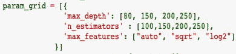

# 了解电器的能耗

> 原文：<https://medium.com/analytics-vidhya/appliances-energy-prediction-2562af6ad3d9?source=collection_archive---------0----------------------->


由 [Unsplash](https://unsplash.com?utm_source=medium&utm_medium=referral) 上的[卡斯滕·沃思](https://unsplash.com/@karsten_wuerth?utm_source=medium&utm_medium=referral)拍摄的照片

在这个全球不确定的时代，世界需要越来越多的能源，以支持经济和社会进步，提高生活质量，特别是在发展中国家。但即使在今天，仍有许多地方，尤其是发展中国家，存在断电现象。这些断电主要是因为家里的电器消耗了过多的负荷。供暖和制冷设备消耗室内大部分电力。在这个项目中，我们将分析通过家用传感器收集的室内电器使用情况。在 4.5 个月内，每隔 10 分钟读取一次所有读数。目标是预测电器的能源消耗。

在智能家居时代，预测能源消耗的能力不仅可以为最终用户节省资金，还可以通过将多余的能量回馈给电网(在使用太阳能电池板的情况下)来帮助用户赚钱。在这种情况下，回归分析将用于基于从各种传感器收集的数据来预测电器能量使用。我的代码可以在 [github](https://github.com/mayur29/Udacity_Machine_Learning_Projects/tree/master/Udacity_ML_Nanodegree_Capstone_Master) 上找到

# 问题陈述

我们应该根据温度、湿度和压力等因素来预测房屋的电器能耗。为了实现这一点，我们需要使用回归算法开发一个监督学习模型。回归算法用于由连续特征组成的数据，并且在数据集中没有器具的标识

# 数据

日期设置可以从 [Kaggle](https://www.kaggle.com/loveall/appliances-energy-prediction) 下载。

有 29 个特征来描述电器的能源使用:

1.日期:时间年-月-日时:分:秒

2.灯:室内照明设备的能源使用

3.T1:厨房区域的温度，单位为摄氏度

4.T2:起居室的温度，以摄氏度计

5.T3:洗衣房区域的温度

6.T4:办公室的温度，单位是摄氏度

7.T5:浴室温度，单位为摄氏度

8.T6:建筑物外部(北侧)的温度，单位为摄氏度

9.T7:熨烫室内的温度，单位为摄氏度

10.T8:青少年房间 2 的温度，单位为摄氏度

11.T9:父母房间的温度，单位为摄氏度

12.T_out:室外温度(来自 Chievres 气象站)，单位为摄氏度

13.Tdewpoint:(来自 Chievres 气象站)，C

14.RH_1:厨房区域的湿度，单位为%

15.RH_2:客厅区域的湿度，单位为%

16.RH_3:洗衣房区域的湿度，单位为%

17.RH_4:办公室的湿度，单位为%

18.RH_5:浴室中的湿度，单位为%

19.RH_6:建筑物外部(北侧)的湿度，单位为%

20.RH_7:熨烫室内的湿度，单位为%

21.RH_8:青少年房间 2 中的湿度，单位为%

22.RH_9:父母房间的湿度，单位为%

23.RH_out:室外湿度(来自 Chievres 气象站)，单位为%

24.压力:(来自 Chievres 气象站)，毫米汞柱

25.风速:(来自 Chievres 气象站)，单位为米/秒

26.能见度:(来自 Chievres 气象站)，公里

27.Rv1:随机变量 1，无量纲

28.Rv2:随机变量 2，无量纲

29.电器:电器使用的总能量，单位为 Wh

# 家电消费探索

```
 import numpy as np *# linear algebra*
import pandas as pd *# data processing*
import numpy as np
import pandas as pd
import matplotlib.pyplot as plt
import seaborn as sns
from sklearn import preprocessing, model_selection, metricsdata = pd.read_csv("../input/KAG_energydata_complete.csv")
data.head()
```


该数据集由放置在房屋内部的传感器收集，外部读数来自附近的气象站。主要属性是温度、湿度和压力读数。每次观察以 10 分钟为间隔测量电流。温度和湿度以 10 分钟为间隔进行平均。

独立变量:28(11 个温度，10 个湿度，1 个压力，2 个随机变量)

因变量:1(设备)

**主要观察结果:**

1.日期列仅用于理解消费与日期时间行为，鉴于这不是一个时间序列问题，已将其删除。我临时增加了一个列(工作日),重点是某一天是工作日还是周末，以便检查电器消耗的差异

2.灯柱也被删除，因为它们是子仪表的读数，我们不关注电器特定的读数

3.此阶段的独立变量数量— 26

4.此阶段的因变量数量— 1

5.总行数— 19735

6.数据集将在培训和测试之间分成 75-25%。

7.定型集中的总行数-14801

8.测试集中的总行数— 4934

9.所有特征都有数值。没有分类或顺序特征。

10.缺失值和空值的数量= 0

**描述性统计:**

**温度柱**


**湿度栏**


**天气栏目**


**电器栏(因变量)**


**功能范围**

1.温度:-6 至 30 度

2.湿度:1 至 100 %

3.风速:0 至 14 米/秒

4.能见度:1 至 66 公里

5.压力:729 至 772 毫米汞柱

6.电器能耗:10 至 1080 瓦时

**数据可视化**


**自变量分布**


**RH_6，RH_out，能见度，风速不规则分布**


**因变量分布**


**基于分布图的观察结果**

1.除了 RH_6 和 RH_out 之外的所有湿度值都遵循正态分布，也就是说，来自室内传感器的所有读数都来自正态分布。

2.类似地，除了 T9，所有温度读数都遵循正态分布。

3.在剩余的列中，我们可以看到能见度、风速和设备是倾斜的。

4.对于所有记录，随机变量 rv1 和 rv2 具有或多或少相同的值。

5.输出变量电器的大多数值小于 200Wh，表明高能耗情况非常少。

6.没有一列像目标变量 Appliances 那样具有分布。

因此，不存在与目标具有线性关系的特征无关的特征。

**相互关系图**


**基于相关图的观察**

1.温度—T1-T9 和 T_out 中的所有温度变量都与目标设备正相关。对于室内温度，相关性如预期的那样高，因为通风是由 HRV 装置驱动的，并使房间之间的空气温差最小化。四列与 T9 高度相关— T3、T5、T7、T8，T6 和 T_Out 也高度相关(两个温度都来自外部)。因此，T6 和 T9 可以从训练集中移除，因为它们提供的信息可以由其他字段提供。

2.天气属性-能见度、Tdewpoint、Press_mm_hg 具有较低的相关值

3.湿度——湿度传感器没有显著的高相关性案例(> 0.9)。

4.随机变量没有任何作用

5.随机变量 rv1、rv2 和可见度 Tdewpoint、Press_mm_hg 与目标变量的相关性低。

由于上述结论，我已经放弃 rv1，rv2，能见度，T6，T9。

# 输入变量的数量— 21 个(从 26 个减少到 21 个)

**造型技术&基准**

这是一个回归问题。回归分析是预测建模技术的一种形式，它调查因变量(目标)和自变量(预测值)之间的关系。使用的回归方法有

**1。线性模型**:

**线性回归**

在线性回归中，我们希望拟合一个函数

形式ŷ=β0+β1x1+β2 x2+β3x 3 其中 x 是特征向量，β0，β1，

β2，β3 是我们希望学习的系数。它在每一步更新β

尽可能降低损失函数。作为对线性回归模型的修改，我们可以应用正则化技术来惩罚特征的系数值，因为较高的值通常倾向于过度拟合和丧失泛化能力。

**岭回归**

这个损失函数包括两个元素。每个预测与其基础事实之间的距离总和。第二个元素对平方的β值求和，并将其乘以另一个参数λ。这样做的原因是为了“惩罚”系数β的高值的损失函数。

它会强制降低β系数，但不会强制使其为零。也就是说，它不会去除不相关的特征，而是最小化它们对训练模型的影响。

**套索回归**

与岭回归的唯一区别是正则项是绝对值。但这种差异对权衡影响巨大。Lasso 方法克服了岭回归的缺点，它不仅惩罚系数β的高值，而且如果它们不相关，实际上将它们设置为零。因此，模型中包含的特性可能会比开始时少，这是一个巨大的优势。

**2。支持向量机**

**支持向量回归**

支持向量回归(SVR)使用与 SVM 相同的原理进行分类。在回归的情况下，一个容限(ε)被设置为接近问题已经要求的 SVM。

**3。最近邻回归变量**

**KNeighborsRegressor**

KNeighborsRegressor 检索查询对象的 k 个邻居，并基于这些邻居进行预测。它计算最近邻标签的平均值。

**4。基于树的回归模型**

我们划分预测值空间，即 X1，.。。，Xp-分成 J 个不同且不重叠的区域，R1，。。。，RJ。对于落在区域 Rj 中的每个观察值，我们进行相同的预测，这只是 Rj 中训练观察值的响应值的平均值。

我们的目标是找到盒子 R1，。。。，最小化 RSS 的 RJ 由下式给出

RSS = X J J = 1 X I∈Rj(yi yˇRj)2，

其中，yrj 是第 j 个框内训练观测值的平均响应。与线性模型相比，基于树的模型受离群值的影响较小。鉴于任何输入和目标变量之间没有线性关系，因此树可能比线性模型更好。

**集成方法**

它结合了几个决策树来产生比使用单个决策树更好的预测性能。集成模型背后的主要原理是一组弱学习者聚集在一起形成一个强学习者。

- **装袋:**装袋(Bootstrap Aggregation)在我们的目标是减少决策树的方差时使用。这里的想法是从随机选择的训练样本中创建几个数据子集。现在，每个子集数据的集合都被用来训练他们的决策树。使用来自不同树的所有预测的平均值，这比单个决策树更健壮。&助推

- **Boosting** : Boosting 是另一种创建预测器集合的集成技术。在这种技术中，学习者是按顺序学习的，早期的学习者将简单的模型与数据拟合，然后分析数据中的错误。换句话说，我们拟合连续的树(随机样本),并且在每一步，目标都是解决来自先前树的净误差。

**随机森林**

随机森林是一种集成技术，能够使用多个决策树和一种称为 bagging 的技术来执行回归任务。并且在高维数据上工作良好

**梯度推进机**

梯度增强是对增强方法的扩展。它使用梯度下降算法，可以优化任何可微损失函数。一个系综树被一个接一个地构建，并且各个树被顺序地求和。下一棵树试图挽回损失。梯度推进=梯度下降+推进。

**极度随机化的树**

Extra-Trees 算法根据经典的自顶向下过程构建一个未修剪的决策树或回归树的集合。它通过完全随机地选择切割点来分割节点，并使用整个学习样本来生长树。

**5。神经网络**

多层感知器(MLP)是一种深度的人工神经网络。它由一个以上的感知器组成。它们由接收信号的输入层、对输入做出决策或预测的输出层以及这两层之间任意数量的隐藏层组成，这些隐藏层是 MLP 的真正计算引擎。具有一个隐藏层的 MLPs 能够逼近任何连续函数。

# 基准

基准是作者在其原始研究论文中使用的梯度推进技术的 R2 分数。以下是基准数据

1.训练数据的 R2 得分:57%

2.测试数据的 R2 得分:97%

3.训练数据上的 RMSE = 17.56

4.测试数据上的 RMSE = 66.65

**数据预处理&实现**

**数据缩放**

功能集包含不同范围的数据。温度(-6 至 30)、湿度(1 至 100)、风速(0 至 14)、能见度(1 至 66)、压力(729 至 772)和应用能耗(10 至 1080)。由于不同的特征范围，一些特征可能会主导回归算法。为了避免这种情况，需要对所有要素进行缩放。因此，使用 sklearn.preprocessing 模块中的 StandardScaler 类将数据缩放到 0 均值和单位方差。

# 履行

下面提到的 scikit-learn & xgboost libaray 用于测试每个回归模型:

1.  sklearn.linear_model。山脉
2.  sklearn.linear_model。套索
3.  sk learn . ensemble . randomforestregressor
4.  sk learn . ensemble . gradientboostingregressor
5.  sk learn . ensemble . extra tree regressor
6.  导入 xgboost
7.  sklearn _ 邻居
8.  sklearn.svm.SVRPipeline
9.  sklearn.neural_network。MLPRegressor

# 管道:

1.将所有算法存储在一个列表中，并遍历该列表

2.回归变量的 random_state 用一个种子初始化，这样每次其他参数为默认值时结果都是相同的。

3.回归器被制作成适合测试和训练数据

4.训练集和测试集的回归变量、名称、计时和分数的属性作为键-值对存储在字典变量中。

5.该词典被附加到转换成数据帧的所有词典的全局列表中

**结果:**


从结果来看，**的 extractreesregressor**在除训练时间之外的所有指标方面都比所有其他回归者表现更好

# 用于改进的功能选择

额外树回归器在默认参数下表现最佳。我使用 sklearn.model_selection 库的 GridSearchCV 函数进行了网格搜索交叉验证。调整的参数:

1.n_estimators:要使用的树的数量

2.max_features:每次分割要考虑的特征数量

3.max_depth:树的最大深度，如果没有提供参数，那么分割将继续，直到所有叶子都是纯的或者包含的内容少于指定的 min_samples_split



使用 GridSearchCV 建议的参数后，R2 评分提高了 10% (0.57 至 0.63)

# 项目过程中的挑战和收获

1.特征缩放对于回归模型来说非常重要，我最初没有尝试过，结果并不好。在 Kaggle 上，所有用户都建议这样做。

2.使用种子值有助于重现算法的结果。如果没有这个值，结果每次都不同。

3.为了去除具有高相关值的冗余特征，检查所有变量之间的相关性是非常重要的。

4.在缩放数据时，维护数据帧的单独副本很有用，这些副本可以使用原始数据帧的索引和列名来创建

5.添加算法的管道应该易于管理

6.Seaborn 和 pyplot 是绘制数据帧各种属性的好库

7.为了在超参数空间中执行穷举搜索或随机搜索以调整模型，总是并行化该过程，因为有许多具有不同配置的模型要拟合。(将 n_jobs 参数设置为值-1，以利用所有 CPU)

8.检查模型稳健性的一种有效方法是在高维数据的情况下将其拟合到一个缩减的特征空间上。为此任务选择前“k”(通常> = 3)个关键功能。

**结果**

**模型评估&估值**

**未调模型的特征:**

> 1.n _ 估计值:10
> 
> 2.最大功能:自动
> 
> 3.最大深度:无

**超参数调整后最佳模型的特征:**

> 1.n _ 估计值:200
> 
> 2.max_features: 'sqrt '
> 
> 3.最大深度:80

在缩减的特征空间上训练最佳模型，该特征空间仅具有 5 个重要性最高的特征，而不是 22 个特征。

**鲁棒性检查:**

在缩减的特征空间上训练最佳模型，该特征空间仅具有 5 个重要性最高的特征，而不是 22 个特征。

> 具有简化特征的测试数据模型的 R2 得分= 0.47。
> 
> 未调整模型的测试数据的 R2 得分= 0.57。
> 
> 差异= 0.10
> 
> 具有简化特征的测试数据模型的 RMSE 得分= 0.72
> 
> 未调整模型的测试数据的 RMSE 得分= 0.65
> 
> 差异= 0.07

因此，我们可以看到，即使特征空间急剧减少(超过 75%)，测试数据的相对性能损失也较少。

**基准对比**

最终模型

> 训练 R2 分数— 1.0
> 
> 测试 R2 分数— **0.63**
> 
> 测试数据上的 RMSE-0.60

基准模型

> 训练 R2 分数— 0.97
> 
> 测试 R2 分数— 0.57
> 
> 测试数据上的 RMSE—0.66

测试集的 R2 分数提高了 10.53%，随着更多的数据和特征工程，这可以进一步提高。

**结论**

根据最佳拟合模型，5 个最重要和最不重要的特征

前 3 个重要特征是湿度属性，这导致湿度比温度更影响功耗的结论。风速是最不重要的，因为风速不影响室内的电力消耗。所以控制室内湿度可以节约能源。

**反思**

这个项目可以概括为

1.在 UCI 机器学习知识库和 Kaggle 上寻找能源相关的数据集

2.在分类和回归问题之间做出决定。

3.可视化数据，通过学习 Kaggle 的其他回归竞赛进行预处理。

4.数据预处理和特征选择。寻找特征之间的相关性

5.决定用于解决问题的回归算法。

6.使用 GridSearchCV 代替 RandomizedSearchCV 创建基准模型。

7.应用选定的算法并可视化结果。

8.为最佳算法调整超参数，并报告最佳模型的测试分数。

9.讨论所选特征的重要性，并检查模型的稳健性..

10.将我调优的模型与作者的基准测试结果进行比较。

**改进**

1.执行积极的特征工程

2.在数据集中寻找分类方案并探究问题

3.修改网格搜索参数空间的参数。

a.添加更多参数，如最小样本分割、最小输入减少等。

b.max_depth 可以有更多的值

# 参考资料:

相关学术研究和早期工作:

[http://dx.doi.org/10.1016/j.enbuild.2017.01.083](http://dx.doi.org/10.1016/j.enbuild.2017.01.083)

[](https://github.com/LuisM78/Appliances-energy-prediction-data) [## luism 78/设备-能源-预测-数据

### 能源与建筑出版物的数据集和脚本。这是出版物的数据存储库…

github.com](https://github.com/LuisM78/Appliances-energy-prediction-data) 

如果你有任何问题，让我知道乐意帮忙。如果你想收到我博客上的更新，请在 [Medium](/@sand.mayur) 或 [LinkedIn](https://www.linkedin.com/in/mayursand/) 上关注我！