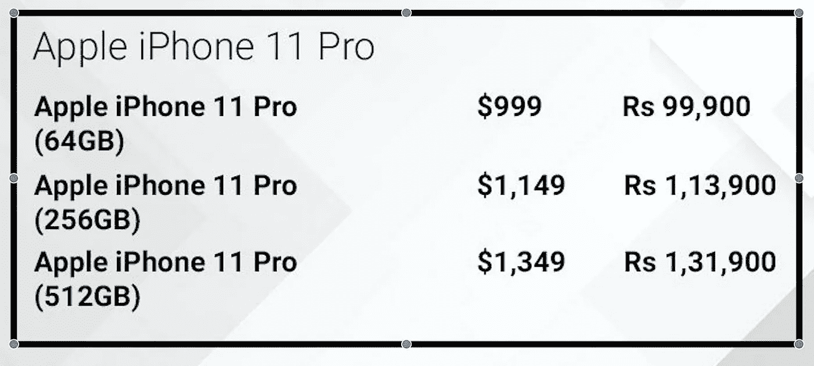
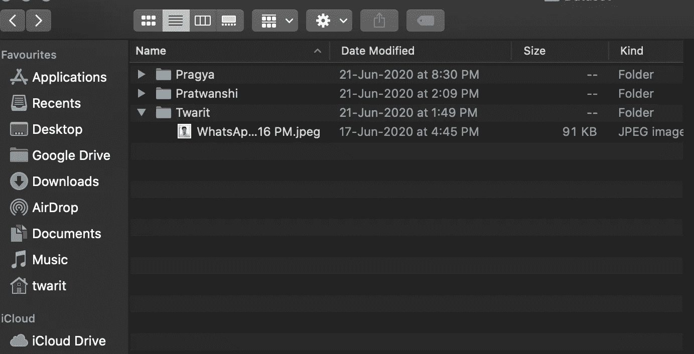
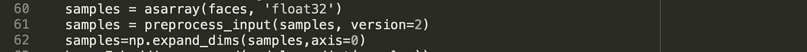
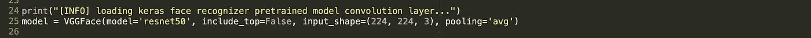
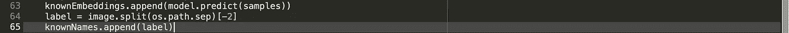
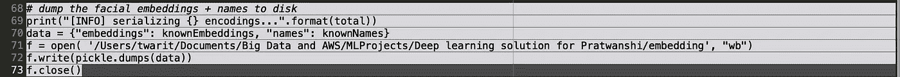
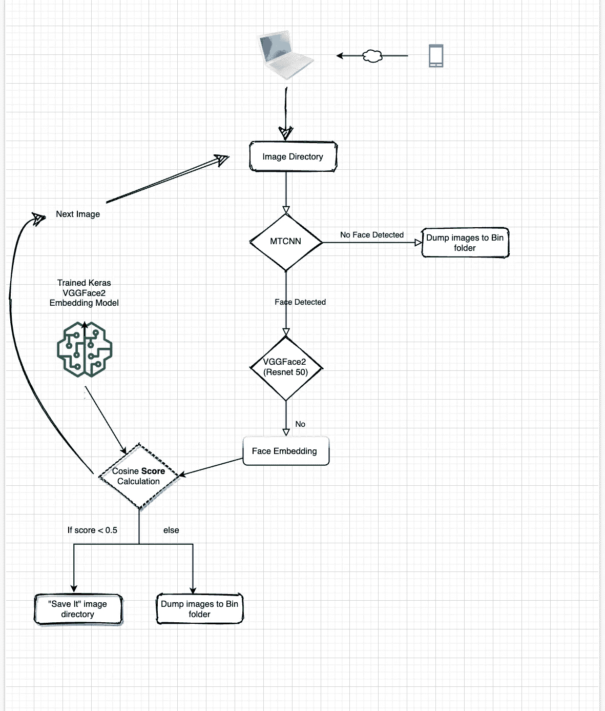

# 人工智能/计算机视觉在解决移动数据存储问题中的应用

> 原文：<https://medium.com/analytics-vidhya/application-of-ai-computer-vision-in-combating-mobile-data-storage-issues-4ff187db10cd?source=collection_archive---------23----------------------->

通常他们会说电子设备上的存储很便宜，但问问苹果吧。

实际上，你会意识到它并不便宜！！

随着手机上数据激增(有价值的和垃圾的)的出现，我们每个人都面临着存储问题的局面，然后开始了最乏味的任务之一，即重新要求我们合理的存储空间。

WhatsApp 的图片和视频转发以及一键图片选项并没有给我们留下太多选择。我们不断存储这些图像和视频，直到我们意识到要么我们的手机变慢了，要么我们开始收到低存储警告。

这给我们留下了两个选择->

1.  开始探索你的手机存储，将你的内容分为“保留”和“不保留”，这是一个非常痛苦的过程。
2.  在对第一步感到失望后，你开始从左到右和中间删除你的内容。

**AI/认知计算来拯救- >**

所以我想为什么不用深度学习技术来解决这个问题，于是我开始尝试。在这篇博文中，我将向你展示我是如何首先解决手机存储中的图像清理问题的(最后提供了 *GitHub 链接*)。(**在第二篇博文中，我将讨论如何处理视频数据**)

先决条件:

1.你需要首先决定那些你最亲近的人，他们的照片是你无论如何都不想公开的。

2.得到 2 或 3 张质量好，清晰的照片。

3.创建一个文件夹结构，每个文件夹包含 1 组人员，文件夹名称作为该人员的名称。文件夹内容将作为神经网络的输入数据，文件夹名称将作为标签。

图书馆:

*   PIL
*   MTCNN
*   Keras_vggface.vggface
*   Keras_vggface.utils
*   泡菜
*   imutils
*   张量流
*   克拉斯

**建立和训练模型- >**

***第一步人脸检测***

在建立模型时，我们通过 MTCNN ( Python 库，一种卷积神经网络)处理每个输入图像，以检测图像中的人脸坐标。

这个库的输出是 json 格式，我们将使用“box”键-值对。在这个过程的最后，我们将得到这个人的面部阵列。我们还需要使用 PIL python 库来读取数组数据，并将检测到的人脸调整到所需的大小。

***第二步人脸识别***

在这一步中，我们将使用 Keras_VGGFace 库来创建人脸嵌入向量和相应的标签值。第一步是使用 Keras_vggface 库对步骤 1 中的数据进行预处理，使像素值以每个通道的平均值为中心。

在定义 VGGFace2 模型时，我们将使用非常流行的预训练“resnet 50”CNN 架构。

创建模型时，定义属性“include_top=False”很重要，因为我们不希望模型进行分类(softmax)。我们只想让模型为我们提供人脸的嵌入向量。

这就是我们将如何存储检测到的人脸嵌入向量和标签。

一旦我们有了嵌入和标签，我们将序列化并使用 pickle 库存储。

这就完成了我们的构建和训练模型阶段。

**将此模型应用于您的手机存储图像数据:**

下面的 flow charge 说明了如何处理手机中的每张图像，并通过 MTCNN->VGGFace2，然后计算测试图像嵌入和 pickled 模型嵌入向量之间的余弦距离。

如果余弦距离是<0.5 for any Embedding vector in the pickle model ,which means model has found the match between your input image face and faces in your pickle model and that image will be saved. Rest all will be moved to “bin” folder.

**计算挑战和性能:**

由于神经网络解决方案是资源密集型的，建议在系统中使用 GPU 或 TPU。我没有带 Nvidia GPU 单元的机器，所以我必须在只有 CPU 的机器上运行完整的解决方案。

图像总数:2689

总大小:347 MB

在我的机器上，看起来神经网络程序需要 2 个小时(大约)来处理这些图像。(如果你有带 GPU 的机器，那么计算和处理会快得多)

**限制**:

由于整个深度学习解决方案依赖于人脸检测，对于那些人脸不可见(或被覆盖)的图像，请准备好这些图像将被移动到 Bin 文件夹中。

GitHub 链接:([https://github.com/twaritn/StorageSol_ComputerVision](https://github.com/twaritn/StorageSol_ComputerVision))