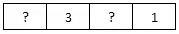
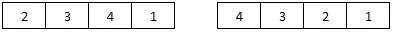
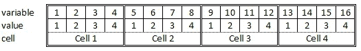

# 布尔可满足性的应用

> 原文：<https://medium.com/analytics-vidhya/application-of-boolean-satisfiability-sat-87f41fb0e5ed?source=collection_archive---------6----------------------->


照片由[詹姆斯·庞德](https://unsplash.com/@jamesponddotco?utm_source=medium&utm_medium=referral)在 [Unsplash](https://unsplash.com?utm_source=medium&utm_medium=referral) 拍摄

> 一个命题是 [**可满足的**](https://en.wikipedia.org/wiki/Boolean_satisfiability_problem) 如果有一个赋值给它的变量使它为真；这组输入值就是问题的解决方案。

我们将使用命题可满足性来建模一些问题，包括数独谜题，然后使用基于 Python 的 [*Pycosat*](https://pypi.org/project/pycosat/) SAT 求解器包来解决它们。SAT 问题需要用**合取范式** ( **CNF** )建模。在 CNF，如果它是一个或多个子句的合取，其中每个子句是文字的析取，则是一个问题；简单地说，它是 or 的 AND。

让我们看一个简单的例子。

## 设 p = (x₁ ∧ ( x₁ ∨ x₂) ∧ x₃).p 可满足吗？

这个命题已经是合取范式；它有三个由连词连接的析取从句。

在 Python 中，命题被表示为列表的列表，其中每个析取子句被表示为整数的列表。符号对应于布尔值(+代表真，-代表假)，绝对值对应于第 I 个变量。例如，-1 对应 x₁ =假，2 对应 x₂ =真，依此类推。

我们的问题可以用 Python 写成如下:

```
>>> p = [[1], [-1, 2], [3]]
>>> print(pycosat.solve(p))
[1, 2, 3]
```

这个解翻译过来: *p 对于 x₁ = x₂ = x₃ =真*是可满足的。

我们再来看另一个问题。

## 给定一个大小为 4 的列表，其中包含一些值，找出一组介于 1-4 之间的唯一数字，使得每个数字在列表中只出现一次。



样本问题



可能的解决方案

*设 p(i，n)是一个命题，当数字 n 在单元格 I 中时为真* 因为我们有 4 个单元格，每个单元格可以有 4 个可能的值，所以我们有 16 个不同的变量。例如，p(1，2) = True 意味着单元格 1 的值为 2。



```
def p(i, n):
  # returns variable number for a given cell / value combination
  return 4 * (i-1) + n
```

我们可以将我们的问题建模如下

1.  对于每个已知值的单元格，我们断言 *p(i，n) = true* 。

```
sample_input = [0, 3, 0, 1]clauses = []
for i in range(1, 5):
  # lists in python are 0-indexed
  digit = sample_input[i - 1]
  if digit:
    clauses.append([p(i, digit)])
print(clauses)
...
Out: [[7], [13]]
```

此输出转换为(x₇ ∧ x₁₃),其中:

*   *x₇* ≡ *p(2，3)单元格 2 的值是 3*
*   *x₁₃* ≡ *p(4，1)单元格 4 的值为 1。*

2.断言*列表包含每个数字*。

我们将逐步构建这个复合命题。我们来构建一个命题" **q(n) =** **列表包含数 *n* "** : **p(1，n) ∨ p(2，n) ∨ p(3，n) ∨ p(4，n)** 。这可以简化为 **q(n) = ∨⁴ᵢ₌₁p(i，n)** 。

我们现在可以建立一个命题**“列表包含每个数”**:**q(1)∧q(2)∧q(3)∧q(4)**。这可以简化为 **∧⁴ₙ₌₁∨⁴ᵢ₌₁p(i，n)** 。

```
for n in range(1, 5):
  # q(n) = list contains number n
  q = []
  for i in range(1, 5):
    q.append(p(i, n))
  clauses.append(q)
print(clauses)
...
[1, 5, 9, 13], [2, 6, 10, 14], [3, 7, 11, 15], [4, 8, 12, 16]
```

3.通过对所有的 n，n '和 I 取合取来断言没有一个单元格包含一个以上的数，其中每个变量的范围从 1 到 4，n≠n '为

**p(i，n) → p(i，n `)≡p(I，n) ∨ p(i，n`)**

```
for i in range(1, 5):
  for n in range(1, 5):
    for n_not in range(1, 5):
      if n == n_not:
        continue
      clauses.append([-p(i, n), -p(i, n_not)])
print(clauses)
...
[-1, -2], [-1, -3], [-1, -4], [-2, -1], [-2, -3], [-2, -4], [-3, -1], [-3, -2], [-3, -4], [-4, -1], [-4, -2], [-4, -3], [-5, -6], [-5, -7], [-5, -8], [-6, -5], [-6, -7], [-6, -8], [-7, -5], [-7, -6], [-7, -8], [-8, -5], [-8, -6], [-8, -7], [-9, -10], [-9, -11], [-9, -12], [-10, -9], [-10, -11], [-10, -12], [-11, -9], [-11, -10], [-11, -12], [-12, -9], [-12, -10], [-12, -11], [-13, -14], [-13, -15], [-13, -16], [-14, -13], [-14, -15], [-14, -16], [-15, -13], [-15, -14], [-15, -16], [-16, -13], [-16, -14], [-16, -15]
```

我们现在可以使用 SAT 求解器来解决这个问题。

```
for sol in pycosat.itersolve(clauses):
  print(sol)
...
[-1, -2, -3, 4, -5, -6, 7, -8, -9, 10, -11, -12, 13, -14, -15, -16]  [-1, 2, -3, -4, -5, -6, 7, -8, -9, -10, -11, 12, 13, -14, -15, -16]
```

这两种解决方案是:

*   x₄x₇x₁₀x₁₃
*   x₂x₇x₁₂x₁₃

最后，让我们**将数独难题建模为可满足性问题**。数独问题与前一个问题非常相似，所以我们不会对一些断言进行过多的描述。

*设 p(i，j，n)是一个当数字 n 在第 I 行第 j 列的单元格中时为真的命题。我们有 9 行 9 列，每个单元格有 9 个可能的值；因此，我们有 729 个不同的变量。例如，p(1，2，5) = True 意味着单元格(1，2)的值为 5。*

```
def p(i, j, n):
  # return variable number for cell i,j with value n
  return 81 * (i-1) + 9 * (j-1) + n
```

我们可以将我们的问题建模如下

1.  对于每个已知值的单元格，我们断言 *p(i，j，n) = true* 。

```
for i in range(1, 10):
  for j in range(1, 10):
    digit = puzzle[9 * (i-1) + j - 1]
    if digit:
      clauses.append([p(i, j, digit)])
```

2.断言每一行包含每一个数字 **∧⁹ᵢ₌₁∧⁹ₙ₌₁∨⁹ⱼ₌₁p(i，j，n)** 。

```
for i in range(1, 10):
  for n in range(1, 10):
    q = []
    for j in range(1, 10):
      q.append(p(i, j, n))
    clauses.append(q)
```

3.断言每一列都包含每个数字 **∧⁹ⱼ₌₁∧⁹ₙ₌₁∨⁹ᵢ₌₁p(i，j，n)** 。

```
for j in range(1, 10):
  for n in range(1, 10):
    q = []
    for i in range(1, 10):
      q.append(p(i, j, n))
    clauses.append(q)
```

4.断言每个 3x3 块包含每个数**∧ᵣ₌₀∧ₛ₌₀∧⁹ₙ₌₁∨ᵢ₌₁∨ⱼ₌₁p(3r+i，3s+j，n)** 。数独有九个 3x3 的方块。变量 r 和 s 允许我们迭代这九个块中的每一个。然后我们用 I 和 j 在块内移动。

```
for r in range(3):
  for s in range(3):
    for n in range(1, 10):
      q = []
      for i in range(1, 4):
        for j in range(1, 4):
          q.append(p(3 * r + i, 3 * s + j, n))
      clauses.append(q)
```

5.通过对所有的 n，n`, i 和 j 取合取来断言没有一个单元格包含一个以上的数字，其中每个变量的范围从 1 到 9，n≠n `为

**p(i，I，n) → p(i，j，n `)≡**p(I，j，n) ∨ p(i，j，n`)

```
for i in range(1, 10):
  for j in range(1, 10):
    for n in range(1, 10):
      for n_not in range(1, 10):
        if n == n_not:
          continue
        clauses.append([-p(i, j, n), -p(i, j, n_not)])
```

我们现在可以使用 SAT 求解器来解决这个问题。

**本文的代码可以在** [**这里找到**](https://nbviewer.jupyter.org/gist/rummanwaqar/4985fb5b5eebacf18ce5b0e0949fb1e8) **。**

请注意，这篇文章只是我在学习 SAT 求解器时的经验总结；我绝不是这方面的专家。如果你发现任何错误，请让我知道。

数独求解器的布尔方程取自 Rosen K. *离散数学及其应用*。第 7 版。；2011.