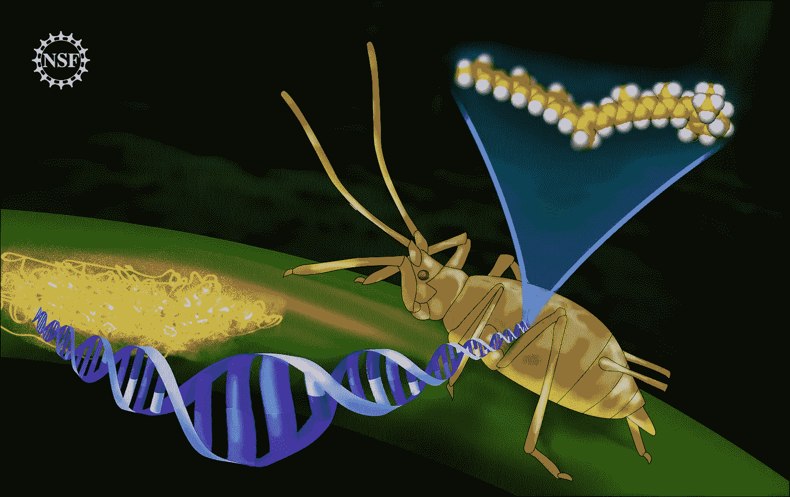
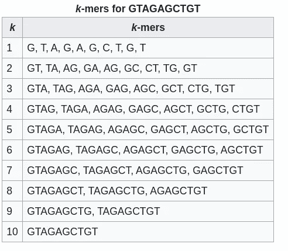
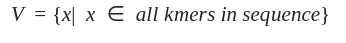
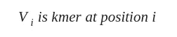
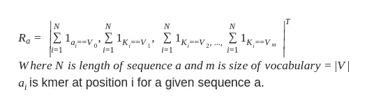
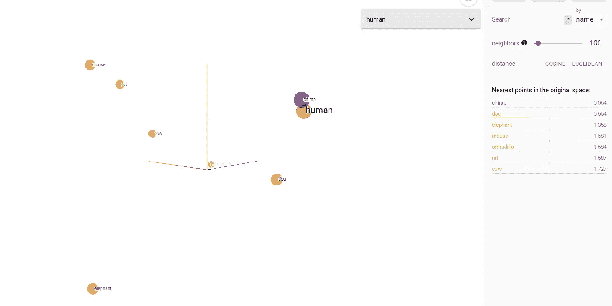

# 机器学习在生命科学(生物学)中的应用(1)

> 原文：<https://medium.com/analytics-vidhya/application-of-machine-learning-to-life-science-biology-part-1-76924b6c3fa3?source=collection_archive---------17----------------------->

# 动物基因组相似性的度量



图一。来源:[https://upload . wikimedia . org/Wikipedia/commons/a/AC/蚜虫 _%284575792195%29.jpg](https://upload.wikimedia.org/wikipedia/commons/a/ac/Aphids_%284575792195%29.jpg)

在这篇博客中，我们将看到如何比较不同动物的基因组。为了简单起见，我们将使用可获得的部分基因组序列[这里](https://drive.google.com/file/d/1mJpltSs1negIBkzFSWYHcF8MyvnnAbrx/view?usp=sharing)，而不是研究动物的全基因组序列。

# 系列介绍

这是“机器学习在生命科学(生物学)中的应用”的第一个系列。这一系列博客旨在让人们对机器学习技术在生物数据中的应用有一个清晰的认识。

# 该系列的范围

本系列的目的不是提供生命科学或机器学习领域的压缩指南。相反，它的目的是给出一个关于如何将机器学习应用于一些公开可用数据集的介绍性概述。博客使用的所有代码都在 [git 库](https://github.com/mitiku1/ml4compbio)中。

# 先决条件

假设读者对机器学习和 python 编程语言有基本的了解。此外，假定读者在遗传学、基因组测序、DNA、蛋白质合成和相关主题领域具有中等水平的生命科学知识。

# 第 1 部分简介

在这篇博客中，我们将看到如何比较八种动物(人类、黑猩猩、小鼠、大鼠、狗、牛、犰狳和大象)的基因组。为了简单起见，我们将使用可用的部分基因组序列[在这里](https://drive.google.com/file/d/1mJpltSs1negIBkzFSWYHcF8MyvnnAbrx/view?usp=sharing)，而不是研究动物的整个基因组序列。该数据集用于 AIMS-AMMI 计算生物学课程。

我们使用的数据集是 [**FASTA**](https://en.wikipedia.org/wiki/FASTA_format) 格式。它是多序列 FASTA 格式。每个基因组序列以一行开始，该行以'>'(大于符号)开始，它指示下一行的基因组序列。

以下 python 函数可用于加载 FASTA 格式的文件。

```
def read_fasta_file(path):
    """
    Gets genome sequence saved in a file with FASTA format. It is assumed that file is in the following format. >SEQUENCE_1 MTEITAAMVKELRESTGAGMMDCKNALSETNGDFDKAVQLLREKGLGKAAKKADRLAAEG LVSVKVSDDFTIAAMRPSYLSYEDLDMTFVENEYKALVAELEKENEERRRLKDPNKPEHK IPQFASRKQLSDAILKEAEEKIKEELKAQGKPEKIWDNIIPGKMNSFIADNSQLDSKLTL MGQFYVMDDKKTVEQVIAEKEKEFGGKIKIVEFICFEVGEGLEKKTEDFAAEVAAQL >SEQUENCE_2 SATVSEINSETDFVAKNDQFIALTKDTTAHIQSNSLQSVEELHSSTINGVKFEEYLKSQI ATIGENLVVRRFATLKAGANGVVNGYIHTNGRVGVVIAAACDSAEVASKSRDLLRQICMH Paramters --------- Path : str Path to file containing genome sequence. Returns -------    dict A key-value pair where the keys are sequence names and values are genome sequences """ with open(path) as data_file: output = {} sequence_name = None for line in data_file.readlines(): if line.startswith(">"): sequence_name = line[1:].strip() else: output.setdefault(sequence_name, "") line = "".join(re.findall("[acgtACGT]+", line)
                output[sequence_name]+=line.upper() return output
```

# 使用 KMer 特征构建序列表示

维基百科对 k-mer 的定义是

> 在生物信息学中， ***k* -mers** 是生物序列中包含的长度为 k 的子序列。

Kmer 方法对于生物序列的分析是有用的。它在某种程度上与 DNA 的转录有关。密码子是 3 聚体，滑动窗口大小为 3，步距为 3，而正常的 3 聚体步距为 1。

# 例如:k-mers[**GTAGAGCTGT**](https://en.wikipedia.org/wiki/K-mer)



图 2:来源[https://en.wikipedia.org/wiki/K-mer](https://en.wikipedia.org/wiki/K-mer)

以下 python 脚本可用于将序列转换为给定 k 的 kmers。

```
def get_kmers(seq, k): """ Gets kmers for the given sequence. Parameters ---------- seq : str Genomic sequence k : int Length of the kmers to return Returns ------- list List of kmers of length k. """

    return [seq[i:i+k] for i in range(len(seq)-k+1)]
```

一旦为每个序列提取了 kmer 列表，接下来就可以创建 kmer 词汇表。



现在让我们用整数来索引词汇表中的所有 kmers。



因为我们能够索引 kmer，所以我们可以通过索引来访问和表示每个 kmer。有了这些信息，我们可以为每个序列建立向量表示。



以下 python 函数可用于构建序列的矢量表示。结果是一个形状为`(s,m)`的矩阵，其中`s`是序列的数量，`m`是词汇的大小

```
def get_sequences_kmers_counts(sequences, k, index2animal):
    kmers_counts =[] kmers_vocabulary = set() for i in range(len(index2animal)): seq_kmers = get_kmers(sequences[index2animal[i]], k) kmers_counts.append(Counter(seq_kmers)) kmers_vocabulary.update(seq_kmers) return kmers_counts, kmers_vocabularydef build_vector_representation(sequences, k): animals = list(sequences.keys()) index2animal = {i:animals[i] for i in range(len(animals))} kmers_counts, kmers_vocabulary =   get_sequences_kmers_counts(sequences, k, index2animal) 
    indexed_voc = list(kmers_vocabulary) kmer2index = {indexed_voc[i]:i for i in range(len(indexed_voc))} representation = np.zeros((len(sequences), len(indexed_voc)))
    for i in range(len(sequences)): seq_kmer_counts = kmers_counts[i] for kmer in seq_kmer_counts: representation[i][kmer2index[kmer]] = seq_kmer_counts[kmer] return representation, index2animal
```

下图显示了通过上述方法创建的嵌入的 3D 投影。



图三。低维空间中基因组序列表示的可视化。

这个也可以在线查看[这里](https://projector.tensorflow.org/?config=https://gist.githubusercontent.com/mitiku1/85bb27d1d4cb2856a4db36f015229b3e/raw/c7b0aa42f0e639c4ee1e193870a998afbb7947c2/animal_genome.config)。