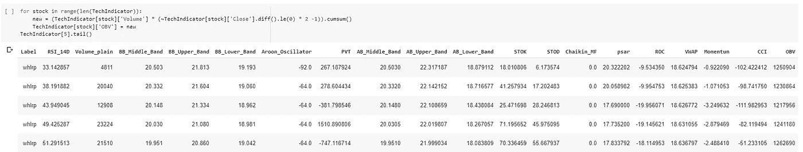
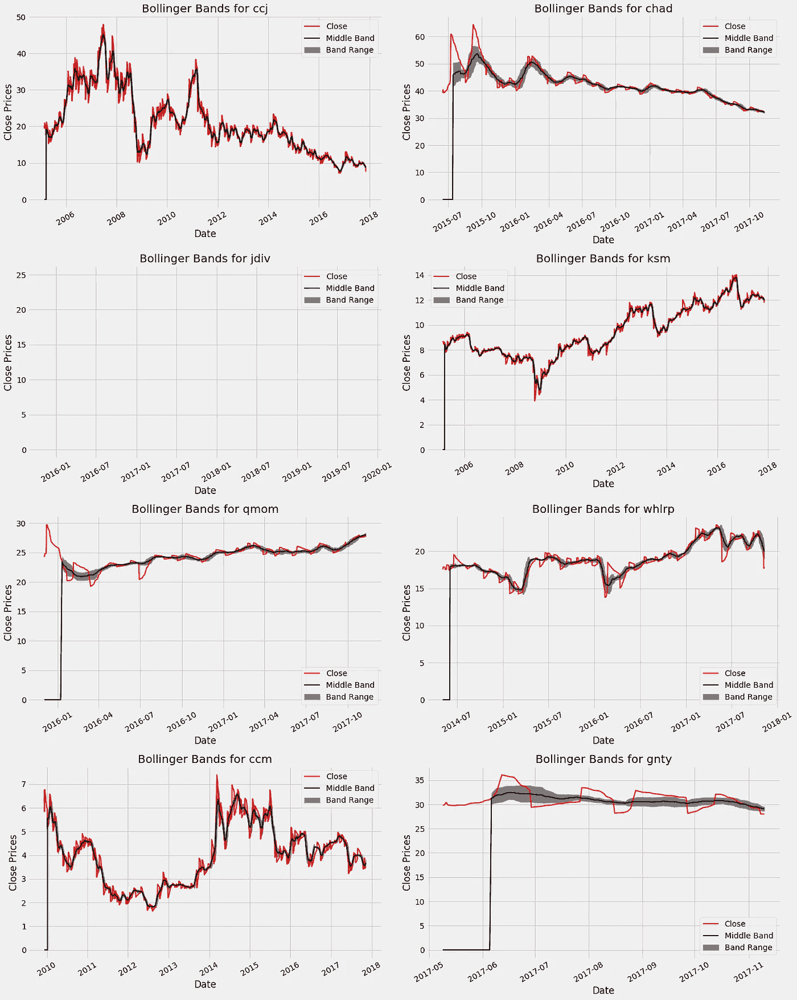
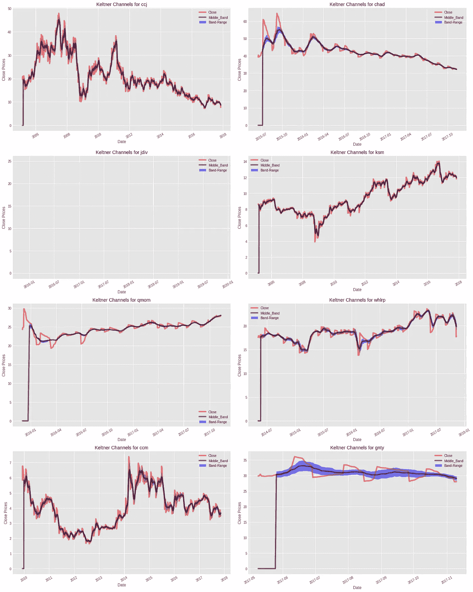

# 机器学习在股票市场研究和预测中的应用:货币乘数技术

> 原文：<https://medium.com/analytics-vidhya/application-of-machine-learning-to-study-and-predict-stock-market-money-multiplier-techniques-ace9f895236f?source=collection_archive---------12----------------------->

*计算能力和算法预测未来趋势的真正潜力*

由 [Carlos Muza](https://unsplash.com/@kmuza?utm_source=medium&utm_medium=referral) 在 [Unsplash](https://unsplash.com?utm_source=medium&utm_medium=referral) 上拍摄的照片

> “每个人都有一些特定的品质，机器学习和投资也是如此:花在改进和学习上的时间越多，成功的准确度就越高”

为了研究股票并获得可预测的结果，了解各种技术指标是很重要的。

值得考虑的技术指标:

— RSI，成交量(平盘)，布林线，Aroon，价格成交量趋势，加速带。

—随机、链式资金流动、抛物线 SAR、变化率、成交量加权平均价格、动量。

—商品通道指数、平衡交易量、凯特纳通道、三重指数移动平均线、归一化平均真实范围、方向性移动指标。

— MACD，资金流动指数，Ichimoku，威廉%R，最小最大交易量，自适应移动平均线。

在继续之前，让我们了解一些关于这些技术指标的信息。

1.  相对强弱指数(RSI):-相对强弱指数(Relative Strength Index)根据最近发生的交易中的最近收盘价，显示市场中股票当前和历史强弱的指标。
2.  **成交量(plain)** :-顾名思义，成交量意味着数量(QTY)，即围绕特定股票或一组股票发生的活动，如买入/卖出。成交量是一个重要的技术指标，因为成交量(买入/卖出的人数)越大，股票预测强弱和预测价格的能力就越强，因为为了预测或达到可接受的结果，一切都需要强大的数据集。
3.  **布林线**:一种技术分析工具，由一组标绘标准偏差(SD)的线组成，正负偏离股票价格的简单移动平均线，股票价格通常在每天交易前设定。这也有根据用户调整波段的偏好。
4.  **Aroon** :衡量一段时间内“高点”和“低点”之间的时间的指标，通常用于监控价格的趋势变化以及趋势的强度。
5.  **价格成交量趋势** :-一个强大的必看技术指标，有可能决定供求关系。证券价格的变化肯定会表明证券的相对需求和供给，但另一方面，交易量将表明推动这一趋势的力量。
6.  **加速带** :-这是一组围绕 20 天简单移动平均线(特定证券活动的平均值)等距放置的包络线。这通常用于查看在每周和每月的时间框架内加速区间内发生的突破，以确定价格加速。
7.  **商品通道指数** :-通常被称为显示周期性趋势的 CCI 指标。它由在“零”线顶部和底部之间波动的线组成。给出超买/超卖信号的建议，有助于绘制趋势图，找到任何现有的背离。
8.  **论平衡成交量:-** 利用成交量的流动来预测股价变化的动量指标。
9.  **凯尔特纳通道:-** 凯尔特纳通道是一个基于波动的技术指标，由三条独立的线组成。中线是价格的指数移动平均线(EMA)。额外的线放在均线的上面和下面。上波段通常设置为均线以上平均真实范围(ATR)的两倍，下波段通常设置为均线以下 ATR 的两倍。随着波动性(通过 ATR 衡量)的扩大和缩小，波段也会扩大和缩小。因为大部分价格波动都包含在上下波段(通道)内，通道外的波动可能是趋势变化或趋势加速的信号。通道的方向，如向上，向下，或横向，也可以帮助识别安全的趋势方向。
10.  **三重指数移动平均线:-** 为了计算 TEMA，一旦分析师选择了时间周期，他就计算初始均线。然后，第二个均线，双指数移动平均线(d EMA)，从最初的均线计算出来。计算 TEMA 的最后一步是用 d EMA 的第三根均线。使用 TEMA 可以减少微小波动和波动的影响。
11.  **归一化平均真实范围:-** 它只是归一化平均真实范围值。NATR =平均真实范围(周期数)/收盘价* 100。
12.  **方向运动指标:-** 预测资产价格的运动方向。该指标通过比较之前的高点和低点，并画出两条线:正向移动(+DI)和负向移动(-DI)。如果(+DI)高于(-DI)，则表明价格的上行压力大于下行压力，反之亦然。交叉，如+DI 交叉在-DI 之上，表明应该买入(价格上升趋势)。
13.  **MACD** :-移动平均线收敛/发散，用于揭示股价趋势的强度、方向、动量和持续时间的变化。
14.  **资金流动指数**:另一种衡量一段时间内资金进出证券的动量指标。与 RSI 相关，但它考虑了交易量，而在 RSI 中只考虑价格。
15.  **Ichimoku:-** 一体化指标，同时提供关于支撑/阻力、趋势方向和动量的信息。
16.  **威廉%R:-** 它在 0 和-100 之间波动，衡量超买和超卖水平。威廉姆斯%R 可以用来在市场中寻找进场点和出场点。该指标与随机振荡指标非常相似，使用方式也一样。它将股票的收盘价与特定时期的高低区间进行比较。
17.  **Volume Min-Max** :-返回特定证券的最小和最大交易量和价格。
18.  **自适应移动平均线:-** 自适应移动平均线(AMA)技术指标用于构建对价格序列噪声敏感度低的移动平均线，其特点是趋势检测的滞后最小。

将通过使用机器学习算法收集的知识应用于股票价格数据集。

关于数据集:-数据集已从鲍里斯马贾诺维奇提供的 kaggle 获得，这是一个庞大的数据集，提供了所有在纽约证券交易所、纳斯达克和纽约证券交易所交易的美国股票和 ETF 的全部历史每日价格和交易量数据。

可以看出，数据提供了日期、日高、日低和成交量。

—相对强弱指标

—体积(普通)

—布林线

—阿隆

—加速带

—删除列并计算随机振荡器

— Chaikin 资金流动

—抛物线 SAR

—价格变化率

—加权平均价格

—动量

—商品渠道指数

—平衡体积

—凯尔特纳频道

—三倍指数移动

—方向运动指示器

—移动平均收敛/发散

资金流动指数

—市目

—威廉%R

—最小最大体积

—自适应移动平均

—所有指示图

*   RSI

*   音量(普通)

*   布林线

*   阿龙

*   价格量趋势

*   加速带图

*   随机振荡器图

*   柴金资金流

*   抛物线 SAR、ROC、动量和加权平均价格

*   商品通道指数、TEMA 和余额

*   标准化平均值

*   凯尔特纳海峡

*   平均方向指数

*   移动平均 con/div 和自适应移动平均

*   威廉 R 和资金流

*   市目

**递归神经网络在 whlrp 股票价格预测中的应用。**

我们现在有了预测股票价格的趋势

结论:-详细的指标和神经网络可以证明有利于预测股票价格。

**参考文献:**

[1][https://www.investopedia.com/articles/trading](https://www.investopedia.com/articles/trading)

[2]“深度学习的股市预测:基于事件交易的基于字符的神经语言模型”——莱昂纳多·多斯桑托斯·皮涅罗(Leonardo dos Santos Pinheiro)和马克·德拉斯(Mark Dras)。

链接:[https://www.aclweb.org/anthology/U17-1001.pdf](https://www.aclweb.org/anthology/U17-1001.pdf)

[3]可视化:[https://www . ka ggle . com/kratisaxena/stock-market-technical-indicators-Visualization](https://www.kaggle.com/kratisaxena/stock-market-technical-indicators-visualization)