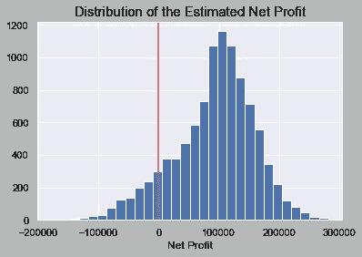

# 蒙特卡罗模拟在市场营销中的应用

> 原文：<https://medium.com/analytics-vidhya/application-of-monte-carlo-simulation-in-marketing-811f9e6b07e4?source=collection_archive---------2----------------------->


根据本文的主题，您可能想知道𝗠𝗼𝗻𝘁𝗲 𝗖𝗮𝗿𝗹𝗼 𝗦𝗶𝗺𝘂𝗹𝗮𝘁𝗶𝗼𝗻是什么意思。好了，让我们把题目分成几部分，详细了解每一部分。

**模拟:**如维基百科所述，模拟的定义是对一个过程或系统在一段时间内的运行的近似模仿。模拟通常使用统计和计算机建模来调查业务流程的性能，以适应新的情况或改进现有的流程。

**蒙特卡罗:**根据韦氏词典词典，蒙特卡罗的定义是:使用随机抽样技术，并经常使用计算机模拟来获得数学或物理问题的近似解，特别是在一系列数值方面，每个数值都有一个计算出的成为解的概率。还要注意的是，摩纳哥的蒙特卡洛以其赌场而闻名。

所以从个别术语的定义可以推断，

> **蒙特卡洛模拟**是一种实验性技术，涉及使用随机抽样方法模拟业务场景，以获得业务场景的一系列可能结果。

使用“蒙特卡洛”(以赌博娱乐场闻名)这个名字的主要原因是因为模拟是围绕机会和随机结果进行的，就像轮盘赌、骰子等娱乐场中的游戏一样。

好吧，如果你还对题目的定义感到困惑或不满意，这里有一个经典的例子给你:

> 我们都知道抛硬币得到正面/反面的概率是 1/2 或 0.5。但是我们最初是如何得出这个结论的呢？
> 
> 让我们做一个实验。拿一枚硬币，掷 10000 次，记下每次的结果。如果你现在计算得到正面/反面的概率，它大约等于 0.5。这在技术上被称为蒙特卡洛模拟。

蒙特卡罗模拟的思想是测试各种结果的可能性。实际上，只有一种可能的结果会发生，但是就风险评估而言，任何一种可能性都有可能发生！

但是这个想法并不局限于简单的扔硬币实验。从技术上讲，它可以应用于任何涉及公式/方程的问题。金融、零售和营销领域最常见的一些应用有:

**金融:**
1。股权期权的估价
2。投资组合估值
3。金融建模中的敏感性分析

**零售:**
1。销售估算
2。库存管理
3。寻找产品的最佳价位

**营销:**
1。营销活动模拟
2。利润/销售预测

我认为关于这个话题有很多理论。现在，我们将开始处理一个您可能会遇到的示例案例，以及蒙特卡罗模拟如何帮助您轻松解决这个问题。

# **问题陈述:**

假设你是一家公司的营销经理，该公司计划推出一种新产品。您需要估计该产品的第一年净利润，这取决于:

1.  销售量(单位)
2.  单价
3.  单位成本
4.  固定成本

净利润的计算方法如下:

> **净利润=销售量*(售价-单位成本)-固定成本**

固定成本(管理费用、广告等。)已知为 12 万美元。但是其他因素都包含一些不确定性。销售量(单位)可以涵盖相当大的范围，每单位的销售价格将取决于竞争对手的行动。单位成本也会因供应商价格和生产经验而异。

所以，这里我们有 3 个未知变量，可以取任何可能的值。

**销售和价格:**

基于你的市场研究，你认为市场有同等的机会变得缓慢、良好或火爆。

1.  在 ***“慢市”*** 场景中，您预计以每台 11.00 美元的平均售价售出 50，000 台。
2.  在***【OK market】***场景中，您预计销售 75，000 件，但您可能会实现较低的平均销售价格，每件 10.00 美元。
3.  在 ***【热门市场】*** 场景中，您预计销售 100，000 台，但这会带来竞争对手，他们会将平均售价压低至每台 8.00 美元。

因此，您预计以每单位 9.67 美元的平均售价销售 75，000 单位(即(50，000+75，000+100，000)/3 = 75，000)(即(11+10+8)/3 = 9.67)。

**单位成本:**

另一个不确定的变量是单位成本。你公司的生产经理告诉你，单位成本可能在 5.50 美元到 7.50 美元之间，最有可能是 6.50 美元。在这种情况下，最有可能的成本也是平均成本。

# **普通模特**

有了上面的信息，人们可能会认为使用每个变量的平均值来估计净利润是个好主意。

因此，让我们继续尝试，看看它是如何工作的。

```
The Net Profit for an Average model: 117750.0
```

但是你能确定你对净利润的估计是 11.7 万美元吗？这个数字有意义吗？你能在下一次会议上向你的经理展示这一发现吗？即将推出的产品的净利润将是 11.7 万美元。—嗯，你们大多数人可能会说不！

你是对的。报告净利润在不同情况下的取值范围总是比报告平均值的单点估计值更好。但是怎么做呢？

这就是 ***蒙特卡洛模拟*** 的用武之地。

如上所述，蒙特卡罗模拟的思想是测试各种结果的可能性。实际上，只有一种可能的结果会发生，但是就风险评估而言，任何一种可能性都有可能发生！

# **蒙特卡洛模拟模型**

在我们的问题中，我们有 3 个未知变量(销售额、价格、单位成本)，需要它们来计算净利润。

我们要做的是，我们将随机插入这 3 个变量的值，并计算净利润的多种可能结果。最后，如果您检查净利润估计值的分布，您可以了解这些值可能达到的极端程度、平均值以及许多有用的统计数据。

但是这里要考虑的重要事情是未知变量的分布。

*   **市场情景:**产品的销量和价格取决于市场情景。因此，这里我们需要考虑每种不同的市场情景发生的可能性。在这里，这三种情况都有可能发生。于是，我们可以用*均匀分布*。

*   **单位成本:**问题陈述中给出，单位成本介于 5.50 和 7.50 之间，平均值为 6.50 美元。请注意，单位成本可以取 5.50 到 7.50 之间的任何值，因此我们可以使用“*正态分布*”对此变量的值进行采样。对于正态分布:均值= 6.50，标准差=(上水平—下水平)/3.29。[值 3.29 是从 z 表中获得的，它只是 95%置信区间的 z 得分]

现在，让我们开始模拟。

一旦模拟完成，列表 *profit_estimates* 包含所有观察到的不同市场场景的 10000 个不同利润值。下面是同样的分布。



现在，让我们检查从模拟中获得的净利润值的汇总。

> **模拟结果:**
> 最低净利润可能为:$-178057.099
> 最高净利润可能为:$281443.321
> 平均净利润可能为:$92291.789
> 亏损概率:10.34%

你现在对自己的利润估计有多自信？我相信你的经理会印象深刻的！！

[这里的](https://github.com/hariharan2305/DailyKnowledge/blob/master/Monte%20Carlo%20Simulation/Monte%20Carlo%20Simulation.ipynb)是文章的 Github 链接。

我希望这对你有所帮助。快乐学习！！